## State-of-the-art in NLP {#c01-01-sota-nlp}

*Author: Cem Akkus*

*Supervisor: Matthias Aßenmacher*

### Introduction

Natural Language Processing (NLP) exists for about 50 years, but it is
more relevant than ever. There have been several breakthroughs in this
branch of machine learning that is concerned with spoken and written
language. In this work, the most influential ones of the last decade are
going to be presented. Starting with word embeddings, which efficiently
model word semantics. Encoder-decoder architectures represent another
step forward by making minimal assumptions about the sequence structure.
Next, the attention mechanism allows human-like focus shifting to put
more emphasis on more relevant parts. Then, the transformer applies
attention in its architecture to process the data non-sequentially,
which boosts the performance on language tasks to exceptional levels. At
last, the most influential transformer architectures are recognized
before a few current topics in natural language processing are
discussed.

### Word Embeddings

As mentioned in the introduction, one of the earlier advances in NLP is
learning word internal representations. Before that, a big problem with
text modelling was its messiness, while machine learning algorithms
undoubtedly prefer structured and well-defined fixed-length inputs. On a
granular level, the models rather work with numerical than textual data.
Thus, by using very basic techniques like one-hot encoding or
bag-of-words, a text is converted into its equivalent vector of numbers
without losing information.\
In the example depicting one-hot encoding (see Figure \@ref(fig:onehot)), there
are ten simple words and the dark squares indicate the only index with a
non-zero value.

```{r onehot, echo=FALSE, out.width="70%", fig.cap="(ref:onehot)", fig.align="center"}
knitr::include_graphics("./figures/01-01-nlp/onehot_pilehvar_p10.png")
```
(ref:onehot) Ten one-hot encoded words (Source: @Pilehvar2021)

In contrast, there are multiple non-zero values while using
bag-of-words, which is another way of extracting features from text to
use in modelling where we measure if a word is present from a vocabulary
of known words. It is called bag-of-words because the order is
disregarded here.\
Treating words as atomic units has some plausible reasons, like
robustness and simplicity. It was even argued that simple models on a
huge amount of data outperform complex models trained on less data.
However, simple techniques are problematic for many tasks, e.g. when it
comes to relevant in-domain data for automatic speech recognition. The
size of high-quality transcribed speech data is often limited to just
millions of words, so simply scaling up simpler models is not possible
in certain situations and therefore more advanced techniques are needed.
Additionally, thanks to the progress of machine learning techniques, it
is realistic to train more complex models on massive amounts of data.
Logically, more complex models generally outperform basic ones. Other
disadvantages of classic word representations are described by the curse
of dimensionality and the generalization problem. The former becomes a
problem due to the growing vocabulary equivalently increasing the
feature size. This results in sparse and high-dimensional vectors. The
latter occurs because the similarity between words is not captured.
Therefore, previously learned information cannot be used. Besides,
assigning a distinct vector to each word is a limitation, which becomes
especially obvious for languages with large vocabularies and many rare
words.\
To combat the downfalls of simple word representations, word embeddings
enable to use efficient and dense representations in which similar words
have a similar encoding. So words that are closer in the vector space
are expected to be similar in meaning. An embedding is hereby defined as
a vector of floating point values (with the length of the vector being a
hyperparameter). The values for the embedding are trainable parameters
which are learned similarly to a model learning the weights for a dense
layer. The dimensionality of the word representations is typically much
smaller than the number of words in the dictionary. For example,
[@Mikolov2013] called dimensions between 50-100 modest for more than a
few hundred million words. For small data sets, dimensionality for the
word vectors could start at 8 and go up to 1024 for larger data sets. It
is expected that higher dimensions can rather pick up intricate
relationships between words if given enough data to learn from.

```{r embedPilehvarP11, echo=FALSE, out.width="70%", fig.cap="(ref:embedPilehvarP11)", fig.align="center"}
knitr::include_graphics("./figures/01-01-nlp/embed_pilehvar_p11.png")
```
(ref:embedPilehvarP11) Three-dimensional word embeddings (Source: @Pilehvar2021).

For any NLP tasks, it is sensible to start with word embeddings because
it allows to conveniently incorporate prior knowledge into the model and
can be seen as a basic form of transfer learning. It is important to
note that even though embeddings attempt to represent the meaning of
words and do that to an extent, the semantics of the word in a given
context cannot be captured. This is due to the words having static
precomputed representations in traditional embedding techniques. Thus,
the word \"bank\" can either refer to a financial institution or a river
bank. Contextual embedding methods offer a solution, but more about them
will follow later.\
It should be noted that words can have various degrees of similarity. In
the context of inflectional languages, it becomes obvious because words
are adjusted to articulate grammatical categories. For example, in a
subspace of the original vector, nouns that have similar endings can be
found. However, it even exceeds simple syntactic regularities. With
straightforward operations on the word vectors, it can be displayed that
vector ("King") - vector ("Man") + vector ("Woman") equals a vector that
is closest in vector space (and therefore in meaning) to the word
\"Queen\". A simple visualization of this relationship can be seen in
the left graph below (see ). The three coordinate systems are
representations of higher dimensions that are depicted in this way via
dimension reduction techniques. Furthermore, the verb-to-tense
relationship is expressed in the middle graphic, which extends the
insight from before referring to the word endings being similar because
in this instance the past tenses of both verbs walking and swimming are
not similar in structure. Additionally, on the right side of the figure,
there is a form of the commonly portrayed and easily understood
Country-Capital example (see [@Mikolov2013]).

```{r embedVectors, echo=FALSE, out.width="100%", fig.cap="(ref:embedVectors)", fig.align="center"}
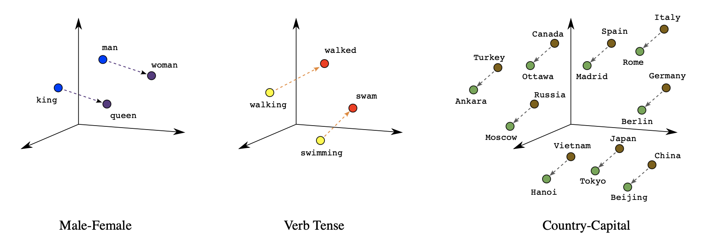
```
(ref:embedVectors) Three types of similarities as word embeddings (Source: @Google2022).


Another way of using vector representations of words is in the field of
translations. It has been presented that relations can be drawn from
feature spaces of different languages. In below, the distributed word
representations of numbers between English and Spanish are compared. In
this case, the same numbers have similar geometric arrangements, which
suggests that mapping linearly between vector spaces of languages is
feasible. Applying this simple method for a larger set of translations
in English and Spanish led to remarkable results - achieving almost 90 %
precision.

```{r embedTransl, echo=FALSE, out.width="90%", fig.cap="(ref:embedTransl)", fig.align="center"}
knitr::include_graphics("./figures/01-01-nlp/embed_transl_mikolova_p2.png")
```
(ref:embedTransl) Representations of numbers in English and Spanish (Source: @Mikolov2013a).

This technique was then used for other experiments. One use case is the
detection of dictionary errors. Taking translations from a dictionary
and computing their geometric distance returns a confidence measure.
Closely evaluating the translations with low confidence and outputting
an alternative (one that is closest in vector space) results in a plain
way to assess dictionary translations. Furthermore, training the word
embeddings on a large corpora makes it possible to give sensible
out-of-dictionary predictions for words. This was tested by randomly
removing a part of the vocabulary before. Taking a look at the
predictions revealed that they were often to some extent related to the
translations with regard to meaning and semantics. Despite the
accomplishments in other tasks, translations between distant languages
exposed shortcomings of word embeddings. For example, the accuracy for
translations between English and Vietnamese seemed significantly lower.
This can be ascribed to both languages not having a good one-to-one
correspondence because the concept of a word is different than in
English. In addition, the used Vietnamese model contains numerous
synonyms, which complicates making exact predictions (see
[@Mikolov2013a]).\
Turning the attention to one of the most impactful embedding techniques,
word2vec. It was proposed by [@Mikolov2013] and is not a singular
algorithm. It can rather be seen as a family of model architectures and
optimizations to learn word representations. Word2vec's popularity also
stems from its success on multiple downstream natural language
processing tasks. It has a very simple structure which is based on a
basic feed forward neural network. They published multiple papers (see
[@Mikolov2013], [@Mikolov2013a], [@Mikolov2013b]) that are stemming
around two different but related methods for learning word embeddings
(see ). Firstly, the Continuous bag-of-words model aims to predict the
middle word based on surrounding context words. Hence, it considers
components before and after the target word. As the order of words in
the context is not relevant, it is called a bag-of-words model.
Secondly, the Continuous skip-gram model only considers the current word
and predicts others within a range before and after it in the same
sentence. Both of the models use a softmax classifier for the output
layer.

```{r embedArch, echo=FALSE, out.width="85%", fig.cap="(ref:embedArch)", fig.align="center"}
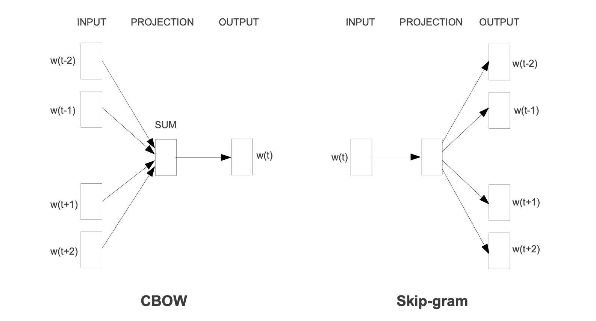
```
(ref:embedArch) CBOW and Skip-gram architecture (Source: @Mikolov2013).


Then, [@Bojanowski2016] built on skip-gram models by accounting for the
morphology (internal structure) of words. A different classical
embedding architecture that has to be at least mentioned is the GloVe
model, which does not use a neural network but incorporates local
context information with global co-occurrence statistics.

### Encoder-Decoder

The field of natural language processing is concerned with a variety of
different tasks surrounding text. Depending on the type of NLP problem,
the network may be confronted with variable length sequences as input
and/or output. This is the case for many compelling applications, such
as question answering, dialogue systems or machine translation. In the
following, many examples will explore machine translations in more
detail, since it is a major problem domain. Regarding translation tasks,
it becomes obvious that input sequences need to be mapped to output
sequences of different lengths. To manage this type of input and output,
a design with two main parts could be useful. The first one is called
the encoder because, in this part of the network, a variable length
input sequence is transformed into a state with a fixed state. Next, the
second component called the decoder maps the encoded state to an output
of a variable length sequence. As a whole, it is known as an
encoder-decoder or sequence-to-sequence architecture and has become an
effective and standard approach for many applications which even
recurrent neural networks with gated hidden units have trouble solving
successfully. Deep RNNs may have a chance, but different architectures
like encoder-decoder have proven to be the most effective. It can even
deal with different word orders and active, as well as passive voice
[@Sutskever2014]. A simplified example of the encoder-decoder model
can be seen in .

```{r arch1Encdec, echo=FALSE, out.width="85%", fig.cap="(ref:arch1Encdec)", fig.align="center"}
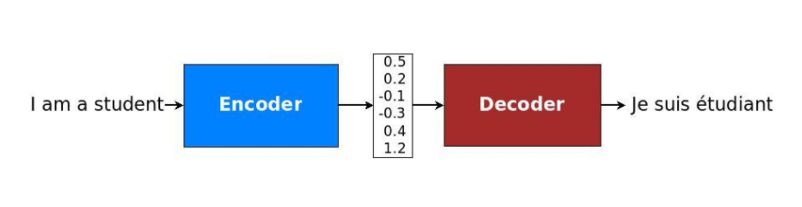
```
(ref:arch1Encdec) Translation through simplified seq2seq model (Source: @Manning2022).

Before going through the equations quantifying the concepts, it makes
sense to examine the sequence-to-sequence design closer by studying
proposed by [@Cho2014]. An encoder-RNN processes the input sequence of
length $n_x$ and computes a fixed-length context vector C, which is
usually the final hidden state of the encoder or a simple function of
the hidden states. After the input sequence is processed, it is added to
the hidden state and passed forward in time through the recurrent
connections between the hidden states in the encoder. Despite the
context vector usually being a simple function of the last hidden state,
its role cannot be underestimated. Specifically, the encoded state
summarizes important information from the input sequence, e.g. the
intent in a question answering task or the meaning of a text in the case
of machine translation. After the context is passed to every hidden
state of the decoder, the decoder RNN uses this information to produce
the target sequence of length $n_y$, which can of course vary from
$n_x$.

```{r encdecArchCho, echo=FALSE, out.width="56%", fig.cap="(ref:encdecArchCho)", fig.align="center"}
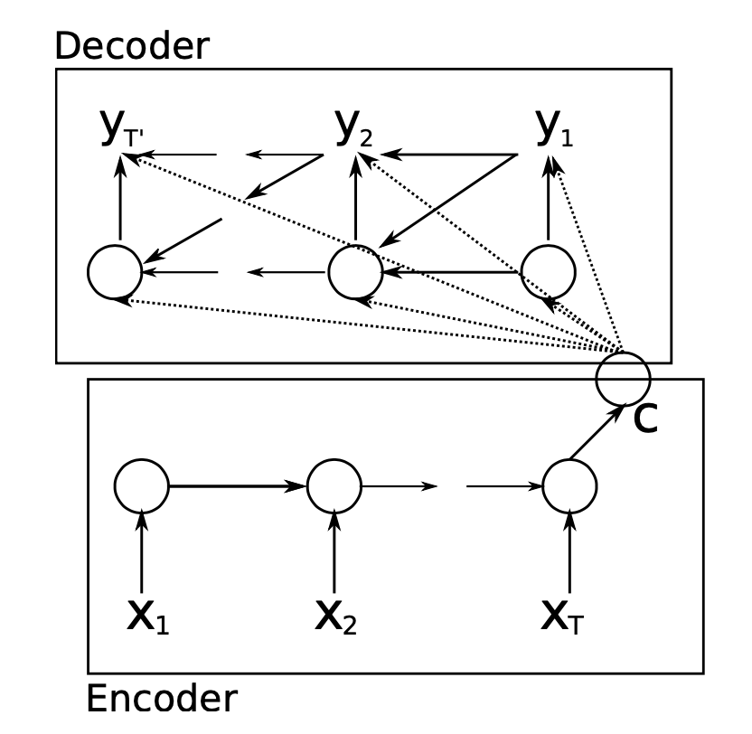
```
(ref:encdecArchCho) Encoder-decoder architecture (Source: @Cho2014).

At the latest through the above illustration, it is clear that the
decoder is particularly interesting to look at in the form of equations.
The notations mainly follow [@Cho2014]. The decoder is another type of
RNN which is trained to predict the target based on the hidden state at
the last time step. However, unlike regular RNNs, it is also conditioned
on the output of the last time step ($y_{t-1}$) and a summary of the
input c. Therefore, the hidden state of the decoder is computed by:

$$h_d^{[t]} = f(h_d^{[t-1]},y^{[t-1]},c).
    \label{eqn:h_dec}$$

Similarly, each conditional probability is given by the following, where
f is a non-linear activation function (and must produce probabilities in
, e.g. the softmax function):

$$P(y^{[t]}|y^{[1]},...,y^{[t-1]},c) = f(h_d^{[t]}, y^{[t-1]}, c).     \label{eqn:P_dec}$$

The two parts are jointly trained to maximize the conditional
log-likelihood, where $\theta$ denotes the set of model parameters and
$(x_n, y_n)$ is an (input sequence, output sequence) pair from the
training set with size $N$:

$$\max_\theta \frac{1}{N} \displaystyle \sum_{n=1}^{N} \log p_{\theta}(y_n|x_n).
    \label{eqn:train_dec}$$

The best probability is usually found by using the beam search
algorithm. The core idea of it is that on each step of the decoder, we
keep track of the $k$ most probable partial translations (which are
called hypotheses).\
Examining the translation presented in with hidden units unrolled
through time could look like in . In particular, multiple hidden layers
are recommended by the researchers. The idea is that lower layers
compute lower-level features and higher layers compute higher-level
features.

```{r encdecArch2, echo=FALSE, out.width="70%", fig.cap="(ref:encdecArch2)", fig.align="center"}
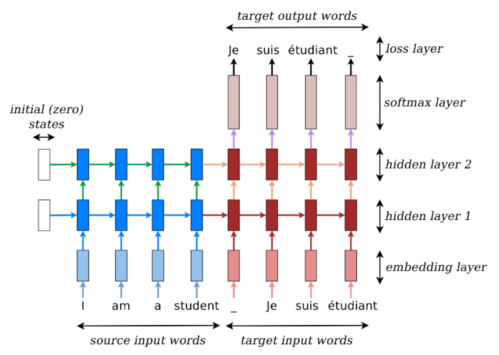
```
(ref:encdecArch2) Translation through seq2seq model (Source: @Manning2022).

Gated recurrent networks, especially long short-term memory networks,
have been found to be effective in both components of the
sequence-to-sequence architecture. Furthermore, it was revealed that
deep LSTMs significantly outperform shallow LSTMs. Each additional layer
reduced perplexity by nearly 10%, possibly due to their much larger
hidden state. For example, [@Sutskever2014] used deep LSTMs with 4
layers and 1000 cells at each layer for 1000-dimensional word
embeddings. Thus, in total, 8000 real numbers are used to represent a
sentence. For simplification, the neural networks are in the following
referred to as RNNs which is not contradicting the insights of this
paragraph as LSTMs are a type of gated RNNS ([@Sutskever2014]).

### Attention

Although encoder-decoder architectures simplified dealing with variable
length sequences, they also caused complications. Due to its design, the
encoding of the source sentence is a single vector representation
(context vector). The problem is that this state must compress all
information about the source sentence in a single vector and is commonly
referred to as the bottleneck problem. To be precise, the entire
semantics of arbitrarily long sentences need to be wrapped into a single
hidden state. Moreover, it constitutes a different learning problem
because the information needs to be passed between numerous time steps.
This leads to vanishing gradients within the network as a consequence of
factors less than 1 multiplied with each other at every point. To
illustrate, the last sentence is an ideal example of one in which an
encoder-decoder approach could have difficulty coping. In particular, if
the sentences are longer than the ones in the training corpus
([@Manning2022]).\
Due to the aforementioned reasons, an extension to the
sequence-to-sequence architecture was proposed by [@Bahdanau2014], which
learns to align and translate jointly. For every generated word, the
model scans through some positions in the source sentence where the most
relevant information is located. Afterwards, based on the context around
and the previously generated words, the model predicts the target word
for the current time step. This approach is called attention, as it
emulates human-like (cognitive) attention. As a result of directly
looking at the source and bypassing the bottleneck, it provides a
solution to the problem. Then, it mitigates the vanishing gradient
problem, since there is now a shortcut to faraway states. Consequently,
incorporating the attention mechanism has been shown to considerably
boost the performance of models on NLP tasks.\
A walkthrough of the example below should resolve any outstanding
questions regarding the procedure of the attention mechanism. The source
sentence is seen on the bottom left, which is given in French and acts
as the input for the encoder-RNN (in red). Then, the attention scores
(in blue) are computed by taking the dot product between the previous
output word and input words. Next, the softmax function turns the scores
into a probability distribution (in pink). They are used to take a
weighted sum of the encoder's hidden states and form the attention
output, which mostly contains information from the hidden states that
received high attention. Afterwards, the attention output is
concatenated with the decoder hidden state (in green), which is applied
to compute the decoder output as before. In some scenarios, the
attention output is also fed into the decoder (along with the usual
decoder input). This specific example was chosen because \"entarter\"
means \"to hit someone with a pie\" and is therefore a word that needs
to be translated with many words. As a consequence of no existing direct
equivalents for this phrase, it is expected that there is not only one
nearly non-zero score. In this snapshot, the attention distribution can
be seen to have two significant contributors.

```{r attentionExStanford, echo=FALSE, out.width="90%", fig.cap="(ref:attentionExStanford)", fig.align="center"}
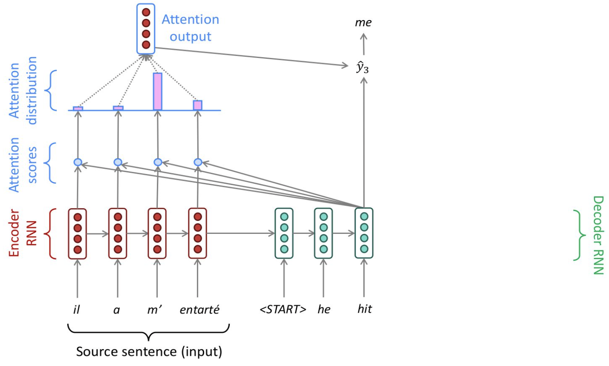
```
(ref:attentionExStanford) Translation process with attention mechanism (Source: @Manning2022).

The following equations aim to compactly represent the relations brought
forward in the last paragraphs and mainly follow [@Manning2022]. The
attention scores $e^{[t]}$ are computed by scalarly combining the hidden
state of the decoder with all of the hidden states of the encoder:

$$e^{[t]} = [(h_{d}^{[t]})^T h_{e}^{[1]}, \ldots  , (h_{d}^{[t]})^T h_{e}^{[N]} ].$$

Besides the basic dot-product attention, there are also other ways to
calculate the attention scores, e.g. through multiplicative or additive
attention. Although they will not be further discussed at this point, it
makes sense to at least mention them. Then, applying the softmax to the
scalar scores results in the attention distribution $\alpha^{[t]}$, a
probability distribution whose values sum up to 1:

$$\alpha^{[t]} = softmax(e^{[t]}).$$

Next, the attention output $a^{[t]}$ is obtained by the attention
distribution acting as a weight for the encoder hidden states:

$$a^{[t]} = \sum_{i=1}^{N} \alpha_i^{[t]} h_{e,i}.$$

Concatenating attention output with decoder hidden state and proceeding
as in the non-attention sequence-to-sequence model are the final steps:

$$o^{[t]} = f(a^{[t]} h_d^{[t]}).$$

By visualizing the attention distribution, also called alignments (see
[@Bahdanau2014]), it is easy to observe what the decoder was focusing on
and understand why it chose a specific translation. The x-axis of the
plot of below corresponds to the words in the source sentence (English)
and the y-axis to the words in the generated translation (French). Each
pixel shows the weight of the source word for the respective target word
in grayscale, where 0 is black and 1 is white. As a result, which
positions in the source sentence were more relevant when generating the
target word becomes apparent. As expected, the alignment between English
and French is largely monotonic, as the pixels are brighter, and
therefore the weights are higher along the main diagonal of the matrix.
However, there is an exception because adjectives and nouns are
typically ordered differently between the two languages. Thus, the model
(correctly) translated \"European Economic Area\" into \"zone économique
européene\". By jumping over two words (\"European\" and \"Economic\"),
it aligned \"zone\" with \"area\". Then, it looked one word back twice
to perfect the phrase \"zone économique européene\". Additional
qualitative analysis has shown that the model alignments are
predominantly analogous to our intuition.\

```{r attentionfocus, echo=FALSE, out.width="50%", fig.cap="(ref:attentionfocus)", fig.align="center"}
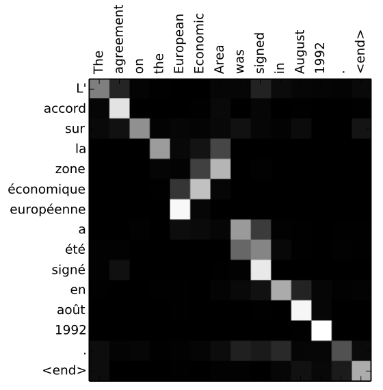
```
(ref:attentionfocus) Attention alignments (Source: @Bahdanau2014).

### Transformer

For this subsection, [@Manning2022] constitutes the main source.\
RNNs are unrolled from one side to the other. Thus, from left to right
and right to left. This encodes linear locality, which is a useful
heuristic because nearby words often affect each other's meaning. But
how is it when distant words need to interact with each other? For
instance, when we mention a person at the beginning of a text portion
and refer back to them only at the very end, the whole text in between
needs to be tracked back (see below). Hence, RNNs take O(sequence
length) steps for distant word pairs to interact. Due to gradient
problems, it is therefore hard to learn long-distance dependencies. In
addition, the linear order is ingrained. Even though, as known, the
sequential structure does not tell the whole story.

```{r tfrnnlimstanford, echo=FALSE, out.width="70%", fig.cap="(ref:tfrnnlimstanford)", fig.align="center"}
knitr::include_graphics("./figures/01-01-nlp/transformer_rnnlim_stanford.png")
```
(ref:tfrnnlimstanford) Sequential processing of recurrent model (Source: @Manning2022).

GPUs can perform multiple calculations simultaneously and could help to
reduce the execution time of the deep learning algorithm massively.
However, forward and backward passes lack parallelizability in recurrent
models and have O(sequence length). To be precise, future hidden states
cannot be computed in full before past states have been computed. This
inhibits training on massive data sets. indicates the minimum number of
steps before the respective state can be calculated.

```{r tfrnnlim2stanford, echo=FALSE, out.width="70%", fig.cap="(ref:tfrnnlim2stanford)", fig.align="center"}
knitr::include_graphics("./figures/01-01-nlp/transformer_rnnlim2_stanford.png")
```
(ref:tfrnnlim2stanford) Sequential processing of recurrent model with number of steps indicated (Source: @Manning2022).

After proving that attention dramatically increases performance, google
researchers took it further and based transformers solely on attention,
so without any RNNs. For this reason, the paper in which they were
introduced is called \"Attention is all you need\". Spoiler: It is not
quite all we need, but more about that on the following pages.
Transformers have achieved great results on multiple settings such as
machine translation and document generation. Their parallelizability
allows for efficient pretraining and leads them to be the standard model
architecture. In fact, all top models on the popular aggregate benchmark
GLUE are pretrained and Transformer-based. Moreover, they have even
shown promise outside of NLP, e.g. in Image Classification, Protein
Folding and ML for Systems (see [@dosovitskiy2020image], [@Jumper2021],
[@Zhou2020], respectively).\
If recurrence has its flaws, another adjustment of the attention
mechanism might be beneficial. Until now, it was defined from decoder to
encoder. Alternatively, attention could also be from one state to all
states in the same set. This is the definition of self-attention, which
is encoder-encoder or decoder-decoder attention (instead of
encoder-decoder) and represents a cornerstone of the transformer
architecture. depicts this process in which each word attends to all
words in the previous layer. Even though in practice, most arrows are
omitted eventually.\

```{r tfselfa, echo=FALSE, out.width="70%", fig.cap="(ref:tfselfa)", fig.align="center"}
knitr::include_graphics("./figures/01-01-nlp/transformer_self-attention_stanford.png")
```
(ref:tfselfa) Connections of classic attention mechanism (Source: @Manning2022).


Thinking of self-attention as an approximate hash table eases
understanding its intuition. To look up a value, queries are compared
against keys in a table. In a hash table, which is shown on the left
side of , there is exactly one key-value pair for each query (hash). In
contrast, in self-attention, each key is matched to varying degrees by
each query. Thus, a sum of values weighted by the query-key match is
returned.

```{r tfhashtable, echo=FALSE, out.width="70%", fig.cap="(ref:tfhashtable)", fig.align="center"}
knitr::include_graphics("./figures/01-01-nlp/transformer_hash-table_stanford.png")
```
(ref:tfhashtable) Comparison of classic attention mechanism with self-attention with hash tables (Source: @Manning2022).

The process briefly described in the last paragraph can be summarized by
the following steps that mainly follow [@Manning2022]. Firstly, deriving
query, key, and value for each word $x_i$ is necessary:
$$q_i = W^Q x_i , \hspace{3mm} k_i = W^K x_i, \hspace{3mm} v_i = W^V x_i$$

Secondly, the attention scores have to be calculated:

$$e_{ij} = q_i k_j$$

Thirdly, to normalize the attention scores, the softmax function is
applied:

$$\alpha_{ij} = softmax( e_{ij} ) = \frac{exp(e_{ij})}{\displaystyle \sum_k e_{ij}}$$

Lastly, taking the weighted sum of the values results in obtaining the
attention output:

$$a_{i} = \displaystyle \sum_j \alpha_{ij} v_j$$

Multiple advantages of incorporating self-attention instead of
recurrences have been revealed. Since all words interact at every layer,
the maximum interaction distance is O(1) and is a crucial upgrade. In
addition, the model is deeply bidirectional because each word attends to
the context in both directions. As a result of these advances, all word
representations per layer can be computed in parallel. Nevertheless,
some issues have to be discussed. Attention does no more than weighted
averaging. So without neural networks, there are no element-wise
non-linearities. Their importance cannot be understated and shows why
attention is not actually all that is needed. Furthermore,
bidirectionality is not always desired. In language modelling, the model
should specifically be not allowed to simply look ahead and observe more
than the objective allows. Moreover, the word order is no longer
encoder, and it is bag-of-words once again.\
Fortunately, the previously mentioned weaknesses have been addressed for
the original transformer-architecture proposed by [@Vaswani2017]. The
first problem can be easily fixed by applying a feed forward layer to
the output of attention. It provides non-linear activation as well as
extra expressive power. Then, for cases in which bidirectionality
contradicts the learning objective, future states can be masked so that
attention is restricted to previous states. Moreover, the loss of the
word can be corrected by adding position representations to the inputs.\
The more complex deep learning models are, the closer they become to
model the complexity of the real world. That is why the transformer
encoder and decoder consist of many layers of self-attention with a feed
forward network, which is necessary to extract both syntactic and
semantic features from sentences. Otherwise, using word embeddings,
which are semantically deep representations between words, would be
unnecessary (see [@Sejnowski2020]). At the same time, training deep
networks can be troublesome. Therefore, some tricks are applied to help
with the training process.\
One of them is to pass the \"raw\" embeddings directly to the next
layer, which prevents forgetting or misrepresent important information
as it is passed through many layers. This process is called residual
connections and is also believed to smoothen the loss landscape.
Additionally, it is problematic to train the parameters of a given layer
when its inputs keep shifting because of layers beneath. Reducing
uninformative variation by normalizing within each layer to mean zero
and standard deviation to one weakens this effect. Another challenge is
caused by the dot product tending to take on extreme values because of
the variance scaling with increasing dimensionality $d_k$. It is solved
by Scaled Dot Product Attention (seen in below), which consists of
computing the dot products of the query with its keys, dividing them by
the dimension of keys $\sqrt{d_k}$, and applying the softmax function
next to receive the weights of the values.

```{r tfsdpa, echo=FALSE, out.width="18%", fig.cap="(ref:tfsdpa)", fig.align="center"}
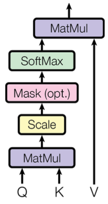
```
(ref:tfsdpa) Scaled dot-product attention (Source: @Vaswani2017).

Attention learns where to search for relevant information. Surely,
attending to different types of information in a sentence at once
delivers even more promising results. To implement this, the idea is to
have multiple attention heads per layer. While one attention head might
learn to attend to tense information, another might learn to attend to
relevant topics. Thus, each head focuses on separate features, and
construct value vectors differently. Multi-headed self-attention is
implemented by simply creating $n$ independent attention mechanisms and
combining their outputs.

```{r tfmha, echo=FALSE, out.width="34%", fig.cap="(ref:tfmha)", fig.align="center"}
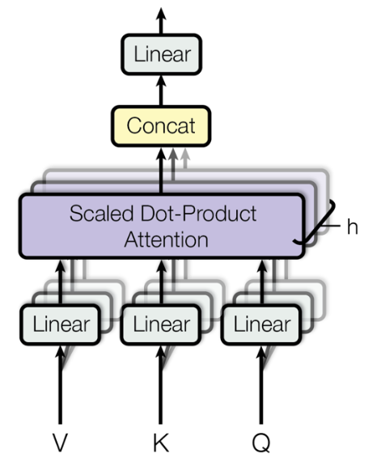
```
(ref:tfmha) Multi-head attention (Source: @Vaswani2017).

At this point, every part that constitutes the encoder in the
transformer architecture has been introduced (see ). First, positional
encodings are included in the input embeddings. There are multiple
options to realize this step, e.g. through sinusoids. The multi-head
attention follows, which was just mentioned. \"Add & Norm\" stands for
the residual connections and the normalization layer. A feed forward
network follows, which is also accompanied by residual connections and a
normalization layer. All of it is repeated $n$ times. For the decoder,
the individual components are similar. One difference is that the
outputs go through masked multi-head attention before multi-head
attention and the feed forward network (with residual connections and
layer normalization). It is critical to ensure that the decoder cannot
peek at the future. To execute this, the set of keys and queries could
be modified at every time step to only include past words. However, it
would be very inefficient. Instead, to enable parallelization, future
states are masked by setting the attention scores to $-\infty$. After
the decoder process is also repeated $n$ times, a linear layer is added
to project the embeddings into a larger vector that has the length of
the vocabulary size. At last, a softmax layer generates a probability
distribution over the possible words.

```{r tfarch, echo=FALSE, out.width="55%", fig.cap="(ref:tfarch)", fig.align="center"}
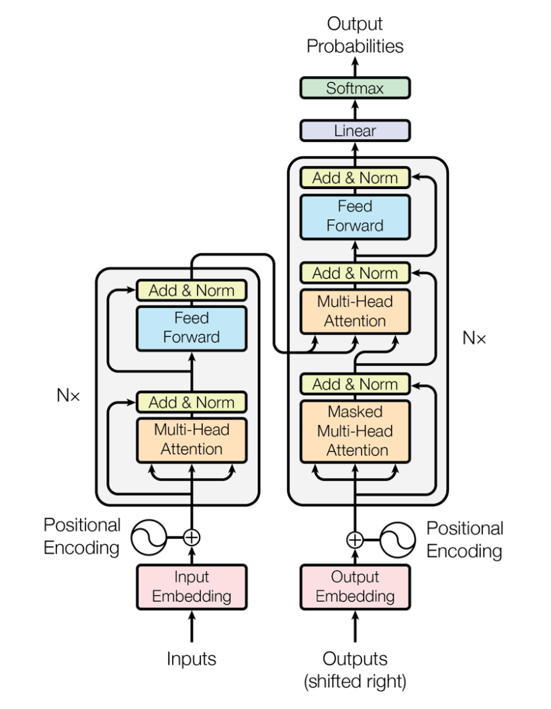
```
(ref:tfarch) Transformer architecture (Source: @Vaswani2017).

### Transformer architectures: BERT, T5, GPT-3

\"You shall know a word by the company it keeps\", an adage by linguist
John Rupert Firth from 1957 goes. Even earlier, in 1935, he stated that
\"\... the complete meaning of a word is always contextual, and no study
of meaning apart from a complete context can be taken seriously\". The
quotes of the famous linguist sum up the motivation to learn word
meaning and context perfectly. Many years later, in 2017, pretraining
word embeddings started. However, some complications arise from solely
pretraining the first part of the network. For instance, to teach the
model all contextual aspects of language, the training data for the
downstream task (e.g. question answering) needs to be adequate.
Additionally, most of the parameters are usually randomly initialized.
presents the network discussed, in which the word \"movie\" gets the
same embedding irrespective of the sentence it appears in. On the
contrary, parameters in modern NLP architectures are initialized via
pretraining (see ). Furthermore, during the pretraining, certain input
parts are hidden to train the model to reconstruct them. This leads to
building suitable parameter initializations and robust probability
distributions over language.\

```{r tfpretrain, echo=FALSE, out.width="80%", fig.cap="(ref:tfpretrain)", fig.align="center"}
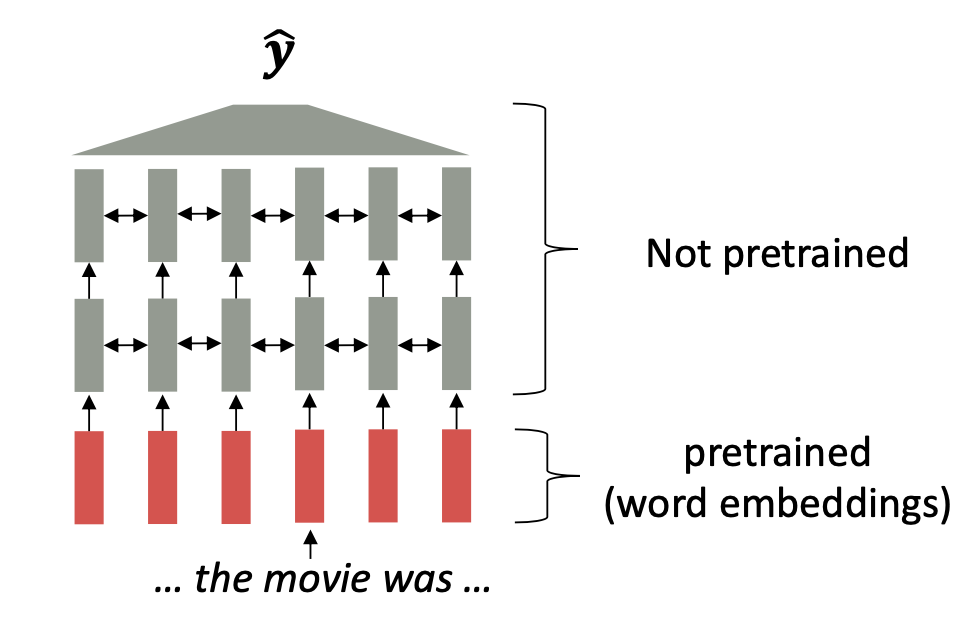
```
(ref:tfpretrain) Partly pre-trained model (Source: @Manning2022).

```{r tfpretrain2, echo=FALSE, out.width="80%", fig.cap="(ref:tfpretrain2)", fig.align="center"}
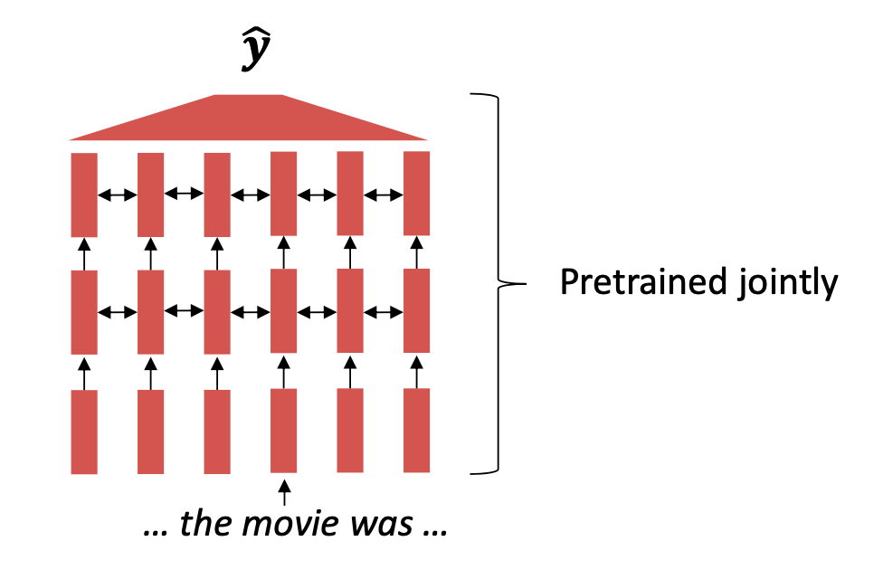
```
(ref:tfpretrain2) Jointly pre-trained model (Source: @Manning2022).

Classic machine learning does not match human learning. Specifically
referring to training a model from scratch, and only being able to learn
from the training data. In contrast, human beings already have prior
knowledge they can apply to new tasks. Transfer learning emulates this
by using an already trained network. The main idea is to use a model
that was pretrained on a hard, general language understanding task using
endless amounts of data, so that, it eventually contains the best
possible approximation of language understanding. Afterwards, the
training data for the new task is applied to slightly modify the weights
of the pretrained model, which is referred to as fine-tuning
([@Manning2022]).\
The specific architecture of a transformer model affects the type of
pre-training, and favourable use cases. In the following, three
different but very influential transformer architectures will be
discussed. BERT can be seen as stacked encoders ([@Devlin2018]), T5 aims
to combine the good parts of encoders and decoders ([@Raffel2019]),
while GPT are stacked decoders ([@Brown2020]).

#### BERT

Transfer learning led to state-of-the-art results in natural language
processing. One of the architectures that led the way was BERT, which
stands for Bidirectional Encoder Representations from Transformers. It
receives bidirectional context, which is why it is not a natural fit for
language modelling. To train it on this objective regardless, masked
language modelling was proposed. The main idea is to cover up a fraction
of the input words and let the model predict them. In this way, the LM
objective can be used while sustaining connections to words in the
future. The masked LM for BERT randomly predicts 15% of all word tokens
in each sequence. Of those, 80% are replaced by the \[MASK\] token, 10%
by a random token, and 10% remain unchanged. Moreover, because the
masked words are not even seen in the fine-tuning phase, the model
cannot get complacent and relies on strong representations of non-masked
words. Initially, BERT had an additional objective of whether one
sentence follows another, which is known as next sentence prediction.
However, it was dropped in later work due to having an insignificant
effect.\
BERT is hugely versatile and was greatly popular after its release.
Fine-tuning BERT led to outstanding results on a variety of
applications, including question answering, sentiment analysis and text
summarization. Thanks to its design, if the task involves generating
sequences, pretrained decoders outperform pretrained encoders like BERT.
Even though, it would not be recommended for autoregressive generation,
up to this day, \"small\" models like BERT are applied as general tools
for numerous tasks.

#### T5

The Text-To-Text Transfer Transformer (T5) is a new model that can be
regarded as an application of the insights gathered by an extensive
empirical study searching for the best transfer learning techniques. It
is pretrained on Colossal Clean Crawled Corpus (C4), an open-source
dataset. [@Raffel2019] found that the best pretraining objective to use
for the encoder component was span corruption. In short, different
length word groups (spans) are replaced with unique placeholders, and
let the model decode them. Text preprocessing is necessary for its
implementation. For the decoder, it is still a language modelling task.
Compared to models like BERT, which can only output a span of the input
or a class label, T5 reframes all NLP tasks into a unified text-to-text
format, where inputs and outputs always consist of text strings. As a
result, the same model, loss function, and hyperparameters can be used
on any NLP task, such as machine translation, document summarization,
question answering, and classification tasks like sentiment analysis. T5
can even be applied to regression tasks by training it to predict the
string representation of a number (and not the number itself). Examples
of potential use cases are depicted in below.

```{r t5, echo=FALSE, out.width="80%", fig.cap="(ref:t5)", fig.align="center"}
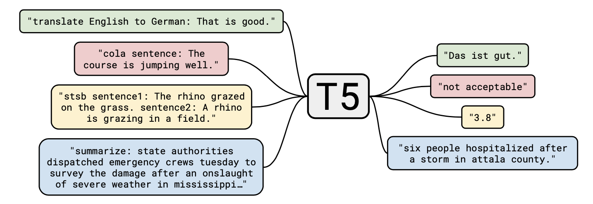
```
(ref:t5) Applications of T5 model (Source: @Raffel2019).

#### GPT-3

As previously stated, the neural architecture influences the type of
pretraining. The original GPT architecture consists of a Transformer
decoder with 12 layers (see [@Radford2018]). For decoders, it is
sensible to simply pretrain them as language models. Afterwards, they
can be used as generators to fine-tune their probability of predicting
the next word conditioned on the previous words. The models are suitable
for tasks similar to the training, including any type of dialogue and
document summarization. Transformer language models are great for
transfer learning. They are fine-tuned by randomly initializing a
softmax classifier on top of the pretrained model and training both
(with only a very small learning rate and a small number of epochs) so
that the gradient propagates through the whole network.\
The success of BERT in 2018 prompted a \"gold rush\" in NLP, in which
ever greater language models were created. One that topped the headlines
and used a customer supercluster for computation was the third iteration
of the GPT architecture by OpenAI, known as GPT-3. reveals why GPT-3 is
a famous example of current research focusing on scaling up neural
language models. While the largest T5 model has 11 billion parameters,
GPT-3 has 175 billion parameters. Moreover, the training data set
contains around 500 billion tokens of text, while the average young
american child hears around 6 million words per year (see [@Hart1995]).
The results of huge language models suggest that they perform some form
of learning (without gradient steps) simply from examples provided via
context. The tasks are specified by the in-context examples, and the
conditional probability distribution simulates performing the task to an
extent.

```{r gpt3scaling, echo=FALSE, out.width="70%", fig.cap="(ref:gpt3scaling)", fig.align="center"}
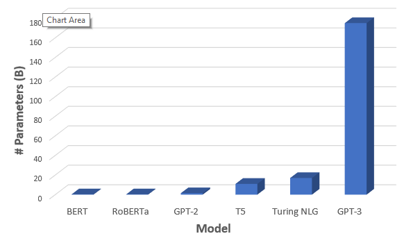
```
(ref:gpt3scaling) Comparison of number of parameters between Transformer-architectures (Source: @Saifee2020).

### Current Topics

#### Concerns regarding growing size of Language Models {#sec:concerns-lm}

As the last chapter ended with GPT-3 and emphasized the concerning trend
of ever larger language models, one could ask which other costs arise
from the developments. Risks and harms among environmental and financial
costs have been studied by [@Bender2021]. They state that marginalized
communities are not only less likely to benefit from LM progress, but
also more likely to suffer from the environmental repercussions of
increasing resource consumption. [@Strubell2019] estimated that training
a Transformer (big) model resulted in 249t of $CO_2$. To compare, an
average human is responsible for approximately 5t of $CO_2$ per year
(according to [@Ritchie2020]). In addition, they discovered that an
estimated increase of 0.1 in BLEU score increased computation costs by
\$ 150,000 (for English to German translations). Furthermore, larger
models require more data to sufficiently train them. This has resulted
in large but poorly documented training data sets. Multiple risks can be
mitigated if there is a common understanding of the model's learnings.\
Moreover, it has been argued that datasets consisting of web data
over-represent hegemonic views and encode bias towards marginalized
communities. This is among other factors due to internet access being
unevenly distributed. In particular, there is an over-representation of
younger internet users and those from developed countries. It is
generally naive to educate AI systems on all aspects of the complex
world, and hope for the beautiful to prevail ([@Bender2021]).

#### Improving Understanding of Transformer-based models

The results of transformer-based models clearly show that they deliver
successful results. However, it is less clear why. The size of the
models makes it difficult to experiment with them. Nevertheless, having
a limited understanding restrains researchers from coming up with
further improvements. Therefore, multiple papers analysed BERT's
attention in search of an improved understanding of large transformer
models. BERT is a smaller model out of the more popular ones, and its
attention is naturally interpretable because the attention weight
indicates how significant a word is for the next representation of the
current word ([@Clark2019]). In the following, some of the findings are
going to be shared.\
BERT representations are rather hierarchical than linear, and they
include information about parts of speech, syntactic chunks and roles
(see [@Lin2019] and [@Liu2019]) Furthermore, it has semantic knowledge.
For example, BERT can recognize e.g. that \"to tip a chef\" is better
than \"to tip a robin\" but worse than \"to tip a waiter\"
([@Ettinger2019]). However, it makes sense that BERT has issues with
knowledge that is assumed and not mentioned, which especially refers to
visual and perceptual properties ([@Da2019]). Additionally, BERT
struggles with inferences, e.g. even though it is known that \"people
walk into houses\" and \"houses are big\", it cannot infer that \"houses
are bigger than people\" ([@Forbes2019]).\
While it is true that different transformer heads attend to various
patterns (see ), interestingly, most of them could be neglected without
notable performance loss ([@Voita2019]). Probing attention maps can be
tedious, but allows to gain knowledge of common patterns, such as an
unexpected amount focusing on the delimiter token \[SEP\].

```{r ctattentionheads, echo=FALSE, out.width="90%", fig.cap="(ref:ctattentionheads)", fig.align="center"}
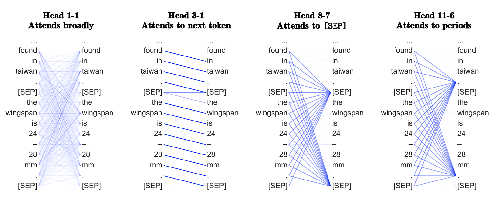
```
(ref:ctattentionheads) Common patterns of attention heads (Source: @Clark2019).


#### Few-Shot Learning

For NLP tasks, the model is usually trained on a set of labelled
examples and is expected to generalize to unseen data. Annotating is not
only costly but also difficult to gather for numerous languages,
domains, and tasks. In practice, there is often only a very limited
amount of labelled examples. Consequently, few-shot learning is a highly
relevant research area ([@Schick2020]). It defines a model that is
trained on a limited number of demonstrations to guide its predictions.
Referring back to , the benefits of lower computational and
environmental costs have to be mentioned.\
Traditional fine-tuning uses a large corpus of example tasks, and the
model is updated repeatedly with gradient steps so that it adapts to the
task with minimal accuracy error.

In contrast, few-shot applications have to complete tasks at test time
with only forward passes. They have three main parts: the task
description, examples, and the prompt. In , the task is a translation
from English to French, a few examples, as well as the word that should
be translated are given. Moreover, zero-shot and one-shot learning refer
to the model predicting with no and one learned example, respectively
([@Brown2020]).

```{r gpt3fewshotlearning, echo=FALSE, out.width="50%", fig.cap="(ref:gpt3fewshotlearning)", fig.align="center"}
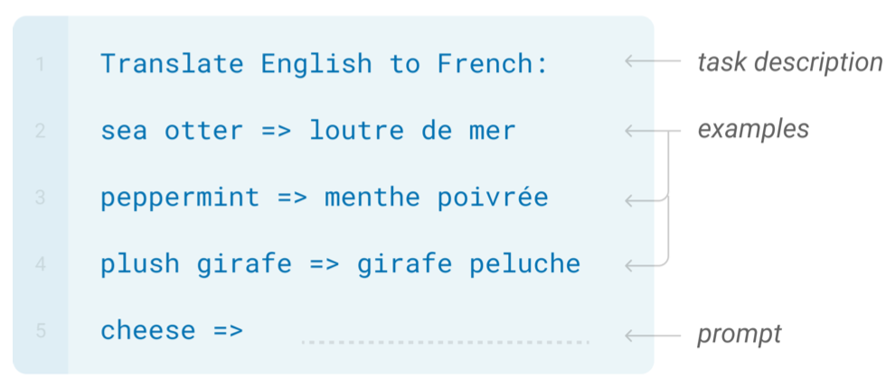
```
(ref:gpt3fewshotlearning) Few-shot learning (Source: @Brown2020).

It is complicated to create the few-shot examples, since the application
relies on them to express the task. This is why smaller models are
susceptible to examples written unfavourably. In [@Brown2020], it was
shown that few-shot performance scales with the number of model
parameters. Even though GPT-3's in-context learning improved few-shot
prompting capabilities, it is still sensitive to the order of training
examples, decoding strategy, and hyperparameter selection. All of this
combined with the fact that current research uses larger or held-out
data sets leads to the suspicion that the true few-shot ability of
language models is overestimated (see [@Perez2021]).\
Moreover, [@Lialin2022] have found that common transformer models could
not resolve compositional questions in a zero-shot fashion and that the
model's parameter count does not correlate with performance. This
indicates a limitation for zero-shot prompting with the existing
pre-training objectives. However, different models provided the best
accuracy with regard to different symbolic reasoning tasks. This
suggests that optimization or masking strategies could be more
significant than the pre-training, data set size or model architecture.

### Summary

Natural Language Processing has been one of the most exciting fields of
machine learning in the last decade considering all the breakthroughs
discussed in this work. Word embeddings made it possible and allowed
developers to encode words as dense vectors that capture their
underlying semantic content. In this way, similar words are embedded
close to each other in a lower-dimensional feature space. Another
important challenge was solved by encoder-decoder (also called
sequence-to-sequence) architectures, which made it possible to map input
sequences to output sequences of different lengths. They are especially
useful for complex tasks like machine translation, video captioning or
question answering. A significant state-of-the-art technique is
attention, which enabled models to actively shift their focus -- just
like humans do. It allows following one thought at a time while
suppressing information irrelevant to the task. As a consequence, it has
been shown to significantly improve performance for tasks like machine
translation. By giving the decoder access to directly look at the
source, the bottleneck is avoided and at the same time, it provides a
shortcut to faraway states and thus helps with the vanishing gradient
problem. One of the most recent data modelling techniques is the
transformer, which is solely based on attention and does not have to
process the input data sequentially. Therefore, the deep learning model
is better in remembering context-induced earlier in long sequences. It
is the dominant paradigm in NLP currently and makes better use of GPUs
because it can perform parallel operations. Transformer architectures
like BERT, T5 or GPT-3 are pre-trained on a large corpus and can be
fine-tuned for specific language tasks. They can generate stories,
poems, code and much more. Currently, there seems to be breaking
transformer news nearly every week with no sign of slowing. This is why
many trends could be recognized as relevant current topics. One of them
is increasing concerns regarding the growing size of language models and
the correlated environmental and financial costs. Another active
research aspect is concerned with improving the understanding of
transformer-based models to further advance them. Additionally, there
are many studies about achieving respectable results on language
modelling tasks after only learning from a few examples, which is known
as few-shot learning.
