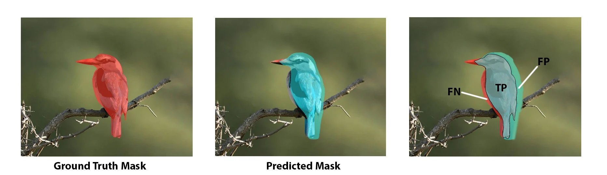

# Resources and Benchmarks for NLP, CV and multimodal tasks

*Author: Christopher Marquardt*

*Supervisor: Prof. Dr. Christian Heumann*

When  see athletes perform in their sports  only see the results of their hard work prior or till to the event. Most of the time they casually talk about their off-season, but everybody knows the results are made in the off-season. 

Same goes for the models  will see in the later chapters. We are just interested in the results, but why and how does the model come to these results? It has to learn to some key fundamentals of the modality to achieve these results. But how do they get them to perform in such a way or even better? It's possible to build better architectures and/or use more and new data to achieve this. New data by hand is easy to get but this new data results in a new problem. New data has to be carefully labeled by humans, which can be very expensive by the amount of data. Models which learn from labeled data use the supervised learning strategy. This learning strategy is a bottleneck for future progress, because of the given reasons.

But the need for labeling the data isn't the only problem. Let's visit the athlete analogy again. Imagine a professional football player has to participate in a professional ski race. He will not be able to compete with the others, because they are trained only to do ski races. Here  see the other problem. Models which use supervised learning have shown to perform very well on the task they are trained to do. This means models which learn on carefully labeled data only perform very well on this specific task, but poor on others. Also it's not possible to label everything in the world. 

So the goal is to generate more generalist models which can perform well on different tasks without the need of huge labeled data. Humans are able to perform well on different tasks in a short amount of time. For example humans only need a small amount of hours to learn how to drive a car, even without supervision. On the other hand fully automated driving AI need thousand of hours of data to drive a car. Why do humans learn so fast compared to machines?
Humans don't rely on labeled data, because most of the time humans learn by observation. By this humans generate a basic knowledge of how the world works, which also called common sense. This enables us to learn so much faster compared to machines.
Meta AI (cite blogpost) believes that self-supervised learning is one of the most promising ways to generate background knowledge and some sort of common sense in AI systems. By self-supervised learning one means a supervised learning algorithm, but it doesn't need an external supervisor. Self-supervised pre-training differs between the modalities, which means there is not an approach which works in all modalities.
The following chapter will inspect on the one hand pre-training resources and the use of them and on the other hand also the benchmarks which are used for NLP, CV and ,the combination of both, vision language pre-trained models (VL-PTM).

## Datasets
  
After pointing out that pre-training is very important one might ask how do the different modalities pre-train and how do the datasets look? At first we will inspect the last one and focus afterwards on the use of the resources.
As one might expect NLP models pre-train on text, CV models pre-train on images and MML models pre-train on text image pairs, which can somehow be seen as a combination of NLP and CV. But CV models mostly used labeled data like a picture of a dog with the corresponding single label "dog". MML datasets can contain several sentences of text which correspond to the given image.
Even if the datasets might be completely different, the procedure to get the data is the same for all of them, because the data is crafted from the internet. This can lead to a problem, since by using this method the resulting dataset might be noisy. One approach for the VL-PTM is to use common crawl and extract the image plus the alt of a image. The alt is an alternate text for an image, if the image cannot be displayed or for visual impaired people. This seems like a reasonable approach, but the alt is often not very informative about what's in the image. (maybe add example)
Another difference between the modalities is the cardinality of the pre-training data. It's easy to realize that text is by far easiest to crawl from the internet. This results in huge high-quality massive text data. Some magnitudes smaller are the datasets for CV. Since MML is pretty new compared to the other modalities it still relatively small but growing fast. A small downer is that some of the datasets are not public available. The big companies like to keep their models and used datasets private, which hinders the reproducibility, but there are also real open AI competitors like LAION and Eleuther in the field. 
The next chapter will provide some of the most used pre-training datasets.
As already mentioned, extracting text from the internet is rather easy. More precisely there is a non-profit organization, called [Common Crawl](https://commoncrawl.org), which does exactly this. They provide copies of the internet to researchers, companies and individuals at no cost for the purpose of research and analysis. The Common Crawl corpus contains petabytes of data collected since 2008. Every month, Common Crawl releases a snapshot of the web obtained by randomly exploring and sampling URLs. It contains raw web page data, extracted metadata and text extractions. The advantages of Common Crawl come along with their disadvantages. The text is from diverse domains but with varying quality of data. To handle the raw nature of the datasets one often has to use a well-designed extraction and filter to use the datasets appropriately [@gao2020pile]. For example GPT-3 uses a filtered version of Common Crawl, which consists of 410 billion tokens [@brown2020language]. So it's freely available but one needs to use well-designed extraction and filtering to really use the dataset.
Recent work [@rosset2020turing] showed that diversity in training datasets improves general cross-domain knowledge and downstream generalization capability for language models. The Pile [@gao2020pile] was introduced to address exactly these results. The Pile contains $22$ sub-datasets, including established NLP datasets, but also several newly introduced ones. The size of the $22$ sub-datasets, which can be categorized roughly into 5 categories, pile up to around $825$ GB of data.
The following treemap shows the distribution of the dataset.

```{r pile treemap, echo=FALSE}
htmltools::includeHTML("data/01-chapter1/CompositionPile.html")
# Plot passt leider noch nciht ganz. Aus einem Grund kommt eine Category nicht obwohl sie im .html sonst gezeigt wird
# label
```

While only 13% of the world’s population speaks English, the vast majority of NLP research is done on English. @gao2020pile followed this trend, but did not explicitly filtered out other languages when collecting our the data. This leads to the fact that roughly 95\% of the Pile is English. Also EuroParl [@koehn2005europarl], a multilingual parallel corpus introduced for machine translation, is included in the Pile. To train GPT-2 Open AI collected data from WebText. WebText is an internet dataset created by scraping URLs extracted from Reddit submissions with a minimum score for quality, but sadly it was never released to the public. Independent researchers reproduced the pipeline and released the resulting dataset, called OpenWebTextCorpus [@Gokaslan2019OpenWeb] (OWT).  Eleuther created an enhanced version of the original OWT Corpus called OpenWebText2. It  covers all Reddit submissions from 2005 up until April 2020. It covers content from multiple languages, document metadata, multiple dataset versions, and open source replication code. They also explicitly included a dataset of mathematical problems (DeepMind Mathematics) to improve the mathematical ability of language models trained on the Pile. An ArXiv dataset was in included in the hopes that it will be a source of high quality text and math knowledge, and benefit potential downstream applications to research in these areas and also because arXiv papers are written in LaTeX. Training a language model to be able to generate papers written in LaTeX could be a huge benefit to the research community. Since CC needs further steps,  due to the raw nature of CC, to really use is. Pile-CC is Common Crawl-based dataset, which can be used directly. It yields higher quality output than directly using the WET files. 
These were only some of the 22 included datasets. A more detailed description of the sub-dataset and the reasons why these were included can be found in the corresponding paper [@gao2020pile].
Another pre-cleaned version of CC is CC-100[@wenzek2019ccnet]. They present a pipeline to create curated monolingual corpora in more than 100 languages. A filter, which covers the data based on their distance to Wikipedia, is used and this improves the quality of the resulting dataset. However, its English portion is much smaller than the Pile. But a multilingual dataset might help a low-resource language acquire extra knowledge from other languages. Perhaps the most multilingual corpus publicly available, containing 30k sentences in over 900 languages, is the Bible corpus [@mayer2014creating].
Till now all datasets were freely available and almost directly usable. The next one is not public available for some reasons. 
To provide mT5 [@xue2020mt5], which is multilingual pre-trained text-to-text transformer, a suitable pre-training dataset, Google Research designed a dataset including more than 100 languages. The dataset is called mC4 [@xue2020mt5]. Since some languages are relatively scarce on the internet, they used all of the 71 monthly web scrapes released so far by Common Crawl. It contains 6.6 billion pages and 6.3 trillion tokens. A smaller version of the mC4 is also used by Google Research. The smaller dataset C4 was explicitly designed to be English only. The C4 dataset is a collection of about $750$GB of English-language text sourced from the public Common Crawl web.
Most of the datasets used in NLP are derived entirely from Common Crawl and @rosset2020turing came to the result, that the current best practice in training large- scale language models involve using both large web scrapes and more targeted, higher-quality datasets, which the Pile directly addresses. 
The last dataset for NLP is the BooksCorpus dataset [@zhu2015aligning]. The BooksCorpus uses books from yet unplished authors from the web. Only books with more than 20k words were included to filter out shorter, noisier stories.
This results in around 11k books from 16 different genres. So more than 74 million sentences can be used in pre-training. BooksCorpus contains a sample of books from [a distributor of indie ebooks](https://www.smashwords.com). Sadly a datasheet about the BooksCorpus was not releasd with the corresponing paper. Frankly there was just an paragraph about the content and the extraction inside the paper. @bandy2021addressing addressed exactly this short coming. They provided a retrospective datasheet about the BooksCorpus. Some of their major concerns were copyright violations, duplicate books, skewed genre representation, potentially skewed religious representation and also problematic content (18+ content). Little harm can be expected if an informed adults reads books with these concers, but how does a language model contribute to for example well-documented gender discrimination if it trains on these books. Since BookCorpus is no longer distributed, one has to visit the distributor of the [indie ebooks](https://www.smashwords.com) and collect a own version of the BookCorpus. This is one of the user-based dataset, besides to the datasets of the Pile.

The next inspected modality is CV. Almost every state-of-the-art CV model uses a classifier pre-trained on an ImageNet based dataset. ImageNet uses the hierarchical structure of WordNet [@fellbaum2010wordnet]. At the release of ImageNet-1k the amount of classes was unheard at this time point. Datasets like CIFAR-10 [@krizhevsky2009learning] and CIFAR-100 [@krizhevsky2009learning] had 10 and 100 classes, but ImageNet1k had 1000 different classes and this was not the only major improvement. They also increased the resolution from $32 \times 32$ to $256 \times 256$.  In all, there are roughly 1.2 million training images, 50,000 validation images, and 150,000 testing images. The ImageNet-1k dataset is a subset of the ImageNet dataset [@deng2009imagenet]. The full ImageNet dataset is also called ImageNet-21k. It consists of more than 14 million images, divided in almost 22k classes. Because of this some paper described it as ImageNet-22k. Those two dataset do not only differ by the amount of classes, but also by the type of labels. The labels of ImageNet-21k are not mutually exclusive. Because of this the pre-training wiht ImageNet-1k is far more popular. Also the ImageNet-21k dataset lacks an official train-validation split, which is just another reason why ImageNet-1k is more popular. The raw dataset ImageNet-21k is around 1.3 terabyte (TB). It's also nice, that the the dataset of ImageNet are open available. The next dataset is in contrast to this, because it's not freely available.
The Joint-Foto-Tree (JFT) 300M is one of the follow up version of the JFT dataset [@hinton2015distilling]. Given the name it consists of 300 million images and on average each image has 1.26 labels. The whole datasets has around 375 million labels. These labels can be divided into 18291 classes. These categories form a rich hierarchy with the maximum depth of hierarchy being 12 and maximum number of child for parent node being 2876 [@sun2017revisiting]. For example there are labels for 1165 types of animals and 5720 types of vehicles. The work states that approximately 20% of the labels in this dataset are noisy [@sun2017revisiting], because the labels are generated automatically. It also provides the fact, that the distribution is heavily long-tailed, which means that some of the classes have less than 100 images. There is also an extendend version of the JFT dataset. It's called Entity-Foto-Tree (EFT), ecause the class labels are physical entities organized in a tree-like hierarchy, which contains 20 diversified verticals and consists of 100k classes. It's even rarely used  in practice by Google because of the intolerable large model size and the slow training speed [@gao2017knowledge]. Honestly nobody really knows what is inside these datasets JFT and EFT datasets, except Google and they never published a datasheet about it.
These datasets are often used for image classification, but localization-sensitive tasks like object detection and semantic segmentation are also of interest in CV. Objects365 [@shao2019objects365] is a large-scale object detection and semantic segmentation freely available dataset. It contains  365 object categories with over 600K training images. More than 10 million, high-quality bounding boxes are manually labeled through a three-step, carefully designed annotation pipeline. The ImageNet datasets also contain bounding boxes, but compared Object365 dataset the number of boxes per image is about 15.8 vs 1.1 [@deng2009imagenet]. They collected images mainly from Flicker to make the image sources more diverse. All the images conform to licensing for research purposes. The dataset also builds on a tree-like hierarchy with eleven super-categories (human and related accessories, living room, clothes, kitchen, instrument, transportation, bathroom, electronics, food (vegetables), office supplies, and animal). Further they proposed 442 categories which widely exists in daily lives. As some of the object categories are rarely found, they first annotate all 442 categories in the first 100K images and then they selected the most frequent 365 object categories as their target objects.
To enable compatibility with the existing object detection benchmarks, the 365 categories include the categories defined in Microsoft Common Objects in Context (COCO) [@lin2014microsoft], which is described in the next paragraph.
Microsoft decided to employed a novel pipeline for gathering data with extensive use of Amazon Mechanical Turk. Their goal was to create a non-iconic image collection. Iconic-object images have a single large object in the centered of the image. By this they provide high quality object instances, but they also lack information of contextual important and non-canonical viewpoints [@lin2014microsoft]. Recent work showed that non-iconic images are better at generalizing [@torralba2011unbiased]. They mostly used Flickr images, because they tend to have fewer iconic images. This results in a collection of 328,000 images. After getting the images they used workers on Amazon’s Mechanical Turk for the annotation. The workers got a list with 91 categories and 11 super-categories. At first a worker had to decide if a super-category (e.g. animal) was present or not. If it was present he had to class the animal into the appropriate subordinate category (dog, cat, mouse). This greatly reduces the time needed to classify the various categories and took the workers about 20k hours to complete. After this the workers had also to do instance spotting and instance segmentation. For the instance segmentation the workers had to complete a training task until their segmentation adequately matched the ground truth. Only 1 in 3 workers passed this training stage. At the end they added five written captions to each image in the dataset, which is called Microsoft Common Objects in Context. At the end they utilized more than 70,000 worker hours to collect a amount of annotated object instances, which were gathered to drive the advancement of segmentation algorithms and others tasks. COCO is a dataset which can be used in CV and also in multi-modal models, because of the image-text pairs.
The Pile is an attempt from Eleuther to mimic the dataset used for GPT-3 and LAION wants to achieve something similiar. Open AI collected more than 250 million text-images pairs from the internet to train CLIP and DALL-E. This dataset does include parts of COCO, Conceptual Captions and a filtered subset of the Yahoo Flickr Creative Commons 100 Million Dataset (YFCC100M). YFCC100M contains of a total of 100 million media objects. The collection provides a comprehensive snapshot of how photos and videos were taken, described, and shared over the years, from the inception of Flickr in 2004 until early 2014. Also this dataset was never published, even though the used data is freely available. To address this LAION created the LAION-400M. LAION-400M [@schuhmann2021laion] consists of 400 million image-text pairs. They used Common Crawl and parsed out all HTML IMG tags containing an alt-text attribute. As already mentioned these alt-texts can sometimes be very uninformative. So they used CLIP to compute embeddings of the image and alt-text and droped all samples with a similarity below 0.3. The dataset also contains the CLIP embedding and kNN indices. @schuhmann2021laion describes the procedure to create the dataset in an open manner. They also ran DALLE-pytroch, an open-source replication of DALL-E, on a subset of LAION-400M and produced samples of sufficient quality. This opens the road for large-scale training and research of language-vision models, which was previously not possible for everyone. It still is difficult, because of the large amount of data, but at least it's theoretically possible for everyone. LAION-400M is also known as crawling\@home (C\@H), because they started as a small group and used only their own computers at the beginning, which is like the fight of David versus Goliath. End of March 2022 the team of LAION released a $14 \times$ bigger than LAION-400M dataset called LAION-5B. It consists of 5.85 billion CLIP-filtered image-text pairs. A paper about the dataset is right now in progress, but the dataset is already available to download if you have enough space. The size of the dataset is about $240$ TB in $384$ or 80 TB in $224$. Due to the nature of the extraction 2,3 billion contain English language, 2,2 billion samples from 100+ other languages and they also provide a [search demo](https://rom1504.github.io/clip-retrieval/?back=https%3A%2F%2Fknn5.laion.ai&index=laion5B&useMclip=false). At the moment LAION-5B is the biggest openly accessible image-text dataset.
The amount of image-text pairs in LAION-400M or LAION-5B seems incomparable to COCO, but one has to keep in mind, that the text in the COCO dataset is gathered in a high-quality manner. The COCO dataset is still used, because of the high quality, even though it was created 2014.
Localized Narratives choose a new form of connecting vision and language in multi-modal image annotations [@pont2020connecting]. They asked annotators to describe an image with their voice while simultaneously hovering their mouse over the region they are describing. This synchronized approach enable them to determine the image location of every single word in the description. Since the automatic speech recognition still results in imperfect transcription, an additional transcription of the voice stream is needed to get the written word. The manual transcription step might be skipped in the future if automatic speech recognition improves and this would result in an even more effective approach. They collected Localized Narratives for, the earlier introduced, COCO [@lin2014microsoft] dataset, ADE20K [@zhou2017scene], Flickr30k & 32k datasets [@young2014image] and 671k images of Open Images[@kuznetsova2020open]. Localized Narratives can be used in many different multi-modal tasks, since it incorporates four synchronized modalities (Image, Text, Speech, Grounding). Another difference is that the captions are longer than in most previous datasets [@krishna2017visual; @kuznetsova2020open; @lin2014microsoft]. Models like Imagen [@saharia2022photorealistic] and Parti [@parti] use long prompts. Beside to that the 849k images with Localized Narratives are publicly available [@LocNarWeb]. 
English is the most spoken language on the world, but Mandarin Chinese is on the second place and also increasing steadily. So we will also present a large-scale Chinese multi-modal dataset WuDaoMM [@yuan2022wudaomm]. Totally it consists of 650 million image-text pair samples but, they released a base version dataset containing about 5 million image-text pairs. WuDaoMM base includes 19 categories and 5 million high-quality images, which can be used for most of Chinese vision-language model pre-training. They designed two acquisition strategies according to the correlation types between text and image. Their collection included data with weak relations, by this they mean that the texts don't hvae tp precisely describe their corresponding images to be retained, and  data with strong relations. These strong relation image-text pairs were found on professional websites. Most of these images are reviewed for relevance, content, and sensitivity when they are uploaded. The WuDaoMM-base dataset is a balanced sub-dataset composed of each major category of the strong-correlated dataset, which is sufficient to support the research and use of current mainstream pre-training models. 
The Wikipedia Image Text (WIT) Dataset ends this chapter. Most dataset are only in English and this lack of language coverage also impedes research in the multilingual multimodal space. To address these challenges and to advance in research on multilingual, multimodal learning they presented WIT [@srinivasan2021wit]. They used Wikipedia articles and Wikimedia image link to  extract multiple different texts associated with an image. Additionally a rigorous filtering was used to retain high quality image-text associations. This results in a dataset, which contains more than 37.6 million image-text sets and spans 11.5 million unique images. Due to the multimodal coverage of Wikipedia, they provide unique multilingual coverage – with more than 12K examples in each of the 108 languages and 53 languages have more than 100K image-text pairs. Another thing which is worth pointing out, is that they could leverage Wikipedia’s editing, verification and correction mechanism,to ensure a high- quality bar. This curation can be seen an huge difference compared to the approach (web crawls) used to create other existing datasets. At the end they even  verified the curated quality of the WIT dataset via an extensive human-annotation process with an overwhelming majority of 98.5% judging the randomly sampled image-text associations favorably.
These datasets were just some of the more used dataset. Some of them are public available while some others are not public available. Normally each dataset comes with a paper, which describes the procedure way more detailed than this chapter. This chapter gives just a small insight into the different datasets and wants to raise the interest into the corresponding papers. [Papers with code](https://paperswithcode.com/) deliver research papers with code implementations by the authors or community. One can get information about the State-of-the-Art for every modality and even more. They also provide available datasets for all possible tasks.
Datasets are critical for research and exploration as, rather obviously, data is required for performing experiments, analyzing designs, and building applications. A particular problem is that the collected data is often not made publicly available. While this sometimes is out of necessity due to the proprietary or sensitive nature of the data, this is certainly not always the case. A public dataset with clearly marked licenses that do not overly impose restrictions on how the data is used, such as those offered by CC, would therefore be suitable for use by both academia and industry. But one has to keep in mind that an effective dataset is a catalyst and accelerator for technological development [@yuan2022wudaomm]. This may be a reason, why the big companies don't share their datasets, but there are also some other reasons for sure. The next chapter will show how these resources are used to pre-train.

## Pre-Training Tasks
Yann LeCun and Ishan Misra suggest in their [blogpost](https://ai.facebook.com/blog/self-supervised-learning-the-dark-matter-of-intelligence/) that supervised pre-training is gone because of the already mentioned reasons at the beginning and the future will be self-supervised pre-training [@darkMatter]. Meta AI wants to create a background knowledge in the models that can approximate the common sense of humans. This suggestion is even more reasonable, because recent work [@unsupBrain] also showed that a self-supervised or a unsupervised pre-training approach is biologically more plausible than supervised methods. This why neuroscientists are taking interest in unsupervised and self-supervised deep neural networks in order to explain how the brain works [@zhuang2021unsupervised].
Self-supervised learning (SSL) is also called predictive learning. This comes by the nature of the process. The general technique of self-supervised learning is to predict any unobserved or hidden part (or property) of the input from any observed or unhidden part of the input [@darkMatter]. Models like BERT and GPT-3 both use masked language modeling (MLM) as a pre-training task. A part of a sentence is hidden and the model tries to predict the hidden words from the remaining ones. Predicting missing parts of the input is one of the more standard tasks for SSL pre-training. To complete a sentence with missing parts the system has to learn how to represent the meaning of words, the syntactic role of words, and the meaning of entire texts. 
These missing parts tasks are easy to implement in NLP compared to CV. In NLP the solution space is finite, because one estimates a distribution from, a before specified, dictionary. In CV the solution space is infinite, because it is not possible to explicitly represent all the possible frames and associate a prediction score to them [@darkMatter]. 
Meta AI proposed an unified view of self-supervised method. They say an energy-based model (EBM) is a system that, given two inputs, x and y, tells us how incompatible they are with each other [@darkMatter]. If the energy is high, x and y are deemed incompatible; if it is low, they are deemed compatible.
The idea sounds simple but it is difficult to achieve this. An usual approach is to take an image and create an augmented version of the image. By this approach the energy has to be low, because it's from save picture. For example one can gray scale the image. By this we say the model the color does not matter. @bromley1993signature proposed this kind of approach under the name Siamese networks. The difficulty is to make sure that the networks produce high energy, i.e. different embedding vectors, when x and y are different images. The problem is that these Siamese networks tend to collapse. When a collapse occurs, the energy is not higher for nonmatching x and y than it is for matching x and y. So the networks ignore their input and produce the same embeddings. 
This lead to so called contrastive methods. The method used to train NLP systems by masking or substituting some input words belongs to the category of contrastive methods. Contrastive methods are based on the simple idea of constructing pairs of x and y that are not compatible, and adjusting the parameters of the model so that the corresponding output energy is large. The problem is that they are very inefficient to train. For a contrastive methods one needs so called hard negatives. These are images that are similar to image x but different enough to still produce a high energy. This is a major issue of contrastive methods. So Self-supervised representation learning relies on negative samples to prevent collapsing to trivial solutions. 
So the best idea is to get rid of the hard negatives and BYOL [@grill2020bootstrap] is one approach that achieved exactly this.
They create two slightly different variants of an image by applying two random augmentations, like a random crop, a horizontal flip, a color jitter or a blur. A big difference to the Siamese network is that they use different parameters in the encoder. They use so called online and target parameters. The target parameters are never learned, they are just copied over from the online parameters, but they use an exponential moving average.So it's some kind of a lagged version of the online parameters. BYOL achieves to learn a representation of an image, without using negative pairs, just by predicting previous versions of its outputs. Still they say, that BYOL remains dependent on existing sets of augmentations and these augmentations require human intention and automating the search for these augmentations would be an important next step, if this is even possible [@grill2020bootstrap].
@he2022masked recently came very close to the MLM pre-training used in BERT with their masked autoencoder (MAE). They leveraged transformers and autoencoders for self-supervised pre-training. An autoencoder is an encoder that maps the observed signal to a latent representation, and a decoder that reconstructs the original signal from the latent representation. The MAE is a form of denoising autoencoding exactly like the MLM. Their approach is to divide an image into, for example, 16 $\times$ 16 patches. Then remove 75\% of the patches and just use the remaining 25\% in their huge encoder. Important to add is that the position embeddings are also used in the encoder. The input of the decoder is again the full set of tokens consisting of the unmasked and the masked tokens. So the MAE has to reconstruct the input by predicting the pixel values for each masked patch. Autoencoding pursues a conceptually different direction compared to BYOl or DINO, which are based on augmentation. Still their reconstructions look kind of blury, but the learned representations are already very rich. Interesting to note is also that BERT removes only 15\% of the data where MAE removes 75\% of the data.
Dual encoder models like CLIP [@radford2021learning] and ALIGN [@jia2021scaling] demonstrated in the past that contrastive objectives on noisy image-text pairs can lead to strong image and text representations. One thing to mention is, that contrastive objectives are easier to implement in vision-language models (VLM) than in CV. This comes from the fact that VLM use image-text pairs. As a dual encoder CLIP encodes the image and text. By construction the text which corresponds to the image or vice versa achieves the highest similarity and the other texts will have a lower similarity. So one already has some hard negatives and don't has to search for some.
Through the SSL the models already learned a good representation of the given input, but fine-tuning the models lead to even better results. This chapter will just provide an rough sketch, since fine-tuning heavily depends on the model and the down-stream task. Also fine-tuning will be shown in later chapters. Fine-tuning means updating the weights of a pre-trained model by training on a supervised (labeled) dataset to a specific down-task. A huge amount of data is needed to pre-train a model. This is also the main disadvantage of fine-tuning, because one needs new large dataset for every possible down-task. 
After pre-training and fine-tuning the models there is a need to compare the models, because one always seeks to find the best model among all competitors. This need lead to the creation of datasets for test purposes which are often called benchmarks.

## Benchmarks

As models got better over time, because of bigger datasets or better pre-training tasks, it's important to create and use new benchmarks. Interestingly there are also benchmarks, which rely only on Zero-Shot performance. Zero-shot learning (ZSL) is a problem in machine learning, where during test time, a learner observes samples from classes not observed during training when the learner needs to predict sample class.

Benefit noch nennen/ warum ZSL gut sein kann. Bias im DS kann nicht ausgenutzt werden

But the most common approach is to use some of the datasets which were used to train the models. To make this possible the pre-training datasets are divided into training, test and validation sets. It's clear that the models must not be tested on the training data. Some of the already mentioned datasets like COCO are often used for CV or VLM. Like already mentioned almost every state-of-the-art CV model uses a classifier pre-trained on an ImageNet based dataset and afterwards benchmarked on the validation sets of the dataset. Pre-training on large internet datasets may lead to the unintentional overlap of pre-training and down-tasks. Because of this many studies [@radford2021learning, @parti, @brown2020language] conducted a de-duplication analysis. CLIP analysis resulted in a median overlap of 2.2\% and an average overlap of 3.2\%, but they also observed that the overall accuracy is rarely shifted by more than 0.1\% [@radford2021learning]. @mahajan2018exploring, @kolesnikov2019large also came to the similar results. Still it's important to analyse and keep that in mind. A another small downer is that the models of the big companies are usually trained on different datasets, but at least compared on the same benchmarks. So the comparison seems a bit odd. Maybe the better performance of the models  come from the different used datasets. The benchmarks on which the models of the different modalites are tested will be shown now. 

### Benchmarks NLP
The goal of NLP is the development of general and robust natural language understanding systems. Through SSL models gain a good “understanding” of language in general. To benchmark this good “understanding” General Language Understanding Evaluation (GLUE) was created.  It's a collection of nine different task datasets. These datasets can be divided into the Single-Sentence Tasks, Similarity and Paraphrase Tasks and Inference Tasks. 
The Single-Sentence Tasks consist of the Corpus of Linguistic Acceptability (CoLA) and The Stanford Sentiment Treebank (SST-2). Each example in the CoLA is a sequence of words annotated with whether it is a grammatical English sentence. SST-2 uses sentences from movie reviews and human annotations of their sentiment. The task is to predict the sentiment of a given sentence. 
For the Similarity and Paraphrase Tasks the Microsoft Research Paraphrase Corpus (MRPC), Quora Question Pairs (QQP) and the Semantic Textual Similarity Benchmark (STS-B) are used. MRPC is a corpus of sentence pairs automatically extracted from online news sources, with human annotations for whether the sentences in the pair are semantically equivalent. The model has to predict if sentence B is a paraphrase of sentence A. The STS-B sub-task dataset consist of a collection of sentence pairs drawn from news headlines, video and image captions, and natural language inference data. Each pair is human-annotated with a similarity score from 1 to 5. The task for the model is to predict these similarity scores. QQP is a collection of question pairs from the community question-answering website Quora. Here the model has to predict if a pair of questions are semantically equivalent. 
Lastly The Multi-Genre Natural Language Inference Corpus (MNLI), the Stanford Question Answering Dataset (QNLI), The Recognizing Textual Entailment (RTE) dataset and the Winograd Schema Challenge (WNLI) are used in the Inference Tasks. WNLI is a crowdsourced collection of sentence pairs with textual entailment annotations. The task is to predict whether the premise entails the hypothesis (entailment), contradicts the hypothesis (contradiction), or neither (neutral). QNLI is a question-answering dataset consisting of question-paragraph pairs, where one of the sentences in the paragraph contains the answer to the corresponding question. The task is to determine whether the context sentence contains the answer to the question. RTE comes from a series of annual textual entailment challenges. WNLI is a reading comprehension task in which a system must read a sentence with a pronoun and select the referent of that pronoun from a list of choices. In table BLA is a short summary of all GLUE tasks.

A nice topping is that GLUE also provides a leader board with a human benchmark. So the models can compete against each other and a human benchmark. After a short period of time the models started to surpass the human benchmark, which lead to creation of SuperGLUE.
SuperGLUE consists of a public leaderboard built around eight language understanding tasks, drawing on existing data, accompanied by a single-number performance metric, and an analysis toolkit. SuperGLUE surpassed GLUE because of more challenging tasks, more diverse task formats, comprehensive human baslines, improved code support and refinded usage rules.
The following figure gives a short summary of the SuperGLUE tasks.


These are more or less reduced to a classification problem and we will focus on the later, but it's also of interest to check if the models understand what they are reading. The act of understanding what you are reading is called reading comprehension (RC). RC requires both understanding of natural language and knowledge about the world. @rajpurkar2016squad introduced the Stanford Question Answering Dataset (SQuAD), a large reading comprehension dataset on Wikipedia articles with human annotated question-answer pairs. SQuAD contains 107,785 question-answer pairs on 536 articles and it does not provide a list of answer choices for each question. The model must select the answer from all possible spans in the passage, thus needing to cope with a fairly large number of candidates. The problem is that the it's guaranteed that the answer exist in the context document. To address this weakness @rajpurkar2018know presented SQuAD 2.0, the latest version of SQuAD. SQuAD 2.0 combines existing SQuAD data with over 50,000 unanswerable questions written adversarially by crowdworkers to look similar to answerable ones. @rajpurkar2018know contribution to NLP is not that they provide a deeper glimpse into the workings of QA systems, they also facilitated the creation of more non-English datasets. Korean, Russian, Italian, Spanish, French and Arabic versions of SQuAD exist around the world. XQuAD, MLQA and TyDi are multilingual question-answering datasets. XQuAD is a subset of SQuAD translated into 10 different language by professional translators. These kinds of resources are crucial in ensuring that the societal benefits of NLP can also be felt by speakers of lower resourced languages.
The mentioned ones are rather old compared to Beyond the Imitation Game Benchmark (BIG-bench) [@srivastava2022beyond]. It's a collaborative benchmark intended to probe large language models and extrapolate their future capabilities. BIG-bench already contains more than 200 tasks. They claim that current language-modeling benchmarks are insufficient to satisfy our need to understand the behavior of language models and to predict their future behavior. They mainly provide three reasons for that. One of them is the short useful lifespans. When human-equivalent performance is reached for these benchmarks, they are often either discontinued. One might call this “challenge-solve-and-replace” evaluation dynamic (Zitat). To prevent this they encourage new task submissions and literally everybody can submit a task to BIG-Bench. So they call BIG-bench a living benchmark. The review of the tasks is based on ten criteria. It includes for example "Justification". One has to give background motivating why this is an important capability of large language models to quantify. With the inclusion of small tasks they want to improve the diversity of topics covered and enable domain experts to contribute tasks without the difficulties of distributed human labeling. The another reason for the insufficients is because the others benachmarks are narrowly targeted, and because their targets are often ones that language models are already known to perform. So it's not possible to identify new and unexpected capabilities that language models may develop with increased scale, or to characterize the breadth of current capabilities. Finally, many current benchmarks use data collected through human labeling that is not performed by experts or by the task authors. Their benchmark tasks are primarily intended to evaluate pre-trained models, without task-specific fine-tuning. By focusing on such tasks in the zero- and few-shot evaluation setting, it becomes possible to provide meaningful scores for even those tasks with a very small number of examples.The "everybody can submit" strategy also leads to inclusion a variety of tasks covering non-English languages. Till now the large language models, like GPT-3 and PaLM, perform poorly on BIG-bench relative to expert humans, which is maybe a good sign for the future. But superhuman performance on SuperGLUE benchmark was achieved less than 18 months after it was produced (Zitat BIG-Bench). Hier noch Beispiele so wie oben.
There is a family of datasets which is the most popular datasets used to benchmark machine translation systems. [Workshop on Machine Translation (WMT)](https://machinetranslate.org/wmt) is the main event for machine translation and machine translation research. This conference is held annually. WMT includes competitions on different aspects of machine translation. These competitions are known as shared tasks. Typically, the task organisers provide datasets and instructions. Then teams can submit their output of their models. The submissions are ranked with human evaluation. Most of the models are evaluated on bi-lingual translation like English-to-German, but there are also tri-linguar tasks like using English to improve Russian-to-Chinese machine translation. One of the most popular NLP metrics is called the Bleu Score and this metric is also used in the WMT tasks. It is based on the idea that the closer the predicted sentence is to the human-generated target sentence, the better it is. Bleu Scores are between 0 and 1, but a score of 0.6 or 0.7 is considered the best you can achieve.
Problematic is that @bowman2021will claim that the evaluation for many natural language understanding (NLU) tasks is broken. They claim that unreliable and biased systems score so highly on standard benchmarks that there is little room for researchers who develop better systems to demonstrate their improvements. 
They provide four criteria to handle this:

 1. Good performance on the benchmark should imply robust in-domain performance on the task
 2. Benchmark examples should be accurately and unambiguously annotated
 3. Benchmarks should offer adequate statistical power
 4. Benchmarks should reveal plausibly harmful social biases in systems, and should not incentivize the creation of biased systems
 
Building new benchmarks that improve upon these four axes is likely to be quite difficult.

### Benchmarks CV

CV models try to answer visual tasks. A visual task is a task which can be solved only by visual input. Often visual task can be solved as a binary classification problem, which is called image classification, but there are also numerous other applications for CV. This chapter will focus on image classification, semantic segmentation and object detection with their usual benchmarks datasets.
It's not only common to pre-train your model on ImageNet datasets it's also common to benchmark the models on them. There are many different variants of ImageNet. There is ImageNet-R, a version with non-natural images such as art, cartoons and sketches, or ImageNet-A, which is a a more challenging version because they use adversarial images [@goodfellow2014explaining], or ImageNet-V2 [@recht2019imagenet]. The last was created to check whether there is an over-fitting on the classic pre-training ImageNet dataset. They followed the creation process of the original dataset and tested to what extent current classification models generalize to new data. @recht2019imagenet found accuracy drops for all models and suggested that these drops are not caused by adaptivity, but by the models’ inability to generalize to slightly “harder” images than those found in the original test sets. The goal of image classification is to classify the image by assigning a label. Typically, Image Classification refers to images in which only one object appears. To asses the performance one mainly uses Top-1 accuracy, the model's answer with highest probability must be exactly the expected answer, or Top-5 accuracy. Top-5 accuracy means that any of five highest probability answers must match the expected answer. @beyer2020we tried to answer the question "Are we done with ImageNet?". Many images in the ImageNet dataset contain a clear view on a single object of interest: for these, a single label is an appropriate description of their content. However many other images contain multiple, similarly prominent objects, limiting the relevance of a single label [@beyer2020we]. In these cases, the ImageNet label is just one of many equally valid descriptions of the image and as a result an image classifier can be  penalized for producing a correct description that happens to not coincide with that chosen by the ImageNet label. In short a single label per image is not sufficient in many cases. They concluded yes and no. The shortcomings of ImageNet labels and their accuracy were identified and they provided a new ImageNet validation set ReaL [@beyer2020we] ("Reassessed Labels") and also a new metric, called ReaL accuracy [@beyer2020we]. The ReaL accuracy measures the precision of the model’s top-1 prediction, which is deemed correct if it is included in the set of labels. these findings suggested that although the original set of labels may be nearing the end of their useful life, ImageNet and its ReaL labels can readily benchmark progress in visual recognition for the foreseeable future.
An addition of a localization tasks to the classification tasks results into  object detection. It is used to analyze more realistic cases, like mentioned above, in which multiple objects may or may not exist in an image. The location of an object is typically represented by a bounding box. In the recent years, the Microsoft COCO dataset or the Object365 data have become the standards to evaluate object detection algorithms, but it's also possible to use a ImageNet dataset. The primary challenge metric is called mean Average Precision (mAP) at Intersection over Union (IoU) $=$.50:.05:.95. The IoU is the intersection of the predicted and ground truth boxes divided by the union of the predicted and ground truth boxes. IoU, also called Jaccard Index, values range from 0 to 1. Where 0 means no overlap and 1 means perfect overlap. But how is precision captured in the context of object detection? Precision is known as the ratio of $True~Positive/(True~Positive+False~Positive)$. With the help of the IoU threshold, it's possible to decide whether the prediction is True Positive(TP), False Positive(FP), or False Negative(FN). The example below shows predictions with IoU threshold ɑ set at 0.5.


The .50:.05:.95 means that one uses 10 IoU thresholds of $\{0.50, 0.55, 0.60, \dots ,0.95\}$. COCO uses this as primary metric, because it rewards detectors with better localization [@coco_eval].

Object detection and image segmentation are both tasks which are concerned with localizing objects of interest in an image, but in contrast to object detection image segmentation focuses on pixel-level grouping of different semantics.
Image segmentation can be splitted into various tasks including instance segmentation, panoptic segmentation, and semantic segmentation. Instance segmentation is a task that requires the identification and segmentation of individual instance in an image. Semantic segmentation is a task that requires segmenting all the pixels in the image based on their class label. Panoptic segmentation is a combination of semantic and instance segmentation. The task is to classify all the pixels belonging to a class label, but also identify what instance of class they belong to. Panoptic and instance segmentation is often done on COCO. Semantic segmentation can be done one ADE20K[@zhou2017scene]. ADE are the first three letters of the name Adela Barriuso, who single handedly annotated the entire dataset and 20K is a reference to being roughly 20,000 images in the dataset. This dataset shows a high annotation complexity, because any image in ADE20K contains at least five objects, and the maximum number of object instances per image reaches 273. To asses the performance of a model on the ADE20K dataset one uses the mean IoU. It indicates the IoU between the predicted and ground-truth pixels, averaged over all the classes. In contrast to the object detection task, the definition of TP, FP, and FN is slightly different as it is not based on a predefined threshold. TP is now the area of intersection between Ground Truth and segmentation mask. FP is the predicted area outside the Ground Truth. FN is the number of pixels in the Ground Truth area that the model failed to predict. The calculation of IoU is the same as in object detection tasks. It's the intersection of the predicted and ground truth boxes aka. TP divided by the union of the predicted and ground truth boxes, which is essentially $TP + FN + FP$.
A example is shown down below.



Visual understanding goes well beyond object recognition or semantic segmentation. With one glance at an image, a human can effortlessly imagine the world beyond the pixels. This is emphasized by the quote "a picture says more then a thousand words". High-order of cognition and commonsense reasoning about the world is required to infer people’s actions, goals, and mental states. To answer visual understanding tasks a models needs to leverage more than on modality.

### Benchmarks Multi-Modal
Visual understanding tasks require seamless integration between recognition and cognition and this task can be formalize as Visual Commonsense Reasoning (VCR). @zellers2019recognition introduce a new dataset called VCR. It consists of 290k multiple choice QA problems derived from 110k movie scenes. The key recipe for generating non-trivial and high-quality problems at scale is Adversarial Matching. This matching transforms rich annotations into multiple choice questions with minimal bias. The underlying scenes come from the Large Scale Movie Description Challenge and YouTube movie clips and they searched for interesting an diverse situations to ensure this they trained and applied an "interestingnes filter". The most interesting images were passed to Workers of Amazon Mechanical Turk. Additional context in form of video caption was given to the worker. After reading this they had to propose one to three questions about the image. For each question, they had to provide a reasonable answer and a rationale. This results is an underlying dataset with high agreement and diversity of reasoning.  Almost every answer and rationale is unique. To make these cognition-level questions simple to ask, and to avoid the clunkiness of referring expressions, VCR’s language integrates object tags ([person2]) and explicitly excludes referring expressions (‘the woman on the right.’). These object tags are detected from Mask-RCNN. The following types of questions are in the benchmarks: 38\% Explanation ('Why is [person11] wearing sunglasses inside?'), 24\% Activity ('What are [person1] and person[2] doing?"), 13\% Temporal ("What will [person6] do after unpacking the groceries?"), 8\% Mental, 7\% Role, 5\% Scene, 5\% Hypothetical. Experimental results show
that while humans find VCR easy (over 90% accuracy), state-of-the-art vision models struggle (∼45%). So from cognition-level visual understanding, VCR is far from solved.


VCR
VQA  (1.0&2.0)
GQA

Generative models (Results are cherry picked)
PartiPrompts P2 (generative models) shows how concept "growing a cherry tree"
Drawbench (generative models) same concept as P2

Außerdem noch Benchmarks die testen ob überhaupt cross-modal genutzt wurde
VALSE (Zero Shot Only)
Foil iT
EMAP


## Rough Sketch of my Chapter

Small Intro of my chapter

- Explain that pre-training is huge part why NLP and CV models perform good
- Hint also that combination will be relevant for the rest of the book

Intro for pretraining (Ideas):

- like an athlete.
- Need some base fitness (=pre-training)
- Same like in reality pre-training differs between models

### Dataset

- how does pre-training look for NLP, CV, MML
- Hint availability and size of pre-training for different modalities
- State and explain 3 of the most used resources (maybe add more); Provide source for more

### Pre-Training Tasks

 - How has pre-training changed 
 - supervised to self-supervised learning (Yann LeCun and Ishan Misra Blogpost dark matter
 - neuroscientist paper (SSL more similar to brain)
 - Predicting missing parts comman task in SSL
   - BERT, GPT-3 use MLM, NSP; NSP not really needed (deBERTa or RoBERTa)
   - easy in NLP, impossible in CV (fininte vs infinite solution space)
 - contrastive loss => need for hard negatives (bad) 
 - augmentation used to mimic MLM 
 - augmentation relies on human intention
 - BYOL approach, gets rid of hard negatives $\Rightarrow$ good (non-constrasitve loss)
 - masked autoencoder (MAE) gets rid of augmentation 
 - Pre-Training of CLIP, ALIGN
  - contrastive objectives are easier to implement in vision-language models (VLM) than in CV. Hard negatives already available


#### Fine-tuning aka. transfer learning
   - why fine-tuning is nice but also expensive 
      - use labeled data for down-stream tasks (expensive, cause needed for all down-tasks)
  - Give an example how to fine-tune and tell different for each modality and can be found in other chapters 


#### Benchmarks and model comparision
 
- Importance of benchmarks and also need for new ones (like Psych: Flynn Effect) 
  - do models get better or is it possible that pre-training                         contains already benchmarks (too much crawl; NLP) Compare pre-training and benchmark)
- Hint that models pre-train on different resources but perform on same benchmarks (good or bad) 
- different tasks for benchmarks
  - NLP: Lanuguage modeling, QA, Machine Translation
    - GLUE & SuperGLUE
    - SQuAD
    - BIG-Bench
    - Machine Translation
  - CV: Image Classification, Object Detection, Image Segmentation
    - ImageNet (maybe noch ObjectNet als Kontrast zu ImageNet)
    - COCO Object Detection instance segmentation, panoptic segmentation
    - ADE20K semantic segmentation
  - MML: Image Captioning (image2text), Text2Image (generative models) 
    - PartiPromts (Text2Image)
    - COCO (Image Captioning)
    - VCR
    - VQA
    - NLVR


Hint that it's most of the time reduction to classification tasks (like is this next sentences) (mainly problem for NLP, Image Classification)

Semantic of produced sentences often not nice
MML wrong spelling => increase of parameters gets rid of wrong spelling (example: PARTI)


Outro: Multimodal architectures Chapter


