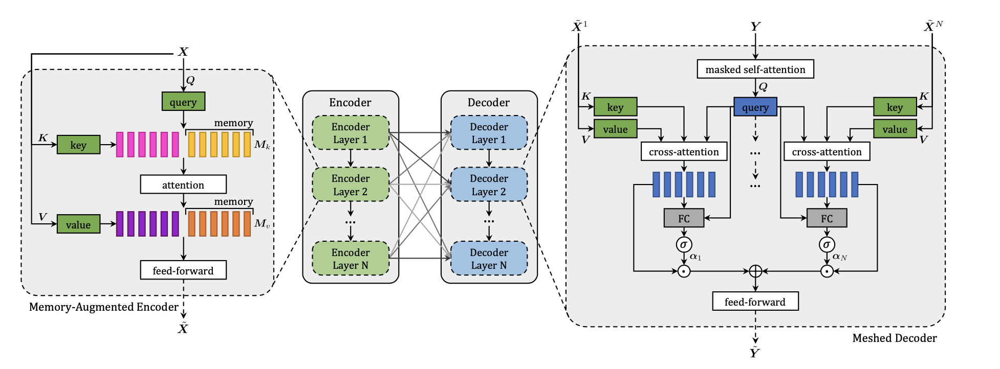

## img2text

*Author: Luyang Chu

*Supervisor: Christian Heumann

### 2.1.1 Microsoft COCO: Common Objects in Context
<br>
Understanding of visual scenes plays an important role in computer vision research (CV)
Many tasks are included in it, such as image classification, object detection, object localization and semantic scene labeling.
Through the computer vision research history, Image Datasets have played a critical role. They are not only essential for training and evaluating new algorithms, but also lead the research to new challenging directions.[@mccoco] In the early year, researchers developed Datasets[345] which enabled the direct comparison of hundreds of image recognition algorithms, that was the early evolution in object recognition. Recent years, ImageNet dataset [1] which contains millions of images has enabled breakthroughs in both object classification and detection research using new deep learning algorithms.
With the goal of advancing the state-of-art in object recognition especially scene understanding, a new large scale data called Microsoft COCO was published in 2014. MS COCO focuses on three core problems in scene understanding: detecting non-iconic views, detecting the semantic relationships between objects and precise localization of image objects.[@mccoco]
MS COCO Dataset contains 91 common object categories with a total of 328,000 images as well as 2,500,000 labeled instances. All these images could be recognized by a 4 year old child.82 categories include more than 5000 labeled The labeled instances which may support the detection of relationships between objects is much larger per image in COCO (7.7) than in ImageNet(3.0)[@mccoco]. In order to provide precise localization of object instances, only "Thing" categories like car, table, dog will be included. objects which do not have clear boundaries like sky, sea, grass, will not be included. In current object recognition research, algorithms perform well on images with iconic views. These images always contains the single object category in the center of the image. To accomplish the goal of detecting the contextual relationships between objects, more complex images with multiple objects or natural images which comes from our daily life are gathered for the Dataset.

2.Image collection and annotation 2.1 categories2.2 non-iconic2.3 annotation
COCO is a large-scale richly annotated Datatset, the progress of building consists of two phases:Data collection and image annotation.

In order to select representative object categories for Images in COCO, researchers collected several categories from different dataset like PASCAL VOC and other sources. All these object categories can be recognized by children between 4 to 8. The quality of the object categories were ensured by co-authors.Co-authors scale the categories from 1 to 5 depending on their common occurrence, practical applications and diversity from other categories [@mccoco].The final number pf the list is 91, which includes all the categories from PASCAL VOC

With the help of representative object categories, COCO want to collect a dataset which a majority of these images are non-iconic. Images are roughly divided into three types:iconic-object images, iconic-scene images and non-iconic images[@mccoco] (Images needs to be added)
Images are collected through two strategies, firstly images from Flickr which contains photos uploaded by amateur photographer with keywords are collected. Secondly, Searching for pairwise combination of object categories like "dog + car" are used by researchers to gather more non-iconic images and images with rich contextual relationships.

Due to the the scale of the dataset and the high cost of the annotation process, the  design of a high quality annotation pipeline with efficient cost is a difficult task.
The annotation pipeline for COCO is splitted into three primary tasks: 1. category labeling, 2.instance spotting, and 3. instance segmenting.
```{r, fig.align = 'center', out.width = '100%',echo=FALSE, fig.cap="Left, [@mccoco]" }
knitr::include_graphics("figures/02-chapter2/2.1 annotation pipeline.png")
```

As we can see in the Image(), object categories in each image will be determined in the first step. Due to the large number of Datasets and categories, they used a hierarchical approach instead of doing binary classification for each category. All the 91 categories have divided into 11 super-categories.The worker will examine the existence of a single instance for a given super-category. This hierarchical approach has helped to reduce the time for labeling. However, the first phase still took ∼20k worker hours to complete.
In the next step, all instances of the object categories in an image were labeled, at most 10 instances of a given category per image will be labeled by each worker. Each image was labeled by 8 workers for a total of ∼10k worker hours.
In the final segmenting stage, each object instance is segmented, the segmentations for other instances and the specification of the object instance by a worker in the previous stage will also shown to the worker.
( all workers are required to complete a training task for each object category. The training task required workers to segment an object instance. )
To ensure good quality an explicit verification step on each segmented instance was performed.
(high cost of time and money .......)


3.datasets ---> further development, the pro cons
In recent years, researchers have developed several pre-trained datasets and benchmarks which helped the developemnt of Algorithms for CV.(from .... simple ones?)
Each of these datasets varies significantly in size, list of labeled categories and types of images.
ImageNet containing millions of images has enabled breakthroughs in both object classification and detection research using a new class of deep learning algorithms.ImageNet was created to capture a large number of object categories, many of which are fine-grained. SUN focuses on labeling scene types and the objects that commonly occur in them. Finally, PASCAL VOC’s primary application is object detection in natural images. MS COCO is designed for the detection and segmentation of objects occurring in their natural context. [@mccoco]
3.1.comparison with other datasets like ImageNet Pascal and SUN using the Fig from [@mccoco]

```{r, fig.align = 'center', out.width = '100%',echo=FALSE, fig.cap="Left, [@mccoco]" }
knitr::include_graphics("figures/02-chapter2/2.1 coco cmparison.png")
```

3.2.conclusion further development and pros cons...
new large scale data set for detecting and segmenting objects found in everyday life
vast cost and over 70,000 worker hours
advancement of object detection and segmentation algorithms
focus non-iconic images of objects in natural environments
rich contextual information with many objects present per image.
a good benchmark for other types of labels, including scene types, attributes and full sentence written descriptions
using coco for the Meshed-Memory Transformer in 2.1.2

Questions & pros cons
only label “things”, but labeling “stuff” may also provide significant contextual information
typical vision datasets are labor intensive and costly to create
teaching only a narrow set of visual concepts;
standard vision models are good at one task and one task only, and require significant effort to adapt to a new task;
models that perform well on benchmarks have disappointingly poor performance on stress tests

### 2.1.2 Meshed-Memory Transformer for Image Captioning ($M^2$)
1. what is $m^2$ intro, the goal of it.
Transformer-based architectures not only for language understanding.
Exploring their applicability to multi-modal contexts like image captioning[@cornia2020m2]

Image captioning: describe visual content of an image in human language.
Understand and model the relationships between visual and textual elements
Generate a sequence of output words.
$m^2$
A Meshed Transformer with Memory for Image Captioning
Improves both the image encoding and the language generation steps
Encoder: a multi-level representation of the relationships between image regions with a priori knowledge
Decoder: a mesh-like connectivity betwwen encoder and decoder to exploit low- and high-level features
Compare performance of the Transformer and different fully-attentive models with recurrent ones
2. $m^2$ Transformer architecture [@cornia2020m2]

```{r, fig.align = 'center', out.width = '100%',echo=FALSE, fig.cap="Left, [@mccoco]" }

```

inspiration from the Transformer model[5]for machine translation with two new concerns
a. Image regions and their relationships encoded through multilevel encoder, take low and high level relations into account
use using persistent memory vectors to learn and encode a priori knowledge
b. exploits both low- and high-level visual relationships through the multi-layer decoder using the weights from a learnable gating mechanism fat each level
A mesh connectivity schema between encoder and decoder layers
2.1 Transformer ( should i provide short revisit for thr Transformer architecture? THE BASIC?)
All interactions between word and image-level features are modeled by using scaled dot-product attention
Attention operates on three sets of vectors, namely a set of queries Q, keys K and values V , and takes a weighted sum of value vectors according to a similarity distribution between query and key vectors.
where Q is a matrix of nq query vectors, K and V both contain nk keys and values, all with the same dimensionality, and d is a scaling factor.
$$ Attention(Q, K, V) = softmax(\frac{QK^T}{\sqrt{d}}) V, $$
2.2 Encoder with stacks of attentive layers.
Process image regions and their relationships between regions
Image region X
Attention used to get permutation invariant encoding of X through the self-attention operations
$$ S(X) = Attention(W_q X, W_k X, W_vX) $$
$ W_q,  W_k,  W_v$ are learnable weights (depend solely on the pairwise similarities between linear projections of the input set X)
Output :  a weighted sum of the values X
Significant limitation of self-attention:  cannot model prior knowledge on relationships between image regions.
To overcome the limitation, introduce Memory-Augmented Attention by extending the keys and values with additional prior information  which does not depend on image region X.
Initialize additional keys and values as plain learnable vectors which can be directly updated via SGD.
$$M_{mem}(X) = Attention(W_qX, K, V )$$
$$K = [W_kX,M_k]$$
$$V =[W_vX,M_v]$$
$M_k$ and $M_v$ are learnable matrices
Encoding layer: embed memory-augmented operator into a Transformer-like layer, output applied to position-wise feed-forward layer
$$ F(X)_i= U\sigma(V X_i +b)+c;$$
$X_i$ indicates the i-th vector of the input set, and $F(X)_i$ the i-th vector of the output. Also, $\sigma(·)$ is the ReLU activation function, V and U are learnable weight matrices, b and c are bias terms.

Enclose the output within a residual connection and a layer norm operation.

$$ Z = AddNorm(M_{mem}(X))$$
$$ \tilde{X}=AddNorm(F(Z))$$

Full encoder: multiple encoding layers in sequence,  the i-th layer uses the output set computed by layer i − 1.
higher encoding Layers can exploit and refine relationships already identified by previous layers,
N encoding layers $\rightarrow$ multi level output $\tilde{X} = (\tilde{X}^1 \dots \tilde{X}^n)$

2.3 decoder with stacks of attentive layers
Conditioned on both previously generated words and region encodings
Input: Vector $Y$ and output from all encoding layers $\tilde{X}$ , connected through gated cross-attentions
Meshed Cross-Attention.
Perform a cross-attention with all encoding layers

$C(·, ·)$ stands for the encoder-decoder cross-attention
$$M_{mesh}(\tilde{X}, Y) =\sum_{i = 1}^{N}\alpha_i C(\tilde{X^i}, Y) $$
C(·, ·) stands for the encoder-decoder cross-attention
$$ C(\tilde{X^i}, Y) = Attention(W_q Y, W_k \tilde{X^i}, W_v \tilde{X^i}) $$
$\alpha_i$ is a matrix of weights same size as the cross-attention results
models single contribution of each encoding layer, and the relative importance between different layers.
$$\alpha_i = \sigma(W_i [Y,C(\tilde{X^i}, Y)]+b_i)$$
$\sigma$ sigmoid activation function
Prediction of a word should only depend on previously predicted words
Decoder layer comprises a masked self- attention operation
Connection between queries derived from the t-th element of its input sequence Y with keys and values
Contains a position-wise feed-forward layer as well
$$Z = AddNorm(M_{mesh}(X,AddNorm(S_{mask}(Y )))$$
$$\tilde{Y} = AddNorm(F(Z)),$$
$S_{mask}$: a masked self-attention over time
Input word vectors, and the t-th element of its output sequence make the prediction of a word at time t + 1, conditioned on $Y≤t$. After taking a linear projection and a softmax operation, this encodes a probability over words in the dictionary.

2.4. Comparison
(not sure)detailed ? test on coco
or just simple explained

```{r, fig.align = 'center', out.width = '100%',echo=FALSE, fig.cap="Left, [@mccoco]" }
knitr::include_graphics("figures/02-chapter2/2.1 m2 example.png")
```
3.conclusion and bridge to next subsection

connections with other subtopics
multimodal tasks


--References( not finished)---------------------------
1.J. Deng, W. Dong, R. Socher, L.-J. Li, K. Li, and L. Fei-Fei, “ImageNet: A Large-Scale Hierarchical Image Database,” in CVPR, 2009.
2.M. Everingham, L. Van Gool, C. K. I. Williams, J. Winn, and A. Zis- serman, “The PASCAL visual object classes (VOC) challenge,” IJCV, vol. 88, no. 2, pp. 303–338, Jun. 2010
3.L. Fei-Fei, R. Fergus, and P. Perona, “Learning generative visual models from few training examples: An incremental bayesian approach tested on 101 object categories,” in CVPR Workshop of Generative Model Based Vision (WGMBV), 2004
4.G. Griffin, A. Holub, and P. Perona, “Caltech-256 object category dataset,” California Institute of Technology, Tech. Rep. 7694, 2007
5.N. Dalal and B. Triggs, “Histograms of oriented gradients for
human detection,” in CVPR, 20
6. Ashish Vaswani, Noam Shazeer, Niki Parmar, Jakob Uszko- reit, Llion Jones, Aidan N Gomez, Łukasz Kaiser, and Illia Polosukhin. Attention is all you need. In Advances in Neural Information Processing Systems, 2017.
7. StevenJRennie,EtienneMarcheret,YoussefMroueh,Jarret Ross, and Vaibhava Goel. Self-critical sequence training for image captioning. In Proceedings of the IEEE Conference on Computer Vision and Pattern Recognition, 2017
8..Peter Anderson, Xiaodong He, Chris Buehler, Damien Teney, Mark Johnson, Stephen Gould, and Lei Zhang. Bottom-up and top-down attention for image captioning and visual question answering. In Proceedings of the IEEE Con- ference on Computer Vision and Pattern Recognition, 2018.
