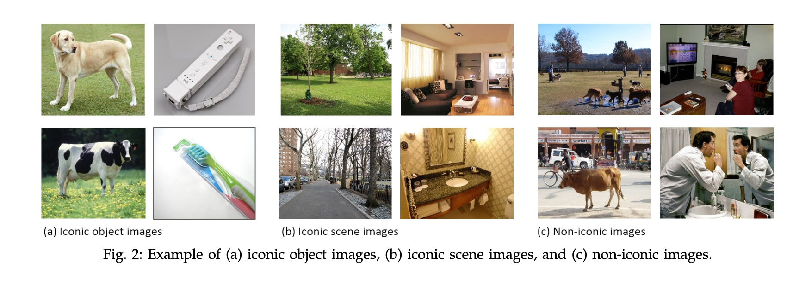
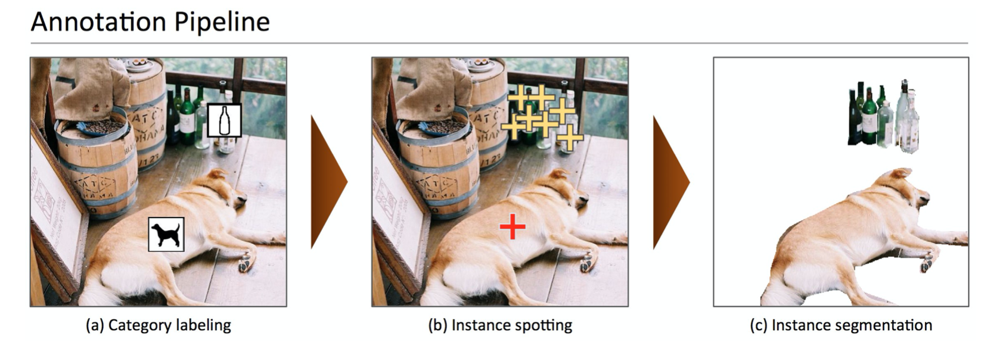
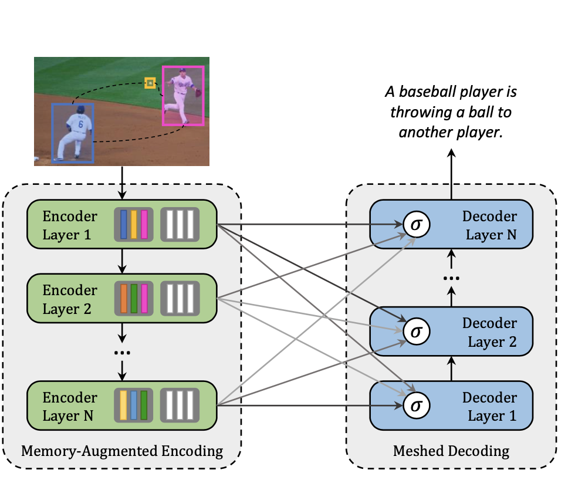
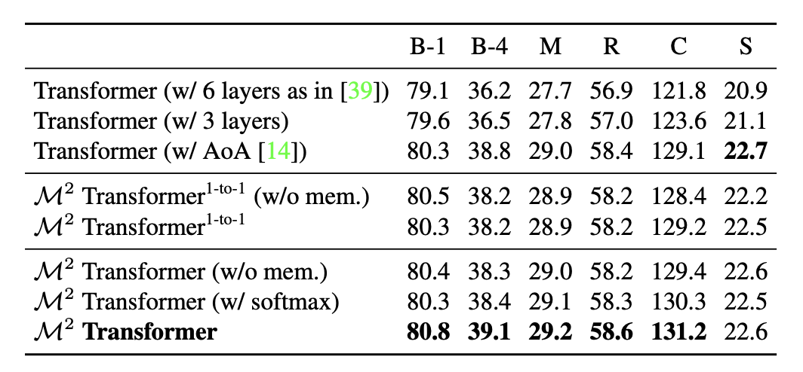
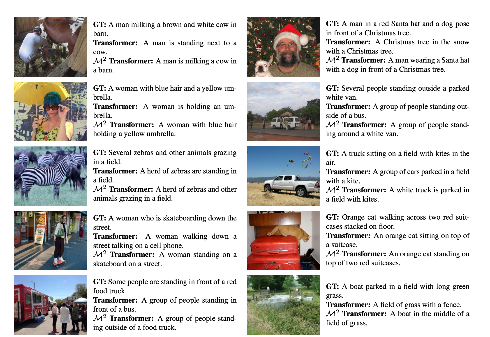

## Image2Text {#c02-01-img2text}

*Author: Luyang Chu*

*Supervisor: Christian Heumann*

Image captioning refers to the task of producing descriptive text for given images. It has stimulated interest in both natural language processing and computer vision research in recent years. Image captioning is a key task that requires a semantic comprehension of images as well as the capacity to generate accurate and precise description sentences.

### Microsoft COCO: Common Objects in Context

The uderstanding of visual scenes plays an important role in computer vision (CV) research. It includes many tasks, such as image classification, object detection, object localization and semantic scene labeling.
Through the CV research history, high-quality image datasets have played a critical role. They are not only essential for training and evaluating new algorithms, but also lead the research to new challenging directions [@mccoco]. In the early years, researchers developed Datasets [@deng2009imagenet],[@sun],[@pascalvoc] which enabled the direct comparison of hundreds of image recognition algorithms, which led to an early evolution in object recognition. In the more recent past, ImageNet [@deng2009imagenet], which contains millions of images, has enabled breakthroughs in both object classification and detection research using new deep learning algorithms.

With the goal of advancing the state-of-the-art in object recognition, especially scene understanding, a new large scale data called "Microsoft Common Objects in Context" (MS COCO) was published in 2014. MS COCO focuses on three core problems in scene understanding: detecting non-iconic views, detecting the semantic relationships between objects and determining the precise localization of objects [@mccoco].

The MS COCO data set contains 91 common object categories with a total of 328,000 images as well as 2,500,000 instance labels. The authors claim, that all of these images could be recognized by a 4 year old child. 82 of the categories include more than 5000 labeled instances. These labeled instances wmay support the detection of relationships between objects in MS COCO. In order to provide precise localization of object instances, only "Thing" categories like e.g. car, table, or dog were included. Objects which do not have clear boundaries like e.g. sky, sea, or grass, were not included. In current object recognition research, algorithms perform well on images with iconic views. Images with iconic view are defined as containing the one single object category of interest in the center of the image. To accomplish the goal of detecting the contextual relationships between objects, more complex images with multiple objects or natural images, coming from our daily life, are also gathered for the data set.

In addition to MS COCO, researchers have been working on the development of new large databases. In recent years many new large databases like ImageNet, PASCAL VOC [@pascalvoc] and SUN [@sun] have been developed in the field of computer vision. Each of this dataset has its on specific focus.

Datasets for object recognition can be roughly split into three groups: object classification, object detection and semantic scene labeling.

Object classification requires binary labels to indicate whether objects are present in an image, ImageNet [@deng2009imagenet] is clearly distinguishable from other datasets in terms of the data set size. ImageNet contains 22k categories with 500-1000 images each.In comparison to other data sets, the ImageNet data set contains thus over 14 million labeled images with both entity-level and fine-grained categories by using the WordNet hierarchy and has enabled significant advances in image classification.

Detecting an object includes two steps: first is to ensure that an object from a specified class is present, the second step is to localize the object in the image with a given bounding box. This can be implemented to solve tasks like face detection or pedestrians detection. The PASCAL VOC [@pascalvoc] data set can be used to help with the detection of basic object categories. With 20 object categories and over 11,000 images, PASCAL VOC contains over 27,000 labeled object instances by additionally using bounding boxes. Almost 7,000 object instances from them come with detailed segmentations [@mccoco].

Labeling semantic objects in a scene requires that each pixel of an image is labeled with respect to belonging to a category, such as sky, chair, etc., but individual instances of objects do not need to be segmented [@mccoco]. Some objects like sky, grass, street can also be defined and labeled in this way.
The SUN data set [@sun] combines many of the properties of both object detection and semantic scene labeling data sets for the task of scene understanding, it contains 908 scene categories from the WordNet dictionary [@WordNet] with segmented objects.
The 3,819 object categories split them to object detection datasets (person, chair) and to semantic scene labeling (wall, sky, floor) [@mccoco].

#### Image Collection and Annotation for MS COCO

COCO is a large-scale richly annotated Datatset, the progress of building consists of two phases:Data collection and image annotation.

In order to select representative object categories for images in COCO, researchers collected several categories from different dataset like PASCAL VOC [@pascalvoc] and other sources. All these object categories can be recognized by children between 4 to 8. The quality of the object categories were ensured by co-authors.Co-authors scale the categories from 1 to 5 depending on their common occurrence, practical applications and diversity from other categories. [@mccoco] The final number of the list is 91. All the categories from PASCAL VOC are also included in COCO. [@pascalvoc]

With the help of representative object categories, COCO wants to collect a dataset which a majority of these images are non-iconic. All these images can be roughly divided into three types in Fig \@ref(fig:imagetype) :iconic-object images, iconic-scene images and non-iconic images.[@mccoco]

```{r imagetype, fig.align = 'center', out.width = '100%',echo=FALSE, fig.cap="(ref:imagetype)" }

```
(ref:imagetype) Type of images [@mccoco].

Images are collected through two strategies, firstly images from Flickr which contains photos uploaded by amateur photographer with keywords are collected. Secondly, researchers will search for pairwise combination of object categories like "dog + car" to gather more non-iconic images and images with rich contextual relationships.[@mccoco]

Due to the the scale of the dataset and the high cost of the annotation process, the design of a high quality annotation pipeline with efficient cost is a difficult task.
The annotation pipeline in Fig \@ref(fig:cocoannotation) for COCO is splitted into three primary tasks: 1. category labeling, 2.instance spotting, and 3. instance segmenting.[@mccoco]

```{r cocoannotation, fig.align = 'center', out.width = '100%',echo=FALSE, fig.cap="(ref:cocoannotation)" }

```
(ref:cocoannotation) Annotation pipeline for COCO [@mccoco].

As we can see in the Fig \@ref(fig:cocoannotation), object categories in each image will be determined in the first step. Due to the large number of Datasets and categories, they used a hierarchical approach instead of doing binary classification for each category. All the 91 categories have divided into 11 super-categories.The worker will examine the existence of a single instance for a given super-category.
Workers will only label one instance for each super-categories with an category’s icon.[@mccoco] For each image, 8 workers were asked to label it.This hierarchical approach has helped to reduce the time for labeling. However, the first phase still took ∼20k worker hours to complete.[@mccoco]

In the next step, all instances of the object categories in an image were labeled, at most 10 instances of a given category per image will be labeled by each worker. In both instance spotting and instance segmenting steps, the location of the instance found by a worker in the previous stage can be seen by the current worker. Each image was labeled by 8 workers for a total of ∼10k worker hours.[@mccoco]

In the final segmenting stage, each object instance is segmented, the segmentation for other instances and the specification of the object instance by a worker in the previous stage will also shown to the worker.Segmenting 2.5 Mio object instances is an extremely time consuming task which requires over 22 worker hours per 1,000 segmentations.To minimize cost and improve the quality of segmentation, all workers are required to complete a training task for each object category.
In roder to ensure a better quality, an explicit verification step on each segmented instance was performed.

#### Comparison with other Datasets

In recent years, researchers have developed several pre-trained datasets and benchmarks which helped the developemnt of Algorithms for CV.
Each of these datasets varies significantly in size, list of labeled categories and types of images.
In the previos part we also introduced the different research main focus of some Datasets like ImageNet [@deng2009imagenet], PASCAL VOC [@pascalvoc] and SUN [@sun]
ImageNe containing millions of images has enabled breakthroughs in both object classification and detection research using a new class of deep learning algorithms. It was created to capture a large number of object categories, many of which are fine-grained. SUN focuses on labeling scene types and the objects that commonly occur in them. Finally, PASCAL VOC’s primary application is object detection in natural images. MS COCO is designed for the detection and segmentation of objects occurring in their natural context.[@mccoco]

With the help of Fig \@ref(fig:cococomparison), we could compare COCO with ImageNet PASCAL VOC and SUN from different aspects.[@mccoco]

```{r cococomparison, fig.align = 'center', out.width = '100%',echo=FALSE, fig.cap="(ref:cococomparison)" }
knitr::include_graphics("figures/02-01/2.1 coco comparison.png")
```
(ref:cococomparison) Comparison COCO with other PASCAL VOC, SUN and ImageNet [@mccoco].

The number of instances per category for all 91 categories for COCO and PASCAL VOC is shown in (a). Compare to PASCAL VOC, COCO has both more categories and more instances per categories.The number of object categories and the number of instances per category for all the datasets is shown in (d). MS COCO has fewer categories than ImageNet and SUN, but it has the most instances per category among all the dataset, which from the hypothesis of researchers might be useful for learning complex models capable of precise localization.[@mccoco]
(b,c) show the number of annotated categories and annotated instances per image for MS COCO, ImageNet Detection, PASCAL VOC and SUN (average number of categories and instances are shown in parentheses). On average COCO contains 3.5 categories and 7.7 instances per image. ImageNet and PASCAL VOC both have less than 2 categories and 3 instances per image on average. SUN dataset has the most contextual information, 9,8 categories and 17 instances per image.
(e) is the distribution of instance sizes for the MS COCO, ImageNet Detection, PASCAL VOC and SUN dataset.[@mccoco]

#### Discussion

COCO is a new large scale data set for detecting and segmenting objects found in everyday life, with the aim of the state-of-the-art in object recognition and scene understanding. It focuses on non-iconic images of objects in natural environments and contains rich contextual information with many objects present per image. COCO is typical vision datasets, which are labor intensive and costly to create.
With the vast cost and over 70,000 worker hours, 2.5 Mio instances were annotated to drive the advancement of object detection and segmentation algorithms. COCO is a good benchmark for the field of CV.[@mccoco]
The COCO Team also shows directions for future. For example “stuff” label like "sky", "grass" and "street" etc, may also be included in the dataset since “stuff” categories provide significant contextual information for the object detection.

<!-- teaching only a narrow set of visual concepts; -->
<!-- standard vision models are good at one task and one task only, and require significant effort to adapt to a new task; -->
<!-- models that perform well on benchmarks have disappointingly poor performance on stress tests -->


### Models for Image captioning

The image captioning task generalizes describe the visual content of an image in natural language, so it requires an algorithm to understand and model the relationships between visual and textual elements, and to generate a sequence of output words.[@cornia2020m2]
In the last few years, collections of methods have been proposed for image captioning. Earlier approaches based on generations pf simple templates, which contains the output produced from the object detector or attribute predictor. [@Socher10connectingmodalities], [@5487377].
With the sequential nature of language, most research on image captioning has focused on deep learning techniques,especially using Recurrent Neural Network models (RNNs)[@vinyals],[@karpthy1] or LSTMs. Mostly, RNNs are used as languages models, and visual information and sequence generation will be encoded from the output of a CNN. With the aim of modelling the relationships between image regions, words, graph convolution neural network in the image encoding phase [@yao1] or single-layer attention mechanisms [@xu1] on the image encoding side have been proposed to incorporate more semantic and spatial relationships between objects.
RNN-based-models are widely adopted, however, the model has its limitation on representation power and sequential nature.[@cornia2020m2]
Recently, new fully-attentive models, in which the use of self-attention has replaced the recurrence,have been proposed. New approaches apply the Transformer models [@NIPS2017_3f5ee243] and BERT [@devlin-etal-2019-bert] models to image captioning tasks.
Transformer consists of an encoder with a stack of self-attention and feed-forward layers, and a decoder which uses self-attention on words and cross-attention over the output of the last encoder layer.[@cornia2020m2]. In some Transformer based approaches, a Transformer-like encoder was paired with an LSTM decoder. While the aforementioned approaches have exploited the original Transformer architecture.
For example Herdade *et al*. [@HerdadeKBS19] proposed Transformer architecture for image captioning with the focus on geometric relations between input objects at the same time. Specially,an additional geometric weight between object pairs which is used to scale attention weights are computed. Similarly, an extension of the attention operator in which the final attended information is weighted by a gate guided by the context was introduced by Huang *et al*. [@huang1],[@cornia2020m2].

### Meshed-Memory Transformer for Image Captioning ($M^2$)

Although Transformer-based architectures have been widely implemented in sequence modeling tasks like machine translation and language understanding. However, its applicability for multi-modal tasks like image captioning is still largely under-explored. [@cornia2020m2]

```{r m2arc1, fig.align = 'center', out.width = '100%',echo=FALSE, fig.cap="(ref:m2arc1)" }

```
(ref:m2arc1) $M^2$ Transformer [@cornia2020m2].

A novel fully-attentive approach called Meshed-Memory Transformer for Image Captioning ($M^2$) for image captioning is proposed by Marcella *et al*[@cornia2020m2] with the aim of improving the design of both the image encoder and the language decoder. Compare to all previous image captioning models, $M^2$ ( see Fig. \@ref(fig:m2arc1) has two new novelties, the encoder encodes a multi-level representation of the relationships between image regions with respect to low-level and high-level relations, a priori knowledge can be learned and modeled by using persistent memory vectors. The multi-layer architecture exploits both low- and high-level visual relationships through a learned gating mechanism, which compute the weight at each level, therefore, a mesh-like connectivity between encoder and decoder layers is created for sentence generation process.[@cornia2020m2]

####  $M^2$ Transformer Architecture

```{r m2arc2, fig.align = 'center', out.width = '100%',echo=FALSE, fig.cap="(ref:m2arc2)" }
knitr::include_graphics("figures/02-01/2.1 m2.png")
```
(ref:m2arc2) $M^2$ Transformer Architecture [@cornia2020m2].

Fig \@ref(fig:m2arc2) shows the detailed architecture of $M^2$ Transformer. $M^2$ Transformer can be divided into Encoder (left) module and Decoder (right) module, both module has multiple layers. Given the input Image region $X$, it go through the Attention and feed forward layer. The relationship between image regions with a priori knowledge will be encoded in each encoding layer, the output of each encoding layers will be read by decoding layers to generate the caption for image word by word.[@cornia2020m2]

All interactions between word and image-level features of the input image $X$ are modeled by using scaled dot-product attention. Attention operates on vectors of queries $Q$, keys $K$ and values $V$ , and takes a weighted sum of value vectors according to a similarity distribution between query and key vectors.
Attention can be defined as follows [@cornia2020m2]:

\begin{equation}
Attention(Q, K, V) = softmax(\frac{QK^T}{\sqrt{d}}) V
(\#eq:binom)
\end{equation}

where $Q$ is a matrix of $n_q$ query vectors, $K$ and $V$ both contain $n_k$ keys and values, all the vectors has the same dimensionality, and $d$ is a scaling factor.

##### Memory-Augmented Encoder

For the given image region $X$ , attention can be used to obtain a permutation in- variant encoding of $X$ through the self-attention operations, the operator from the Transformer can be defined as follows [@cornia2020m2]:

\begin{equation}
S(X) = Attention(W_q X, W_k X, W_vX)
\end{equation}

In this case, queries, keys, and values are linear projections of the input features,$W_q$, $W_k$, $W_v$ are learnable weights, they depend solely on the pairwise similarities between linear projections of the input set X. The self-attention operator encodes the pairwise relationships inside the input.
But self-attention also has its limitation: a prior knowledge on relationships between image regions can not be modelled.
To overcome the limitation, Marcella *et al*[@cornia2020m2] introduce **Memory-Augmented Attention** operator by extending the keys and values with additional prior information,which does not depend on image region $X$.
The additional keys and values are initialized as plain learnable vectors which can be directly updated via SGD.
The operator can be defined as [@cornia2020m2]:

\begin{align}
M_{mem}(X) &=  Attention(W_qX, K, V ) \notag \\
K &=  [W_kX, M_k]\notag \\
V &= [W_vX, M_v]
\end{align}

$M_k$ and $M_v$ are learnable matrices, with $n_m$ rows. [·,·] indicates concatenation. The additional keys and value could help to retrieve a priori knowledge from Input while remaining the quries unchanged.[@cornia2020m2]

For the **Encoding Layer**, Memory-augmented operator is d into a Transformer-like layer, the output applied to position-wise feed-forward layer [@cornia2020m2]:

\begin{equation}
F(X)_i= U\sigma(V X_i + b) + c;
\end{equation}

$X_i$ indicates the $i$-th vector of the input set, and $F(X)_i$ the $i$-th vector of the output. Also, $\sigma(·)$ is the ReLU activation function, $V$ and $U$ are learnable weight matrices, $b$ and $c$ are bias terms.[@cornia2020m2]

Each components will be included in a residual connection and a layer norm operation. The complete definition of an encoding layer can be finally written as [@cornia2020m2]:

\begin{align}
Z &= AddNorm(M_{mem}(X))\notag \\
\tilde{X}&=AddNorm(F(Z))
\end{align}

Finally the **Full Encoder** has multiple encoding layers in sequence, therefore the $i$-th layer uses the output set computed by layer $i − 1$, higher encoding Layers can exploit and refine relationships identified by previous layers, $N$ encoding layers will produce the output $\tilde{X} = (\tilde{X}^1 \dots \tilde{X}^n)$.[@cornia2020m2]

##### Meshed Decoder

The decoder depends on both previously generated words and image region encodings.
**Meshed Cross-Attention** can take the advantage of all the encoding layers to generate sentences for the image. On the right side of the Fig \@ref(fig:m2arc2) shows the structure of the Meshed Decoder. The input sequence vector $Y$ and the output from all encoding layers $\tilde{X}$ are connected by Meshed Attention operator gated through cross-attentions. The meshed attention operator can be formally defined as [@cornia2020m2]:

\begin{equation}
M_{mesh}(\tilde{X}, Y) =\sum_{i = 1}^{N}\alpha_i C(\tilde{X^i}, Y)
\end{equation}

$C(·, ·)$ stands for the encoder-decoder cross-attention, it could be defined with queries from decoder and the keys and values from encoder.[@cornia2020m2]

\begin{equation}
C(\tilde{X^i}, Y) = Attention(W_q Y, W_k \tilde{X^i}, W_v \tilde{X^i})
\end{equation}

$\alpha_i$ is a matrix of weights same size as the cross-attention results, $\alpha_i$ models both single contribution of each encoding layer and the relative importance between different layers.[@cornia2020m2]

\begin{equation}
\alpha_i = \sigma(W_i [Y,C(\tilde{X^i}, Y)]+ b_i)
\end{equation}

The [·,·] indicates concatenation and $\sigma$ is the sigmoid activation function, $W_i$ is a weight matrix, and $b_i$ is a learnable bias vector.[@cornia2020m2]

In decoding layers the prediction of a word should only depend on the word generated previously, so the decoder layer comprises a masked self- attention operation, the operator build connection between queries derived from the $t$-th element of its input sequence Y with keys and values from left sub-sequence,i.e. $Y_{≤t}$.

Simlilar as the Encoding layer, the decoder layer also contains a position-wise feed-forward layer, so the decoder layer can be finally defined as [@cornia2020m2]:

\begin{align}
Z &= AddNorm(M_{mesh}(X,AddNorm(S_{mask}(Y ))) \notag \\
\tilde{Y} &= AddNorm(F(Z)),
\end{align}

$S_{mask}$ indicates a masked self-attention over time.[@cornia2020m2]
Decoder with multiple decoder layers, takes the input word vectors and the $t$-th element of its output sequence to make the prediction of a word for $t + 1$, conditioned on th $Y_{≤t}$. Finally the decoder takes a linear projection and a softmax operation, which encodes a probability over words in the dictionary.[@cornia2020m2]

##### Comparison with other models on COCO Datasets

The $M^2$ Transformer was evaluated on COCO [@mccoco]. COCO is the most commonly used Test dataset for image captioning. In stead of using the original COCO datsets, @cornia2020m2 follows the split of COCO provided by @karpthy1. Karpathy uses 5000 images for validation, 5000 images for testing and the rest for training.

For model evaluation and comparison, standard captioning metrics like BLEU [@papineni-etal-2002-bleu], METEOR [@meteor], ROUGE [@lin-2004-rouge,], CIDEr [@cider], and SPICE [@spice] which have been introduced in the second chapter are used.

```{r compare1, fig.align = 'center', out.width = '100%',echo=FALSE, fig.cap="(ref:compare1)" }

```
(ref:compare1) Comparison with Transformer-based alternatives [@cornia2020m2]

Transformer model in original configuration with six layers  has been applied to captioning, researchers speculated that specific architectures are required for captioning, so variations of the original Transformer are compared with $M^2$ Transformer. Other Variations are Transformer with three layers and “Attention on Attention” (AoA) approach [@huang1] to the attentive layers, both in the encoder and in the decoder. [@cornia2020m2]
The second part intends to evaluate the importance of the meshed connections between encoder and decoder layers. $M^2$ Transformer (1 to 1) is a reduced version of original $M^2$ Transformer, in which one encoder layer only connect to one corresponding decoder layer instead of connect to all the decoding layers.
As we can see from the Fig \@ref(fig:compare1), the original Transformer has 121.8 CIDEr, compare with it, the reduced version of $M^2$ Transformer, we can see the improvement already (129.2 CIDEr). With the respect to meshed connectivity, which help to exploit relationships encoded at all layers and weights them with a sigmoid gating, we could observe better improvement in CIDEr from 129.2 to 131.2. Also the role of mem- ory vectors and the softmax gating schema for $M^2$ Transformer are also included in the table. Without the memory vector lead to the recution of the performance of nearly 1 CIDEr in both reduced $M^2$ Transformer and the original $M^2$ Transformer.[@cornia2020m2]

```{r compare2, fig.align = 'center', out.width = '100%',echo=FALSE, fig.cap="(ref:compare2)" }
knitr::include_graphics("figures/02-01/02-02 compare2.png")
```
(ref:compare2) Comparison with the state of the art on the “Karpathy” test split, in single-model setting [@cornia2020m2].

Fig \@ref(fig:compare2) compares the performance of $M^2$ Transformer with several recent proposals for image captioning.
SCST [@8099614] and Up- Down [@8578734], use attention over the grid of features and attention over regions. RFNet [@renet], which uses a recurrent fusion network to merge different CNN features; GCN-LSTM [@GCN-LSTM] uses a Graph CNN to exploit pairwise relationships between image regions; SGAE [@Yang_2019_CVPR] uses instead auto-encoding scene graphs. The original AoANet [@huang1] approach uses attention on attention for encoding image regions and an LSTM language model. Finally, the ORT [@HerdadeKBS19] uses a plain Transformer and weights attention scores in the region encoder with pairwise distances between detections [@cornia2020m2].

In Fig \@ref(fig:compare2), the $M^2$ Transformer exceeds all other models on BLEU-4, METEOR,CIDEr. The performance of $M^2$ Transformer was very close and competitive with SGAE on BLEU-1 and with ORT on SPICE.

```{r example2, fig.align = 'center', out.width = '100%',echo=FALSE, fig.cap="(ref:example2)"}

```
(ref:example2) Examples of captions generated by $M^2$ Transformer and the original Transformer model, as well as the corresponding ground-truths [@cornia2020m2].

The Fig \@ref(fig:example2) shows some examples of captions generated by $M^2$ Transformer and the original Transformer model, as well as the corresponding ground-truths. According to the selected examples of captions, $M^2$ Transformer shows the ability to generate more accurate descriptions of the images, and the approaches could detect the more detailed relationships between image regions.[@cornia2020m2].

The $M^2$ Transformer is a new Transformer- based architecture for image captioning. It improves the image encoding by learning a multi-level representation of the relationships between image regions while exploiting a priori knowledge from each encoding layer, and uses a mesh-like connectivity at decoding stage to exploit low- and high-level features at the language generation steps. The results of model evaluation with COCO shows that, the performance of $M^2$ Transformer approach surpasses most of the recent approaches and achieves a new state of the art on COCO.[@cornia2020m2].

