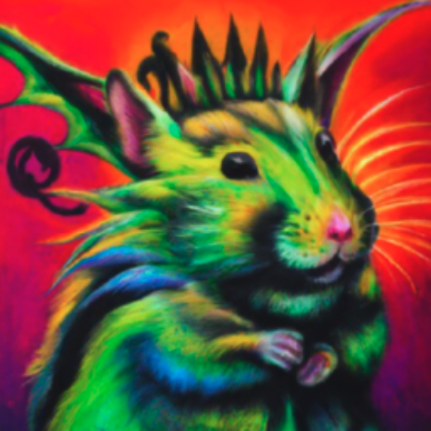
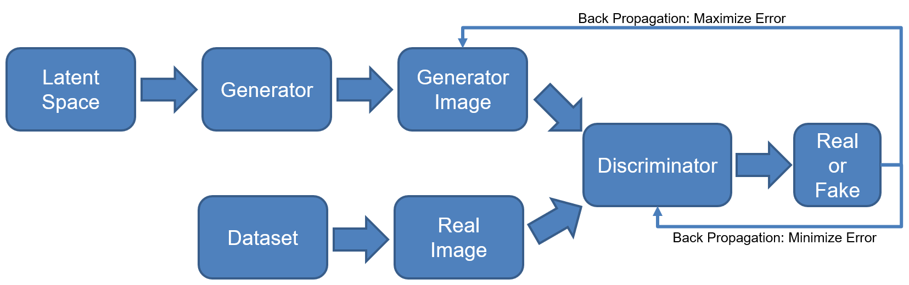
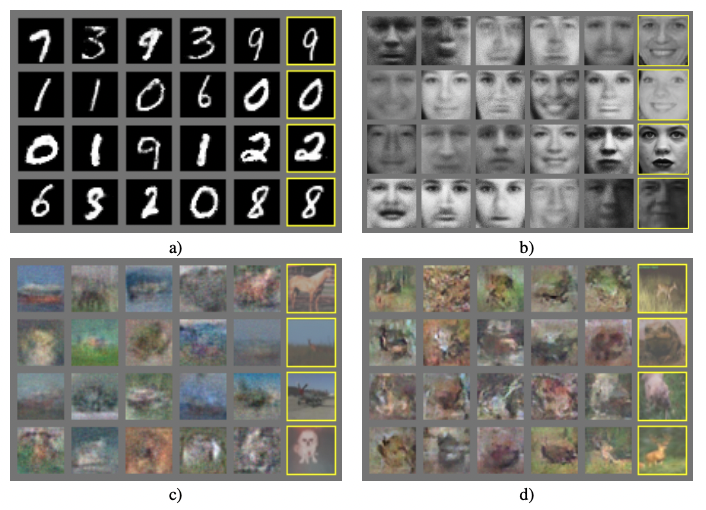
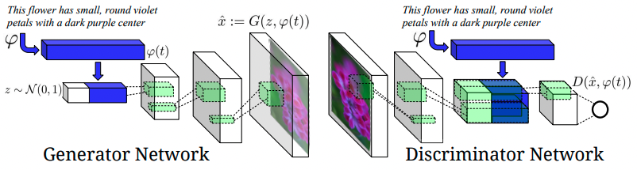
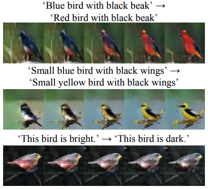
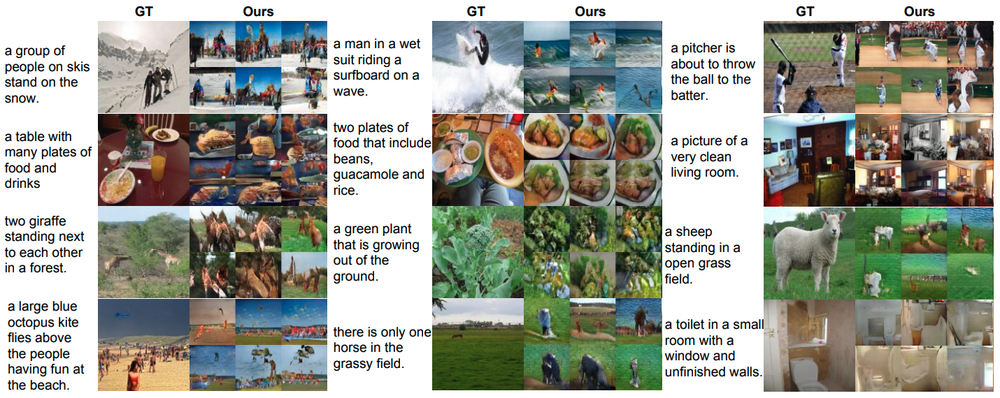

*Author:* Karol Urbańczyk  
*Supervisor:* Jann Goschenhofer

# Text-to-image

Have you ever wondered what a painting artist could bring you if you ordered *a high-quality oil painting of a psychedelic hamster dragon*? Probably not. Nevertheless, one of the answers could be:

```{r hamster_dragon, fig.align = 'center', out.width = '40%',echo=FALSE, fig.cap="Hamster dragon. (xxx)", }

```

The catch is that there is no human artist. The above picture comes from 3.5-billion parameter model called GLIDE by OpenAI (ref. here). Each single value of every pixel was generated from a distribution that the model had to learn in the first place. Before generating the image, GLIDE abstracted what the 'hamster' or 'dragon' are from looking at millions of training images. Only then, it was able to create and combine them successfully into meaningful visual representation. Welcome to the world of current text-to-image modelling!

The cross-modal field of text-to-image models has developed significantly over the recent years. What was considered unimaginable only few years ago, today constitutes a new benchmark for researchers. New break-throughs are being published every couple months. What might be even more important, possible business use cases are emerging, which attracts investment from the greatest players in the AI research. However, further trend of closed-source models is continuing and the text-to-image field is probably one the most obvious ones where it can be noticed. We might need to get used to the fact that the greatest capabilities will soon be monopolized by few companies.

At the same time, the general public is becoming aware of the field itself and the disruption potential it brings. Crucial questions are already emerging. What constitutes an art? What does the concept of being an author mean? Result of a generative model is in a sense a combination, or variation, of the abstracts it has seen in the past. But the same stands for a human author. Therefore, is a discussion about the prejudices and biases needed? Answers to all of these will require a refinement through an extensive discussion. The last section of this chapter will try to highlight the most important factors that will need to be considered.

However, the primary intention of this chapter is to present the reader with a perspective on how the field was developing chronologically. Starting with the introduction of GANs, through first cross-domain models and ending with state-of-the-art achievements (as of September 2022), it will also try to grasp the most important concepts without being afraid of making technical deep-dives. 

Author is aware that since the rapid development pace makes it nearly impossible for this section to stay up-to-date, it might very soon not be fully covering the field. However, it must be stressed that cutting edge capabilities of the recent models tend to come from the scale and software engineering tricks. Therefore, focusing on the core concepts should hopefully make this chapter have a universal character, at least for some time. This design choice also explains why many important works did not make it to this publication. Just to name a few of them: GAWWN, xxx, or most recent ones: LAFITE or Make-a-Scene or CogView. In one way or another, all of them pushed the research frontier one step further, which is widely acknowledged. Therefore, it needs to be clearly stated: the final selection of this chapter's content is a pure subjective decision of the author.

### Seeking objectivity

Before diving into particular models, it would be worth to introduce objective procedures that could help assess how consecutive works are performing in comparison to their predecessors. Unfortunately, objectivity in comparing generative models is very hard to capture since there is no straight way to infer about the model's performance (https://arxiv.org/abs/1511.01844). However, multiple quantitative and qualitative techniques have been developed to make up for it. Unfortunately, there is no general consensus as to which measures should be used. Extensive comparison has been performed by (https://arxiv.org/abs/1802.03446). Few of them that seem to be most widely used in the current research are presented below.

#### Metrics

**Inception Score (IS)**

Introduced by (https://arxiv.org/abs/1606.03498), Inception Score (IS) uses the Inception Net (https://arxiv.org/abs/1512.00567) trained on ImageNet data to classify the fake images generated by the assessed model. Then, it measures the average KL divergence between the marginal labels distribution $p(y)$ and the labels distribution conditioned on the generated samples $p(y|x)$.

>$$exp(\mathop{{}\mathbb{E}}_{x}[KL(p(y|x) || p(y))])$$

$p(y)$ is desired to have high diversity (entropy), in other words: images from generative model should represent a wide variety of classes. On the other hand, $p(y|x)$ is desired to have low diversity, meaning that images should represent meaningful concepts. If a range of cat images is being generated, they all should be confidently classified by Inception Net as cats. The intention behind IS is that generative model with higher distance (KL divergence in this case) between these distributions should have better score. IS is considered a metric that correlates well with the human judgment, hence its popularity.

**Fréchet Inception Distance (FID)**

A metric that is generally considered to improve upon Inception Score is Fréchet Inception Distance (FID). Heusel *at al.* (https://papers.nips.cc/paper/2017/hash/8a1d694707eb0fefe65871369074926d-Abstract.html) argue that the main drawback of IS is that it is not considering the real data at all. Therefore, FID again uses Inception Net, however this time it embeds the images (both fake and real samples) into feature space, stopping at specific layer. In other words, some of the most-right layers of the net are being discarded. Feature vectors are then assumed to come from Gaussian distribution and the Fréchet distance is calculated between real and generated data distributions:

>$$d^2((m, C), (m_{w}, C_{w})) = ||m-m_{w}||_{2}^2 + Tr(C+C_{w}-2(CC_{w})^{1/2})$$

$(m, C)$ and $(m_{w}, C_{w})$ represent mean and covariance of generated and real data Gaussians respectively. Obviously, low FID levels are desired.

FID is considered to be consistent with human judgement and sensitive to image distortions, which are both desired properties. Figure (xxx) shows how FID increases (worsens) for different types of noise being added to images.

```{r fid_distortions, fig.align = 'center', out.width = '80%',echo=FALSE, fig.cap="FID is evaluated for different noise types. From upper left to lower right: Gaussian noise, Gaussian blur, implanted black rectangles, swirled images, salt and pepper, CelebA dataset contaminated by ImageNet images. Figure from (xxx).", }
knitr::include_graphics("figures/02-02-text-2-img/fid_distortions.png")
```

**Precision / recall**

Precision and recall are one of the most widely used metrics in many Machine Learning problem formulations. However, their classic definition cannot be applied to generative models due to lack of objective labels. Sajjadi (https://arxiv.org/abs/1806.00035) came up with a novel definition of these metrics calculated directly from distributions, which was further improved by Kynkaniemi (https://arxiv.org/abs/1904.06991). The argument behind a need for such approach is that metrics such as IS or FID provide only one-dimensional view on the model's performance, ignoring the trade-off between precision and recall. Decent FID result might very well mean high recall (large variation, i.e. wide range of data represented by the model), high precision (realistic images), or anything in between.

Let $P_{r}$ denote the probability distribution of the real data, and $P_{g}$ be the distribution of the generated data. In short, recall is trying to answer how big part of $P_{r}$ can be generated from $P_{g}$, while precision is trying to grasp how many of generated images fall within $P_{r}$.

```{r precision_and_recall, fig.align = 'center', out.width = '80%',echo=FALSE, fig.cap="Definition of precision and recall for distributions. Figure from (xxx).", }
knitr::include_graphics("figures/02-02-text-2-img/precision_and_recall.png")
```

For more thorough explanation of metric calculation, one should follow (https://arxiv.org/abs/1904.06991).

**CLIP score**

CLIP is a model from OpenAI (https://arxiv.org/abs/2103.00020). Its details can be found in chapter (CROSS REFERENCE TO MAX's SECTION). In principle, it is capable of assessing the semantic similarity between the text caption and the image. CLIP score is defined as:

>$$\mathop{{}\mathbb{E}}[s(f(image)*g(caption))]$$

where the expectation is taken over the batch of generated images and $s$ is the CLIP logit scale. (https://arxiv.org/abs/2112.10741)

**Human evaluations**

It is common that researchers report also qualitative measures. Many potential applications of the models are focused on deceiving human spectator, which motivates reporting of metrics that are based on the human evaluation. Many variations can be found, therefore none is going to be presented here. However, the general idea is to test for:

* photorealism
* caption similarity (image-text alignment)

Usually, a set of images is being presented to a human, whose task is to assess their quality with respect to the two above-mentioned criteria.

### Generative Adversarial Networks

Appearance of Generative Adversarial Networks (GAN) was a major milestone in the development of generative models. Introduced by Goodfellow *et al.* (https://arxiv.org/abs/1406.2661), idea of GANs presented new architecture and training regime, which corresponded to minimax two-player game between so called Generator and Discriminator (hence the word *adversarial*).

GANs can be considered as an initial enabler for the field of text-to-image to exist in the first place and for a long time GAN-like models were achieving state-of-the-art results, which makes it more than justified to present their core concepts in this book.

#### Vanilla GAN for Image Generation

In a vanilla GAN, Generator model ($G$) and Discriminator model ($D$) are optimized together in a minimax game, where $G$'s aim is to generate sample so convincing, that $D$ will not be able to distinguish if it comes from real or generated images distribution. On the other hand $D$ is being trained to discriminate between the two. Originally, multilayer perceptron was proposed as model architecture for both $D$ and $G$, although in theory any differentiable function could be used.

More formally, let $p_{z}$ denote the prior distribution defined on the input noise vector $z$. Then, the generator $G(z)$ represents a function that is mapping this noisy random input to generated image $x$. The discriminator $D(x)$ outputs a probability that $x$ comes from the real data rather than generator's distribution $p_{g}$. In this framework, $D$ shall maximize probability of guessing the correct label of both real and fake data. $G$ is trained to minimize $log(1-D(G(z)))$. Now, such representation corresponds to the following value function (optimal solution):

>$$\min_{G}\min_{D}V(D,G) = \mathop{{}\mathbb{E}}_{x \sim p_{data}(x)} [log(D(x))] + \mathop{{}\mathbb{E}}_{z \sim p_{z}(z)} [log(1-D(G(z)))]$$

Figure (xxx) depicts this process in a visual way.

```{r vanilla_gan, fig.align = 'center', out.width = '80%',echo=FALSE, fig.cap="GAN framework as proposed in (xxx).", }

```

Some of the generated samples that had been achieved with this architecture already in 2014 can be seen in Figure (xxx).

```{r vanilla_gan_samples, fig.align = 'center', out.width = '80%',echo=FALSE, fig.cap="Samples from generators trained on different datasets: a) MNIST b) TFD, c) CIFAR-10 (MLP used for G and D) d) CIFAR-10 (CNN used). Highlighted columns show nearest real example of the neighbouring sample. Figure from (xxx).", }

```

#### Conditioning on Text

So far, only image generation has been covered, completely ignoring textual input. Reed *at al* (https://arxiv.org/abs/1605.05396) introduced an interesting concept of conditioning DC-GAN (GAN with CNNs as Generator and Discriminator) on textual embeddings. Separate model is being trained and used for encoding the text. Then, result embeddings are concatenated with noise vector and fed into the Generator. Discriminator takes embeddings as an input as well. Result model is referred to as GAN-INT-CLS. Both abbreviations (INT and CLS) stand for specific training choices, which are going to be explained later in the chapter. The overview of the proposed architecture can be seen in Figure (xxx).


```{r gan_cls, fig.align = 'center', out.width = '80%',echo=FALSE, fig.cap="Proposed architecture of convolutional GAN conditioned on text. Text encoding $\varphi(t)$ is fed into both Generator and Discriminator. Before further convolutional processing, it is first projected to lower dimensionality in fully-connected layers and concatenated with image feature maps. Figure from (xxx).", }

```

**Text embeddings**

Since regular text embeddings are commonly trained in separation from visual modality simply by looking on textual context, they are not well suited for capturing visual properties. This motivated Reed *at al* to come up with a structured joint embeddings of images and text descriptions (https://arxiv.org/abs/1605.05395). GAN-INT-CLS (xxx) implements it in a way described in Figure (xxx).

```{r gan_cls_embeddings, fig.align = 'center', out.width = '60%',echo=FALSE, fig.cap="Figure from (xxx).", }
knitr::include_graphics("figures/02-02-text-2-img/gan_cls_embeddings.png")
```

GoogLeNet is being used as an image encoder $\phi$. For text encoding $\varphi$, authors use a character-level CNN combined with RNN. Essentially, the objective of the training is to minimize the distance between encoded image representation and text representation. Image encoder is then being discarded and $\varphi$ only is used as depicted in Figure (xxx).

**GAN-CLS**

CLS stands for Conditional Latent Space, which essentially means GAN is conditioned on the embedded text. However, in order to fully grasp how exactly the model is conditioned on the input, we need the go beyond architectural choices. It is also crucial to present specific training regime that was introduced for GAN-CLS and the motivation behind it.

One of the possible ways how the system could be trained is to view text-image pairs as joint observations and train the discriminator to classify entire pair as real or fake. However, in such a case discriminator does not have an understanding of whether the image matches the meaning of the text. This is because discriminator does not distinguish between two types of error that exist, namely when the image is unrealistic or when it is realistic but the text does not match.

Proposed solution to this problem is to present the discriminator with three observations at a time, all of which are included later in the loss function. These three are: {real image with right text}, {real image with wrong text}, {fake image with right text}. Intention is that discriminator should classify them as {true}, {false}, {false}, respectively.

**GAN-INT**

Motivation behind this concept comes from the fact that interpolating between text embeddings tend to create observation pairs which are still close to the real data manifold. Therefore, generating additional synthetic text embeddings and using them instead of real captions in the training process might help in a sense that it works as a form of data augmentation and helps regularize the training process. Figure (xxx) might be helpful for developing the intuition behind interpolation process.

```{r interpolating_birds, fig.align = 'center', out.width = '60%',echo=FALSE, fig.cap="Interpolating between sentences. Figure from (xxx).", }

```

**Results**

The model achieves best performance when both of the mentioned methods are being used (so called GAN-INT-CLS). Models prove to successfully transfer style (pose of the objects) and background from the training data when trained on CUB (birds) and Oxford-102 (flowers) datasets. They also show interesting zero-shot abilities, meaning they can generate observations from unseen test classes (Figure xxx). When trained on MS-COCO, GAN-CLS proves its potential to generalize over many domains, although the results are not always coherent (Figure xxx).

```{r gan_cls_zeroshot, fig.align = 'center', out.width = '100%',echo=FALSE, fig.cap="Zero-shot generated birds using GAN, GAN-CLS, GAN-INT, GAN-INT-CLS. Figure from (xxx).", }
knitr::include_graphics("figures/02-02-text-2-img/gan_cls_zeroshot.png")
```

```{r gan_cls_mscoco, fig.align = 'center', out.width = '100%',echo=FALSE, fig.cap="Generated images using GAN-CLS on MS-COCO validation set. Figure from (xxx).", }

```

#### Further GAN-like development 

Generative Adversarial Networks were a leading approach for text-to-image models for most of the field's short history. In the following years after introducing GAN-INT-CLS, new concepts were emerging, trying to push the results further. Many of them had GAN architecture as their core part. In this section, few of such ideas are presented. The intention is to quickly skim through the most important ones. Curious reader should follow the corresponding papers.

**StackGAN**

(https://arxiv.org/abs/1612.03242) introduced what they called StackGAN. The main contribution of the paper that also found its place in other researchers' works, was the idea to *stack* more than one generator-discriminator pair inside the architecture. So called Stage-II (second pair) generator is supposed to improve the results from Stage-I, taking into account only:

* text embedding (same as Stage-I)
* image generated in Stage-I

without a random vector. Deliberate omission of the random vector results in generator directly working on improving the results from Stage-I. The purpose is also to increase resolution (here from 64x64 to 256x256). Authors obtained great results already with two stages, however, in principle architecture allows for stacking many of them.

```{r stackgan, fig.align = 'center', out.width = '100%',echo=FALSE, fig.cap="Samples generated by StackGAN from unseen texts in CUB test set. Figure from (xxx).", }
knitr::include_graphics("figures/02-02-text-2-img/stackgan.png")
```

**AttnGAN**

It is 2017 and many researches believe attention is all they need (https://arxiv.org/abs/1706.03762). Probably for the first time in text-to-image generation attention mechanism was used by (https://arxiv.org/abs/1711.10485). Authors combined the idea with what StackGAN proposed and used three stages (generators $G_{0}$, $G_{1}$ and $G_{2}$). However, this time first layers of particular generator are attending to word feature vectors. This mechanism not only helps control how particular areas of the image are being improved by consecutive generators, but also allows for visualizing attention maps. 

```{r attngan, fig.align = 'center', out.width = '100%',echo=FALSE, fig.cap="Images generated by $G_{0}$, $G_{1}$, $G_{2}$. Two bottom rows show 5 most attended words by $G_{1}$ and $G_{2}$ respectively. Figure from (xxx).", }
knitr::include_graphics("figures/02-02-text-2-img/attngan.png")
```

**DM-GAN**

Another important milestone was DM-GAN (Dynamic Memory GAN) (https://arxiv.org/abs/1904.01310). At that time, models were primarily focusing on generating initial image and then refining it to a high-resolution one (as e.g. StackGAN does). However, such models heavily depend on the quality of first image initialization. This problem was the main motivation for (xxx) to come up with a mechanism preventing it. DM-GAN proposes dynamic memory module, which has two main components. First, its memory writing gate helps select the most important information from the text based on the initial image. Second, a response gate merges the information from image features with the memories. Both of these help refine the initial image much more effectively.

**DF-GAN**

Last but not least, DF-GAN (Deep Fusion GAN) (https://arxiv.org/abs/2008.05865) improves the results by proposing three concepts. So called One-Stage Text-to-Image Backbone focuses on providing architecture which is capable of abandoning the idea of multiple stacked generators and uses single one instead. It achieves that by smart combination of couple of factors, i.a. hinge loss and use of residual blocks. Additionally, Matching-Aware Gradient Penalty helps achieve high semantic consistency between text and image and regularizes learning process. Finally, One-Way Output helps the process converge more effectively.

### Dall-E 1

* Intro: OpenAI, dataset used, not public, etc
before we go, we describe couple of important concepts

**Variational Autoencoder**

https://arxiv.org/pdf/1312.6114v10.pdf

**VQ-VAE / dVAE**

**The Model**
say why we are not going to explain transformers
* Details how it's working. Combining Transformer with VQ-VAE. Training vs inference

**Results**
* Results and image examples
cherrypicking

**Limitations**


### GLIDE

Introduced by (https://arxiv.org/abs/2112.10741), GLIDE started an era of huge scale diffusion models. The concept of diffusion has already been used in area of Deep Learning for some time before. However, authors of the GLIDE took a step further and combined it together with a text-based guidance which is supposed to steer learning process in the direction of the text meaning. This powerful method proved itself to achieve outstanding results which remain competitive to current state-of-the-art models at the moment of writing. Alt

**Diffusion models**

Before understanding inner workings of GLIDE, it is important to introduce core concept that is driving it, namely diffusion. Idea of diffusion comes from physics. In short, it corresponds to the process of diffusing particles, for example of one fluid in another. Normally, it has unidirectional character, in other words it cannot be reversed. However, as (https://arxiv.org/pdf/1503.03585.pdf) managed to show, and (https://arxiv.org/pdf/2006.11239.pdf) improved, if data diffusion process is modelled as Markov chain with Gaussian noise being added in consecutive steps, it is possible to learn how to reverse it. This reversed process is exactly how images are being generated by the model from pure random noise.

Let's construct a Markov chain, where initial data point is denoted by $x_{0}$. In $t$ steps, Gaussian noise is being added to the data. Probability of the data at $t$-step can be characterized the following way:

> $$q(x_{t}|x_{t-1}):=N(x_{t};\sqrt{\alpha_{t}}x_{t-1},(1-\alpha_{t})I)$$

where $(1-\alpha_{t})$ parametrizes the magnitude of the noise being added at each step. Now, if $x_{t-1}$ were to be reconstructed from $x_{t}$, a model needs to learn predict estimates of gradients from the previous steps. Probability distribution of previous steps can be estimated as follows:

> $$p_{\theta}(x_{t-1}|x_{t})=N(x_{t-1};\mu_{\theta}(x_{t}),\Sigma_{\theta}(x_{t}))$$

where particular mean function $\mu_{\theta}$ has been proposed by (https://arxiv.org/pdf/2006.11239.pdf). For more detailed explanation of how this is later parametrized and trained, one could follow (https://lilianweng.github.io/posts/2021-07-11-diffusion-models/).

**GLIDE**
Classifier free guidance as a guided diffusion

mention that they were also using CLIP guidance but with worse results

**Results**

**Limitations**
complex scenarios (complex prompts or highly unusual scenarios) - check figure they provide in the paper
sequential make it slower
closed source


### Dall-E 2
* Intro (mention PR move)
* details how it is working
* results / scores
* Limitations / strengths & weaknesses


### Imagen
* Intro
* details how it is working
* results / scores
* Limitations / strengths & weaknesses

### Parti
* Intro
* details how it is working
* results / scores
* Limitations / strengths & weaknesses

### Open-Source Community
* Although most of the recent work comes from OpenAI and Google, there are very interesting directions taken by the open community
* Mentioning the models and quickly what is happening. VQGAN+CLIP, Latent Diffusion models for sure
* Maybe some links for the reader to play with?

### Discussion
Mention the following points and why they matter
* potential business use cases
* open vs closed-source (mention dall-e mini)
* copyrights
* biases

safety considerations from GLIDE paper?
https://jumpstory.com/blog/the-future-of-ai-generated-images-why-its-both-fascinating-and-a-huge-legal-risk/


<!--
### Datasets

**Microsoft Common Objects in Context (MS COCO)**

MS COCO (https://arxiv.org/abs/1405.0312)

* COCO
* CUB
* Oxford 102
-->

<!--Moreover, the section lists couple of popular datasets that are, or have been used by researchers either for assessment only or for the training process itself.-->

<!--https://medium.com/octavian-ai/a-simple-explanation-of-the-inception-score-372dff6a8c7a-->
<!--https://www.youtube.com/watch?v=YHRnZ13s7xo-->
<!---->
<!--https://medium.datadriveninvestor.com/a-very-short-introduction-to-frechlet-inception-distance-fid-86c95deb0930-->
<!--https://www.youtube.com/watch?v=9zTwSzXxNDo-->

<!--https://towardsdatascience.com/text-to-image-a3b201b003ae-->


