## Images supporting Language Models {#c02-03-img-support-text}

*Author: Giacomo Loss*

*Supervisor: Matthias Aßenmacher*

### Words In (Non-Symbolic) Contexts

Imagine you were alone in a foreign country, you could not speak the language and the only resource you had were a dictionary in the foreign language. You see a word written on a sign but you cannot understand its meaning. What could you do? One idea would be do open the dictionary and look the word up. The problem is that the word is defined by using other words in the foreign language. As a second step you would thus look these new words up and continue like that in further steps to the "infinity and beyond" (cit. Buzz Lightyear). But even after looking every single word in the dictionary up, you would still not be able to understand the meaning of the word written on the sign. If on that sign, next to the unknown word, something else was instead depicted, for example an image of a fork and a knife, you might speculate that the word indicates something which has to do with food, like a restaurant. And this without explicitly knowing the meaning of the word. This example is inspired by the work of Stevan Harnad, which formulated at the beginning of the 90's the so called *Symbol Grounding Problem* (@harnad1990symbol). It asserts that it is not possible to understand the meaning (semantics) of a word by just looking at other words because words are essentially meaningless symbols. It is possible to understand the meaning only if the word is put in a context, a perceptual space, other than that of written language: the word must be *grounded* in non-symbolic representations, like images, for example. Over the past 10 years there has been a whopping development of distributional semantic models (DSMs, henceforth), especially after the Word2vec (@mikolov2013efficient) revolution. This family of models assumes that the meaning of words and sentences can be inferred by the "distribution" of those words and sentences within a text corpus (the *Distributional Hypothesis* formulated by @harris1954distributional). But the *Symbol Grounding Problem* mentioned earlier suggests that DSMs do not resemble the way words are learned by humans, which is in multimodal perceptual contexts. For these reasons, models have been developed with the goal to integrate further modalities (like visual ones) in pure language models, assuming that grounding words and sentences in other perceptual contexts should lead to a better understanding of their semantics and, as a result, to better performance in pure language tasks.

The focus of this subchapter are models which empower pure language models with visual modalities in form of images: their goal is to obtain better semantic representations (in form of embedding vectors) of words. First, a quick recap of the main pure language models will be provided. After that,  the historical evolution of the integration of images as visual modalities into pure language models will be discussed: from simple concatenation of textual and visual modalities, to the projection of visual elements in a common grounded space and more recently, the use of Transformers (see figure \@ref(fig:img-hist)). Eventually, a comprehensive evaluation of the different models against benchmarks will be carried out.

Again, the focus is on how to employ visual elements to obtain embeddings able to capture the semantics of words. More concrete applications, such as those in the field of machine translation are out of scope and will be only marginally addressed at the end of the subchapter.

```{r img-hist, fig.align = 'center', out.width = '100%',echo=FALSE, fig.cap="Historical evolution of models which integrate visual information into pure language models."}
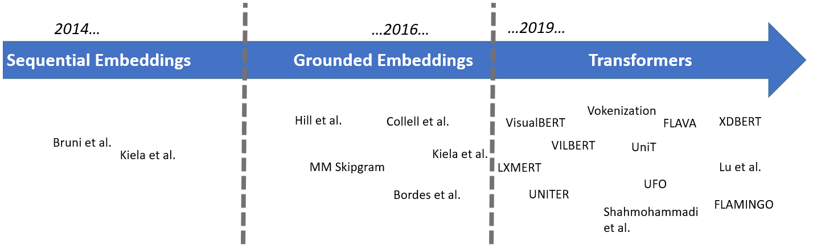
```

### Word-Embeddings: Survival-Kit

In other parts of this books, the most important NLP-models and the latest developments in the field are extensively described. In this section, some information will be provided, which might be helpful to understand some of the aspects discussed in this subchapter. As it may have been inferred in the introduction, the starting point is always a pure language model, namely a model which employs only textual inputs in order to generate word embeddings, which are representations of words in form of numerical vectors.
The most widely used pure language models in the papers presented in this subchapter are the following three:

- **Skipgram** (Word2vec, @mikolov2013efficient), where given a target word, the probability of the neighboring (surrounding) words in a pre-defined window has to be maximized. Trainig takes place either through a *hierarchical softmax* or through *negative sampling*, which involves maximizing the probability of words which are real neighbors and minimizing that of words which are not real neighbors (the "negative samples")
- **GloVe** (@pennington2014glove), which is based on words co-occurrence across the *entire* corpus, with the goal of minimizing the difference between the dot product of the embedding vectors of two words and the logarithm of the number of co-occurrences
- **BERT** (@devlin2018bert): two pre-training tasks to obtain word-embeddings:
  + Masked Language Modelling (MLM): given a sentence with [MASK]ed tokens, the goal is to predict these masked tokens
  + Next Sentence Prediction (NSP): given two sentences A and B, the goal is to predict if B follows from A

Two additional remarks to conclude this section. First, Skipgram and GloVe generate embeddings which are *"context-free"*: they do not take into account the context in which words occur. On the contrary, BERT is designed to represent words given the context (sentence) in which they occur: we can thus have different embeddings for the same word, depending on the context.
Second, the inputs of these models are *tokens*: with the help of a *tokenizer*, which can be different for different models, the text is split in "chunks", called *tokens* (and they are not necessarily single words).


### The Beginning: Sequential Multimodal Embeddings

Supposing we add linguistic and visual feature representations related to a particular word, how could we fuse them? One intuitive idea would be to *concatenate* the textual and visual modalities. Let $V_{text}$ be the textual (vectorial) representation of a word and let $V_{img}$ be its visual (vectorial) representation, a fused representation $F$ of a certain word $w$ might take the following simplified form:

$$F=\gamma(V_{text})\bigoplus(1-\gamma)V_{img}$$

where $\gamma$ is a tuning parameter which controls the relative contribution of both modalities to the final fused representation. @bruni2014multimodal propose a model where the meaning of a target word is represented in the form of a semantic vector and all vectors are collected in a *text-based semantic matrix*; textual embeddings are computed based on (transformed) co-occurrence counts of words in a pre-defined window. The starting point to obtain an image-based representation of certain target word is a dataset of labeled images. For each image associated to the target word (which means that the target word is to be found in the image's caption), low-level features called "local descriptors" - which incorporate geometric information of specific areas of a certain picture - are extracted and then these descriptors are assigned to clusters (*bags*) of "visual words"^[See for example @bosch2007image for more details on this technique, called "bag-of-visual-words".]. Afterwards, for each target word, visual word occurrences are summed up together to obtain the occurrence counts related to the target word. These image-based semantic vectors are then transformed and collected in an *image-based semantic matrix*. The two matrices are then concatenated and projected into a common latent multimodal space with a singular value decomposition. Thanks to this process a *textual **mixed** matrix* and a *visual **mixed** matrix* are extracted and then combined together according to different fusion strategies to build the multimodal embeddings. In this first, relatively cumbersome (historically motivated) example, the vector representation of an image is obtained with non-trivial features engineering.

In recent years, the use of neural networks has made an "automatic feature selection" possible. This is what for example @kiela2014learning propose, extracting visual features from the first seven layers of a convolutional neural network (proposed by @krizhevsky2012imagenet) trained on 1.6 million images from the ImageNet database (@deng2009imagenet), which produces scores for 1,512 object categories. The linguistic part of the model relies on the Skipgram model by @mikolov2013efficient and consists of 100-dimensional vector representations. The multimodal representation is again obtained by concatenation of both modalities.

```{r img-kiela2014-01, fig.align = 'center', out.width = '100%',echo=FALSE, fig.cap="(ref:img-kiela2014-01)"}
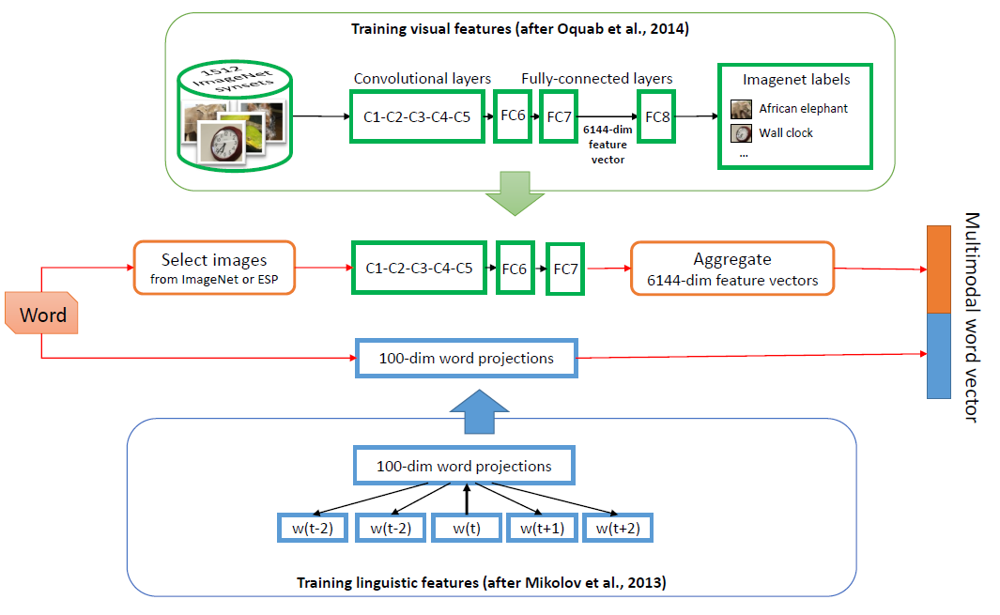
```
(ref:img-kiela2014-01) From @kiela2014learning. Textual and visual features vectors are concatenated.

Another notable example of concatenation/sequential combination of textual and visual modalities is the work of @silberer2014learning: textual and visual modalities are represented by separate vectors of textual and visual attributes. During training, these textual and visual inputs vectors are separately fed to denoising (unimodal) autoencoders, the training objective of which is the reconstruction of a certain corrupted input - e.g. through masking noise - from a latent representation. Their outputs are then jointly fed to a bimodal autoencoder to be mapped to a multimodal space, on which a softmax layer (classification layer) is added, which allows the architecture to be fine-tuned for different tasks.

### The Grounded Space

The aforementioned models assume implicitly a one-to-one correspondence between text and images: a visual representation is extracted only from words which are associated to a concrete image. This is a limitation, for two partially overlapping reasons. One one hand, how can we depict words for which no image is available in our training set? Is it possible to *imagine* visual representations purely from linguistic ones? On the other hand, could we hypothetically find a visual representation for each word? This might be true for concrete words but when it comes to abstract ones, it is not always possible to find suitable visual representations or, said in other terms, many words are not visually grounded. For this reasons, researches have addressed the question: could we map textual and visual elements to a grounded space and design models able to generalize images and words beyond those in the training set? Well, the answer is yes!

@lazaridou2015combining propose a multimodal Skip-gram architecture where the objective function of a Skip-gram is "augmented" with an additional visual objective: $$\frac{1}{T}\sum_{t=1}^{T}\left(\mathcal{L}_{ling}(w_{t})+\mathcal{L}_{vision}(w_{t})\right)$$

where $\mathcal{L}_{ling}$ is the Skip-gram loss function and $\mathcal{L}_{vision}$ is the additional visual loss for the target word $w_{t}$. In particular, $\mathcal{L}_{vision}$ has the form of a hinge loss, the goal of which is to make the (vectorial) linguistic representation of a certain word more similar to its visual representation:

$$\mathcal{L}_{vision}(w_{t})=-\sum_{w^{'}\sim P_{n}(w)}\left(max(0,\gamma-cos(z_{w_{t}},v_{w_{t}})+cos(z_{w_{t}},v_{w^{'}})\right)$$

where $v_{w^{'}}$ is a visual representation of a randomly chosen word $w^{'}$ (drawn from a probability distribution $P_{n}(w)$) used as negative sample, $v_{w_{t}}$ is the corresponding visual vector and $z_{w_{t}}$ is the target multimodal word representation which has to be learned by the model. It is nothing more than a linear transformation of a word representation $u_{w_{t}}$: $z_{w_{t}}=M^{u\rightarrow v}u_{w_{t}}$ and $M^{u\rightarrow v}$ is a cross-modal mapping matrix from linguistic inputs to a visual representation. It is important to remark that during training, for words which do not have associated images, $\mathcal{L}_{vision}$ gets set to zero. When this cross-modal mapping matrix is estimated, it is then possible to find a visual representation for new words, which do not have a related image in the training set: the model allows to *imagine* new words. This is what is meant with grounded space: a perceptual (visual, in this case) space where a word is *grounded*, put in context.


```{r img-lazaridou2015-01, fig.align = 'center', out.width = '80%',echo=FALSE, fig.cap="(ref:img-lazaridou2015-01)"}
knitr::include_graphics("figures/02-03-img-support-text/img-lazaridou2015combining01.png")
```
(ref:img-lazaridou2015-01) From @lazaridou2015combining. The linguistic embedding of the word 'cat' is mapped to a visual space, such that the similarity of vector representations of words and associated images is maximized.


Similar instances of a cross-modal mapping can be found for example in @kottur2016visual (a multimodal extension of the CBOW model specification of word2vec) and in @collell2017imagined, where visual features are obtained from the forward pass of a CNN, pre-trained on ImageNet (@deng2009imagenet) and a mapping function from the textual space to the visual space is obtained as a result of the training process. Also in this case it is possible to generate a visual representation from the embedding of a certain word, not necessarily present in the training set. In particular, they propose two specifications of the mapping function: a simple linear mapping and neural network with a single hidden layer. Last but not least, @hill2014learning recognize that concrete nouns are more likely to have a visual representation. For this reason, they map a set of concrete words (CSLB, @devereux2014centre) to "bags of perceptual/visual features" and every time one of these words is encountered during training, the Skip-gram model they are using stops training on that sentence and instead continues the training on a newly created "pseudo-sentence", which takes into consideration the aforementioned bag of perceptual features. This list is unfortunately not exhaustive and there are other models with similar ideas, for example @ailem2018probabilistic or @kiros2018illustrative.

The aforementioned papers and related models focus on the modeling of semantics of words. Nonetheless, there are models designed to address tasks at sentence-level, such as sentiment analysis or sentence entailment. @kiela2017learning employ a bidirectional Long Short-Term Memory (LSTM, @hochreiter1997long) architecture to model sentence representations, in order to gain information from the text in both directions. The goal is again to encode a sentence and ground it in an image. Textual embeddings are obtained with GloVe (@pennington2014glove) and they are then  projected on a grounded space with a linear mapping. This grounded word vector serves as input for the bidirectional LSTM, which is trained together with the linear mapping. Their model is versatile and depending on the loss function specification, it can not only propose alternative captions to an image (which is a way to frame sentence equivalence tasks) but also predict captions from images or perform both tasks at the same time. This last point highlights an important characteristic of many of the models discussed in this subchapter: even though the focus is on the empowerment of pure language models with the addition of visual elements, some of the models discussed here can be used for purposes other than pure language tasks. The control over which task is performed is usually exercised by either specifying different loss functions (as in the last model described) or setting properly certain hyperparameters (such as in the previously described model by @silberer2014learning).

### The Transformers Era
A turning point for the field of NLP was @vaswani2017attention's paper "Attention is all you need", where the authors proposed for two machine translation tasks a novel architecture, the Transformer (not to be confused with the giant robots from the Michael Bay's blockbuster movies!), which leverages only the attention mechanism. Even though an exhaustive description of the Transformer architecture is beyond the scope of this subchapter, it is worth mentioning why they became so popular over the past four years in the field of NLP (among others), in comparison to Recurrent Neural Networks (RNNs) and Long Short-Term Memory networks (LSTMs).

Well, the three main properties of Transformers are the following:

- Self-Attention
- Parallel input processing
- Positional embeddings^[It may be argued that this point is a necessity to be able to work on sequences rather than a strength.]

When feeding for example a textual sentence to a RNN, the network deals with one word after the other in a sequential fashion and one of the known issues is the fact that information contained in earlier parts of the sequence tend to "fade away" as the sentence is analyzed further: newer inputs carry a larger influence on the outputs at a given step. LSTMs try to mitigate this problem by introducing a component called "gate", which regulates the information flow, namely which information from the past inputs need to be "remembered" by the model. The goal is to capture long-term dependencies among different parts of the sentence fed into the model. \
On the contrary, thanks to the Self-Attention mechanism, at each step Transformers can access previous steps, thus limiting to a minimum the loss of information. Moreover, inputs are processed not sequentially but all at the same time, thus allowing to capture dependencies by looking at the sentence *as a whole* and this could make a fundamental difference in many downstream applications: for example in the German language, in dependent clauses ("Nebensaetze"), the verb comes at the end of the phrase but it determines the verbal case of the nouns that come *before* the verb. Thus Transformer could potentially capture the dependencies between the verb coming at the end of the sentence and the words at the beginning. Lastly, Transformers encode for every input information on its position within a sentence, since it is often the case, that the importance and meaning of a certain word varies depending on its position within a sentence. These were the Transformers, in a nutshell.

But Transformers did not only bring a change of paradigm in terms of architectures. First, while for  models in the pre-Transformers era described before, the focus was on the ability of word embeddings to capture similarity among words, now the focus has shifted more on downstream tasks (more on this later in the evaluation section), encompassing not only pure linguistic ones but also tasks with visual components, such as for example, visual question answering. It is now more difficult (but not impossible) to draw a line between models where "images support pure language models" (the object of this subchapter) and models which could be actually categorized as "vision and language" models but they can be employed also to solve pure linguistic tasks. This issue brings another peculiarity of many Transformers-base models, namely their "universal vocation": without loss of generality we could say that the idea is now to design powerful (multimodal) pre-training (mostly *self-supervised*) tasks capable of generating task-agnostic representations, whose encoded knowledge can be efficaciously transferred to diverse downstream tasks, limiting the amount of labeled data necessary to fine-tune the models (this is the so-called *few-shot learning*).

Let's briefly discuss two examples, Flava (@singh2022flava) and UniT (@hu2021unit). Flava has two separate encoders for images and text and a multimodal encoder, all based on the Vision Transformer (@dosovitskiy2020image). Unimodal pre-training consists of  masked image modeling (where a set of image patches are to be reconstructed from other unmasked image patches) and masked language modeling. Multimodal pre-training tasks consist instead of a global contrastive loss (maximization of cosine similarities between paired images and text), a masked multimodal modeling (where image patches and text tokens are masked) and an image-text matching task. The model is pre-trained jointly on unimodal and multimodal datasets and then evaluated (fine-tuned) on 22 vision tasks, 8 pure linguistic tasks and 5 vision and language tasks. \
UniT has an image encoder and a text encoder, a multimodal domain-agnostic decoder and task-specific heads. There is no pre-training on multimodal data and the model is trained end-to-end on 7 tasks (vision, language and vision an language) and 8 datasets, with the idea that solving different tasks across domains in a jointly fashion should prevent general knowledge from being lost due to fine-tuning over particular downstream tasks.

These two examples clearly show what it is meant by "universal vocation" of many modern Transformer-based models. But there are still models specifically designed to solve pure language tasks and in the following pages, two of them will be described.

#### Vokenization
It is often difficult for a child to describe the meaning of a certain word. A child might not be able to describe what a lion is but if he is given pictures of different animals he might be very well able to point at the picture of a lion. *Visual pointing* could thus act as a form of supervision to natural language. Is it possible to build within a pure language model a form of visual supervision, which mimics the visual pointing often adopted by children? This is exactly the problem that @tan2020vokenization try to address: how to associate to each textual representation (token) a visual representation (Voken).

Let's suppose we had a dataset of word(token)-image pairs. We could integrate in the pre-training framework of pure language models the following *Voken-Classification* task:

$$\mathcal{L}_{VOKEN-CLS}(s)=-\sum_{i=1}^{l}log\ p_{i}(v(w_{i};s)|s) $$
$$\textbf{h}_{1}, \textbf{h}_{2},...,\textbf{h}_{l}=languagemodel(w_{1},w_{2},...,w_{l}) $$
$$p_{i}(v|s)=softmax_{v}\{W\textbf{h}_{i}+b\}$$
where $\{h_i\}$ is the feature representation of each token in a sentence $s=\{w_i\}$ extracted from a language model (such as BERT) and the vokens originate from a **finite** set of images $X$. Each $h_i$ is then transformed into a probability distribution through a softmax layer, with the voken-classification loss defined as the negative log-likelihood of all related vokens.
\
The model architecture would then be:

```{r img-tan2020-04, fig.align = 'center', out.width = '70%',echo=FALSE, fig.cap="(ref:img-tan2020-04)"}
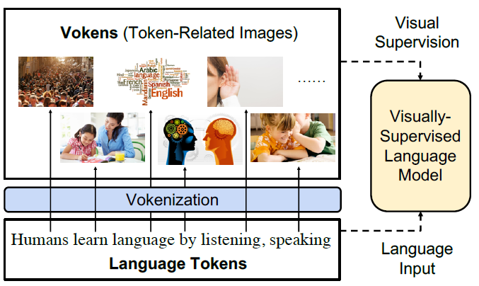
```
(ref:img-tan2020-04) From @tan2020vokenization. Visually supervised the language model with token-related images, called Vokens.

Everything sounds fantastic! There is only one small pitfall: a set of $X$ of images for all tokens does not exist! Could we find a proxy for such a set? One might consider image-captioning datasets such as MS COCO (@lin2014microsoft). But also this suboptimal solution is problematic.

```{r img-tan2020-01, fig.align = 'center', out.width = '100%',echo=FALSE, fig.cap="(ref:img-tan2020-01)"}
knitr::include_graphics("figures/02-03-img-support-text/img-tan2020-01.png")
```
(ref:img-tan2020-01) From @tan2020vokenization. Statistics of image-captioning dataset and other natural language corpora. VG, CC, Eng Wiki, and CNN/DM denote Visual Genome, Conceptual Captions, English Wikipedia, and CNN/Daily Mail, respectively. JSD represents Jensen–Shannon divergence to the English Wikipedia corpus.

The *Grounding Ratio* is defined as the proportion of tokens in a dataset which are related to a specific visual representation (i.e. the tokens are *visually grounded*), such as "dog", "table" and the like. In figure \@ref(fig:img-tan2020-01) it is striking that only around one third of tokens contained in pure language corpora such Wiki103, English Wikipedia and CNN/DM are visually grounded in image captioning datasets^[From an operative point of view, the authors consider a token type "visually grounded" if it has more than 100 occurrences in MS COCO]. It is not possible to rely (only) on image captioning datasets to build the Voken-Classification task. But the fact that a word/token does not have a visual representation in one of these datasets, it does not mean that it is not possible to visually represent the word/token. Would it be possible to associate images to words/tokens not directly visually grounded? Well, the answer is yes!


```{r img-tan2020-05, fig.align = 'center', out.width = '80%',echo=FALSE, fig.cap="(ref:img-tan2020-05)"}
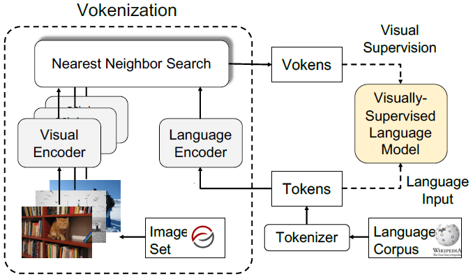
```
(ref:img-tan2020-05) From @tan2020vokenization. The Vokenization process. A contextualized image (visual token, Voken) is retrieved for every token in a sentence and with this visual token, visual supervision is performed.

The **Vokenization** is a process to *assign* every token $w_i$ contained in a sentence $s$ to a visual representation (called *voken*) originating not from a generative model but rather from a finite set of images $X=\{x_1,...,x_n\}$. The voken $v(w_i;s)$ is the image from $X$ which maximizes the following *Relevance Score Function*:
$$v(w_i;s)=arg\ max_{x\in X}r_{\theta^{*}}(w_i,x,s)$$
This function takes into account not only the token $w_i$  itself, but also the context (the sentence) and it is parametrized by $\theta$ with $\theta^{*}$ being the optimal value (which has to be estimated).

##### The Relevance Score Function: Model, Training, Inference

The Relevance Score Function is defined as the inner product of the language feature representation $f_{\theta}(w_i,s)$ and the visual feature representation $g_{\theta}(x)$:

$$f_{\theta}(w_i,s)^Tg_{\theta}(x)$$

Supposing $h_1,...,h_l$ and $e$ are the embeddings originating from pre-trained language and visual encoders respectively (in the paper the authors use BERT and ResNeXt), the language and visual representations are obtained first by applying multi-layer perceptrons $w\_mlp_{\theta}$ and  $x\_mlp_{\theta}$ to downproject the embeddings from the pre-trained models to a common vector space and secondly they are normalized (with L2-Norm):

$$ \textbf{f}_{\theta}(w_{i};s)= \frac{w{\_}mlp_{\theta}(\textbf{h}_{i})}{||w{\_}mlp_{\theta}(\textbf{h}_{i})||} $$
$$ \textbf{g}_{\theta}(x)= \frac{x{\_}mlp_{\theta}(\textbf{e})}{||x{\_}mlp_{\theta}(\textbf{e})||} $$

With respect to the training of the model, to estimate the optimal value for the parameter $\theta$, image-captioning datasets, which are collections of sentence-image pairs, are employed. Operationally, for every sentence $s_k$ associated to image $x_k$ in the image-captioning dataset, each token $w_i$ in $s$ is associated to $x_k$ and the *hinge loss* is used to estimate the optimal value of $\theta^*$:

$$ \mathcal{L}_{\theta}(s,x,x')=\sum_{i=1}^{l}max(0,M-r_{\theta}(w_{i},x,s)+r_{\theta}(w_{i},x',s))$$

The goal is to maximize the Relevance Score Function between aligned token-image pairs $(w_i,x;s)$ and to minimize the score for unaligned pairs $(w_i,x^{'};s)$ by at least a margin $M$, with $x^{'}$ being a randomly sampled image from the image captioning dataset **not** associated to sentence $s$.

Once we have the language feature representation $f_{\theta}(w_i,s)$ for each token in our language corpus  and the optimal estimate of $\theta$, how is it possible to find the image $x$ encoded with the visual feature representation $g_{\theta}(x)$, which maximizes the Relevance Score Function? As said earlier, the function is expressed as the inner product of the textual and visual representations and since the feature vectors have euclidean norm equal to 1, the inner product maximization problem is equivalent to a nearest neighbor search problem. It is just sufficient to find the vector $g_{\theta}(x)$ which is the nearest neighbor of $f_{\theta}(w_i,s)$^[The proof is straightforward. Let $X\in \mathbb{R}^l$ and have euclidean norm equal to 1, which means $||X||_{2}=1$. In the nearest neighbor search we need to find the vector $Y\in \mathbb{R}^l$, also with norm equal to 1, which has minimal euclidean distance with $X$. This is the quantity to be minimized:
\begin{align*}
d(X,Y) &=\sqrt{\sum_{i=1}^{l}{(x_i-y_i)^2}}
  \\&\stackrel{squared}{=} \sum_{i=1}^{l}{x_i^2}+\sum_{i=1}^{l}{y_i^2}-2\sum_{i=1}^{l}{x_iy_i}
  \\&\stackrel{}{=}||X||_{2}^2+||Y||_2^2-2X^TY
  \\&\stackrel{Norm-1}{=}1+1-2X^TY
  \\&\stackrel{}{=}2(1-X^TY)
\end{align*}
And through these simple algebraic manipulations, it is possible to see that minimizing the euclidean distance between $X$ and $Y$ is equivalent to maximize $X^TY$, which is the inner product. This proves the equivalence between inner product maximization and nearest neighbor search.].

With this process, it is thus possible to assign a visual representation, a voken, to any word/token in a language corpus, pooling from a finite set of images. The problem of the low Grounding Ratio outlined above is solved and the Voken-Classification task could be integrated in the pre-training framework of any pure language model. Moreover, the authors propose a method called *Revokenization*, which allows to transfer vokens generated using a particular tokenizer to frameworks which employ other tokenizers.

#### One Step Further: The Power Of Imagination

Wikipedia defines *imagination* as "the production or simulation of novel objects, sensations, and ideas in the mind without any immediate input of the senses". Indeed, humans do not only associate words with real images, but also leverage the ability to *imagine* words/concepts: imagination can help the human brain solve problems with limited supervision or sample points by empowering its generalization capabilities. Until now we discussed language models supported by visual information in form of *real* images (e.g. those retrieved from image-captioning datasets). But with the recent advancements in the field of generative models for images, it is for sure worth investigating if these generative models can help pure language models to produce better representations of words. In particular, the framework proposed by @lu2022imagination, **iACE (Imagination-Augmented Cross-Modal Encoder)** will now be discussed: the idea is simply to use a generative model to obtain a visual representation of a textual input and then use these imagined representations as "imagination supervision" to pure language models.

```{r img-lu2022-01, fig.align = 'center', out.width = '100%',echo=FALSE, fig.cap="(ref:img-lu2022-01)", }
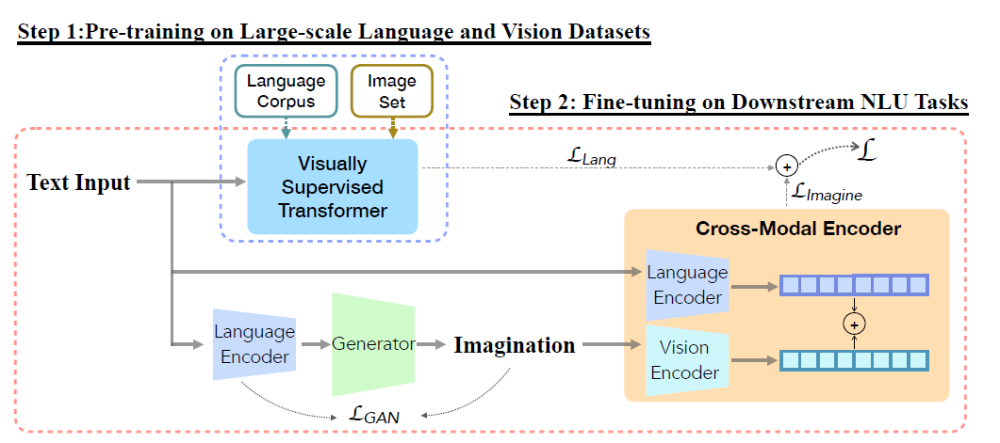
```
(ref:img-lu2022-01) From @lu2022imagination. The generator $G$ visualize imaginations close to the encoded texts by minimizing $\mathcal{L}_{GAN}$. The cross-modal encoder $E_c$ learns imagination-augmented language representation. Two-step learning procedure consists of: 1) pre-train a Transformer with visual supervision from large-scale language corpus and image set, 2) fine-tune the visually supervised pre-trained Transformer and the imagination-augmented cross-modal encoder on downstream tasks.

This framework has two main components:

- the **imagination generator $G$**: given an input text $x$, VQGAN (@esser2021taming) is used to render an "imagination" $i$ of $x$ and CLIP (@radford2021learning) is used  to see how well the generated image $i$ is aligned to the input text $x$. This generative framework is known as VQGAN+CLIP
- **Cross-modal Encoder $E_c$**: the input text and the rendered imagination are firstly encoded with a language and a visual encoder respectively and then  CLIP is employed as cross-modal encoder with inputs being text-imagination pairs

The learning procedure is composed of two main steps (depicted in figure  \@ref(fig:img-lu2022-01)): the first step consists in the pre-training of a visually supervised Transformer. In particular, the Voken-Classification task described before is employed, alongside a masked language modeling task. This is the baseline model, where no information from the "imagination" procedure comes yet into play. The second step is the *imagination-augmented fine-tuning* with two downstream datasets $D$ (GLUE, @wang2018glue and SWAG, @zellers2018swag).
\
On one side, the visually-supervised Transformer (the baseline) relies only on the textual input during the fine-tuning phase and the following loss function is employed:

$$ \mathcal{L}_{Lang}=-\sum_{j=1}^{|D|}\sum_{k=1}^{K}y_{k}\ log\ p_{k}(d_{j}(t)|D) $$

On the other hand, the *iACE* is trained to minimize the following cross-entropy loss:

$$ \mathcal{L}_{Imagine}=-\sum_{j=1}^{|D|}\sum_{k=1}^{K}y_{k}\ log\ p_{k}(d_{j}(t,v)|D) $$

with $t$ and $v$ being the textual and imagined features representations respectively, $j$ indicates the $j$-th data sample in dataset belonging to dataset $D$, $K$ is the number of classes and $p_k$ is the conditional distribution of $d_j$.
Training takes place in a jointly fashion and both losses, the imagination-augmented one $\mathcal{L}_{Imagine}$ and the pure language loss $\mathcal{L}_{Lang}$ are linearly combined, with $\lambda$ being a balance factor:

$$\mathcal{L}=\lambda\mathcal{L}_{Imagine}+(1-\lambda)\mathcal{L}_{Lang} $$

To sum up, this model-agnostic framework uses *generated images* for visual supervision and could be integrated on top of pure language models (such as BERT) or visually supervised models (such as the Voken model, which uses Vokens, real images for visual supervision).

### Was It Worth?
In this subchapter we investigated how visual inputs can support pure language models in capturing the semantics of words. We started with simple concatenation of linguistic and visual features and ended up with Transformer-based models, which are able to shape different word embeddings for the same word by taking into account also the context (the sentence). But now the question arises: with the addition of visual information, do we obtain word embeddings that are better than those from pure language models? In other words, is what we all have so far discussed worth? Well, as it is often the case in scientific research, the answer is: "it depends!"

Individual evaluation of each single model might not be ideal because each model has its peculiarities and it is impractical to make a direct comparison among them. It is more useful to capture and discuss the themes which are common to many models, in order to understand their strengths and weaknesses. This is how we will proceed and we will also differentiate between evaluation before Transformers and evaluation after Transformers.

#### Evaluation In The Pre-Transformers Era
Before the advent of Transformers, the evaluation focus was on the degree of alignment between learned semantic representations (word embeddings) and representations by human speakers, in form of correlation between model-based and human-based word-similarity judgments. Three main types of similarity are usually considered:

- Semantic similarity, e.g. “pasta is similar to rice”

- Semantic relatedness, e.g. “Bear is related to mountain”

- Visual similarity, e.g. "cucumbers look like zucchinis"

The evaluation pipeline could be summarized as follows:

```{r img-eval01, fig.align = 'center', out.width = '100%',echo=FALSE, fig.cap="Pipeline for intrisinsic evaluation of semantic representations. In the first step, the cosine similarity between two word embeddings w1 and w2 is used as similariry measure and in a second step, the correlation with human speakers'assessment is computed to gauge the quality of the embeddings. The higher the correlation, the better the embeddings.", }

```

Word embeddings are vectors and to measure the degree of similarity between two vectors, the *Cosine Similarity* is often used in the literature. In an ideal setting, we would have word embeddings with the following characteristics: if two words are semantically similar, the two embedding vectors should be similar and their cosine similarity should go towards 1. If the two words are unrelated, the embedding vectors should be orthogonal to each other and as a consequence, the cosine similarity should go towards zero. Lastly, if two words are negatively related, the two embedding vectors should point at opposite directions and the cosine similarity should go towards -1.
Once these similarity measures between word pairs are computed, in order to measure the quality of the embeddings several benchmarks can be employed, such as MEN (@bruni2014multimodal), WordSim353 (@agirre2009study) and SimLex999 (@hill2015simlex). These datasets could be described as collections of word pairs and associated similarity ratings by human speakers. Operationally, this means that real people were asked if a pair of words was related or not and to which degree, on a scale between -1 (negatively related) to +1 (semantically equivalent). The higher the correlation between the cosine similarity and the similarity judgments by humans, the higher the quality of the word embeddings. Having done this methodological premise, let's discuss the performance of these pre-Transformer models!

Since the goal of these models is to enhance pure language models with the addition of visual inputs, the baseline in the evaluation is always one (or more) pure language model(s). Well, do visually grounded embeddings outperform non-grounded ones? What emerges from virtually all papers is that visual grounding can actually help get a better semantic representation of *concrete* concepts, such as "cat", "table", "bicycle",  whereas they do not help much with the representation of abstract concepts such as "love" and "peace".

```{r img-2014hill-01, fig.align = 'center', out.width = '100%',echo=FALSE, fig.cap="(ref:img-2014hill-01)"}
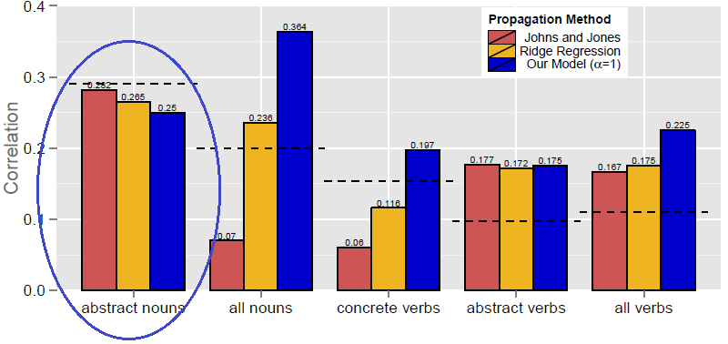
```
(ref:img-2014hill-01) From @hill2014learning: Each bar represents a different model settings and the dashed line indicates the pure linguistic benchmark model.
In figure \@ref(fig:img-2014hill-01) we can see that pure language models still perform better than models with visual inputs when it comes to the representation of abstract *nouns*. Another example is @kiela2017learning: they found that their models perform better when tested on datasets with a higher degree of concreteness and the same conclusion is reached by @collell2017imagined, which state that visual information can empower the representations of concepts that are to a certain extent visual. To sum up, effective semantic representation of abstract concepts constitute the main limitation common to many of the models discussed in this section.

#### Evaluation In The Post-Transformers Era

A limitation of the *intrinsic* evaluation metrics is the high degree of subjectivity: the *similarity* between two concepts depends in many instances on the experience, cultural background and preferences of the human observers. This is why the evaluation focus has now shifted to a more *extrinsic* dimension: how well do the models perform in downstream tasks? The problem of the "lack of objectivity" is thus solved because on downstream tasks there is no room for opinions. The datasets used to train the models are also different and the most widely used are:

- GLUE (@wang2018glue): 9 tasks, including single-sentence tasks (e.g. sentiment analysis), similarity tasks (e.g. paraphrasing), inference tasks (e.g. textual entailment)
- SQuAD (@rajpurkar2016squad): question/answer pairs
- SWAG (@zellers2018swag): multiple choice questions about grounded situations

As previously discussed, many Transformer-based models have universal vocation: they are built to solve a heterogeneous range of tasks from the language and vision domain. If we thus consider only performance on pure language tasks, the following two tables from @tan2020vokenization are insightful:

```{r img-tan2020-02, fig.align = 'center', out.width = '100%',echo=FALSE, fig.cap="(ref:img-tan2020-01)"}
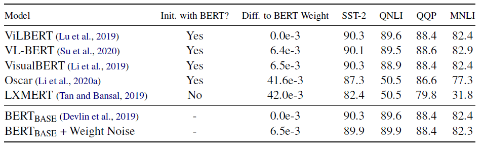
```
(ref:img-tan2020-02) From @tan2020vokenization. Results of vision-and-language pre-trained models (universal models) on GLUE tasks compared to baseline models (BERT).


```{r img-tan2020-03, fig.align = 'center', out.width = '100%',echo=FALSE, fig.cap="(ref:img-tan2020-03)"}
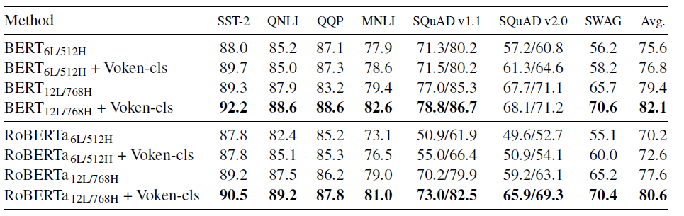
```
(ref:img-tan2020-03) From @tan2020vokenization. Fine-tuning results of different pre-trained models w/ or w/o the voken classification task (denoted as“Voken-cls”).

It is straightforward: unlike in the pre-Transformers Era, where grounded word embeddings could improve performance over baselines, Transformer-based universal models **do not** outperform pure language models such as BERT or RoBERTa. Nonetheless, the addition of visual supervision (the Voken-Classification task) in the pre-training framework can boost performance above the level of pure language models.


@pezzelle2021word analyzed the *intrinsic* quality of embeddings of some vision and language ("universal") models:

```{r img-pezzele2021-01, fig.align = 'center', out.width = '100%',echo=FALSE, fig.cap="(ref:img-pezzele2021-01)"}
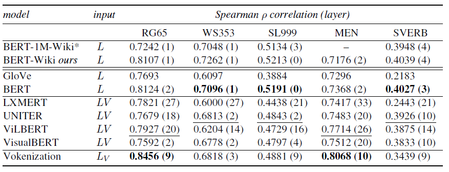
```
(ref:img-pezzele2021-01) From @pezzelle2021word. Spearman’s rank correlation between similarities computed with representations by all tested models and human similarity judgments in the five evaluation benchmarks.

```{r img-pezzele2021-02, fig.align = 'center', out.width = '100%',echo=FALSE, fig.cap="(ref:img-pezzele2021-02)"}
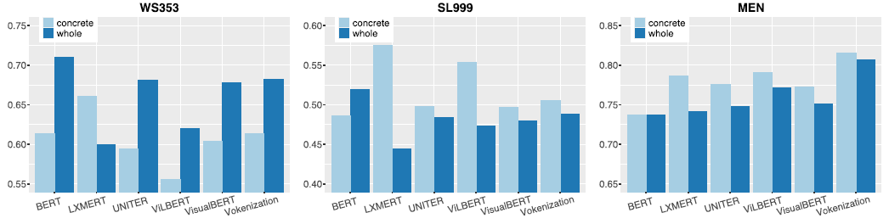
```
(ref:img-pezzele2021-02) From @pezzelle2021word. Correlation between model and human similarity ratings on WordSim353, SimLex999 and MEN. Each barplot reports results on both the whole benchmark and the most concrete subset of it.

From this *intrinsic* evaluation perspective (which was popular in the pre-Transformers Era), vision and language models do not generally outperform domain-specific models such as BERT and also in this case the only real competitor of pure language models is a model with visual supervision (again, Vokenization).

The bar plots depict correlation between human- and model-based similarity ratings, differentiating between the most *concrete* concepts contained in a certain dataset^[See @brysbaert2014concreteness for information on how *concreteness* of a word can be estimated.] and the whole dataset (thus including more abstract concepts). The results confirm the trend: multimodal models are more effective than pure language models at representing concrete words but in many instances they still lag behind when it comes to more abstract concepts.

Last but not least, few words need to be spent on a topic which has been steadily gaining relevance: **Few-Shot Learning**. To train and test models, a large pool of paired images and texts is often needed and the creation of many of the datasets used in fine-tuning required a huge data collection effort, which had to be performed by human agents. This implies that the creation of such data pools can be very costly. For this reason, there is a growing interest in creating models able to cope with low-resource settings. This boils down to the question: can a model perform well on downstream tasks even with just a *limited number* of training examples? The goal is actually once again, to mimic how humans learn: a person does not need to see one thousand pictures of a table, to be able to recognize a table...


```{r img-lu2022-02, fig.align = 'center', out.width = '100%',echo=FALSE, fig.cap="(ref:img-lu2022-02)"}
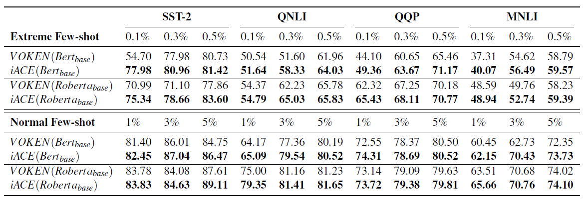
```
(ref:img-lu2022-02) From @lu2022imagination. Model-agnostic improvement in Few-shot Setting with GLUE benchmark.

This table from @lu2022imagination, where models are trained using only up to 5% of the training set, shows for example the ability for a model supervised with "imagination" (which was a generated visual representation of a certain textual input) to outperform models with only simple visual supervision (the Voken-model). This is just an example, but the ability to perform well in *few-shot* settings has become the touchstone of the evaluation modern multimodal models.

### The End Of This Story

We started this story with the *Symbol Grounding Problem*, which affirms that to grasp the meaning of a word, the word has to be put in a context other than the pure linguistic one. We thus investigated some of the architectures proposed to ground words in a visual space in form of static images. The goal (hope) is to better capture the semantics of words, in form of better word embeddings, to be employed in heterogeneous tasks, from *semantic-similarity* to downstream tasks, such as *sentiment analysis*.
\
From this brief analysis it emerges that grounding words in images can actually improve the representation of *concrete* concepts, whereas visual grounding does not seem to add value to pure language models when it comes to *abstract* concepts. Nonetheless, forms of visual supervision like the *Voken-Classification* task or the employment of generative models which allow to *imagine* words, such as in the *iACE-Framework*, might be the right way to bridge this gap.
\
The Transformers have been a revolution in the field of NLP and with their advent, the trend has now become to build models with pre-training tasks capable of generating powerful task-agnostic word representations. The knowledge gained with these tasks can be then transferred to downstream tasks with the goal to limit the amount of labeled data necessary to fine-tune models. Labeling data is indeed costly: this is why the ability of a model to generalize well when exposed to just few training examples has been steadily gaining importance as evaluation metric. This was the so called *few-shot learning*. Moreover, Transformer-based models have "universal vocation": they tend to be multimodal and multi-task, encompassing vision, language and vision and language tasks. This idea might be appealing because humans learn by being exposed to a multitude of different inputs and tasks. But as we have seen, pure language models such as BERT tend to still outperform multimodal multi-task models. There is definitely room for improvement.
\
One might wonder whether the grounding of words in images is the right way to seek a better representation of words. Well, humans learn using all five senses and maybe the answer might be to incorporate in the models more heterogeneous perceptual information: not only static images but also videos, speech and the like. The debate is still open: the story *goes on*...

Last but not least, a mention needs to be made on concrete applications of these image-empowered word-embeddings. The use of images to support linguistic models has been experimented in several fields, from *Dialogue Response Generation* (e.g. @sun2021multimodal) to *Machine Translation*, where for example @ive2019distilling found images to improve the quality of translation when the textual context is generic and/or ambiguous. The number of potential applications of the models described in this subchapter is growing steadily in the scientific community. But this is yet *another* story...


### Appendix: Selected Models - Summary

A table (available [here](https://github.com/slds-lmu/seminar_multimodal_dl/blob/master/Table-ch2-3-final.pdf)) contains a summary of selected language models augmented with visual components. For each model, the following information are reported:

- Pure language model and pretraining data
- Visual features and pretraining data
- Fusion strategy of the two modalities
- Benchmarks/baselines for evaluation

