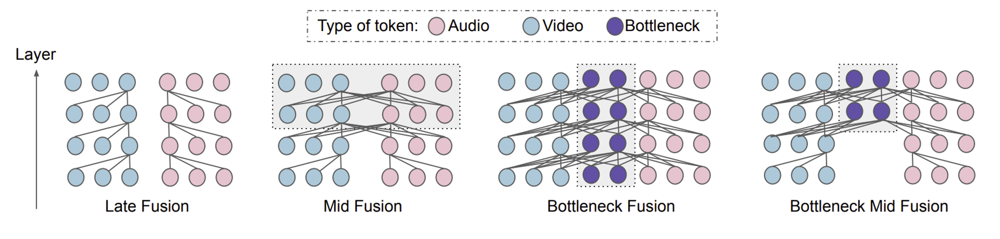
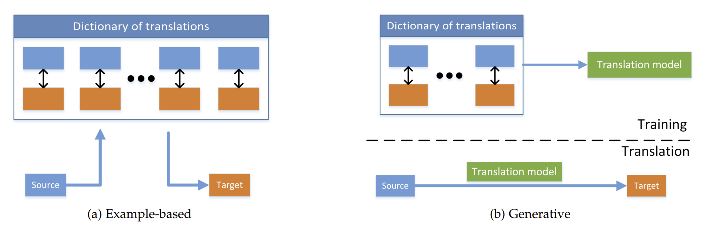
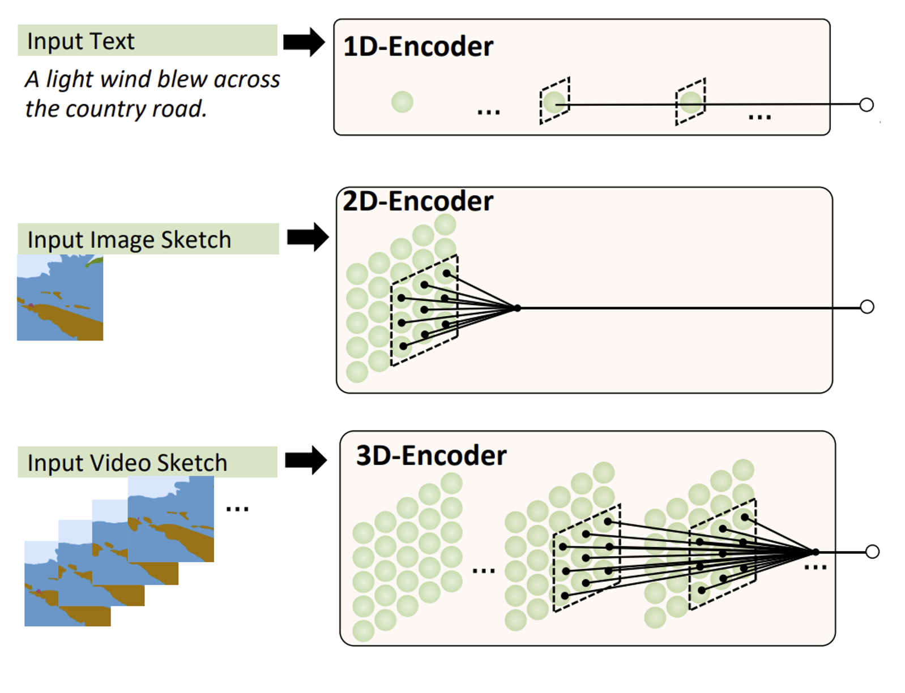
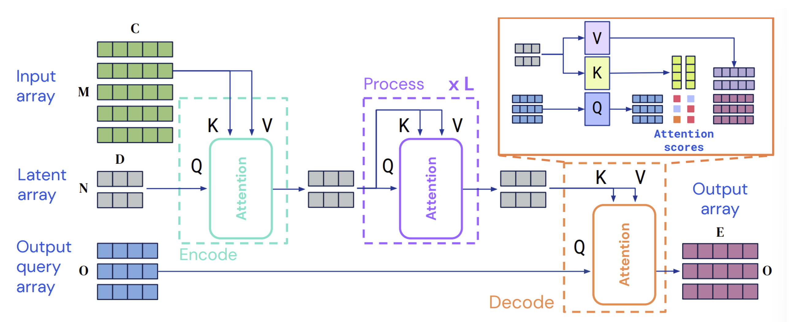
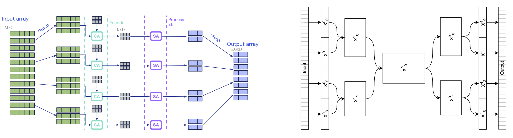
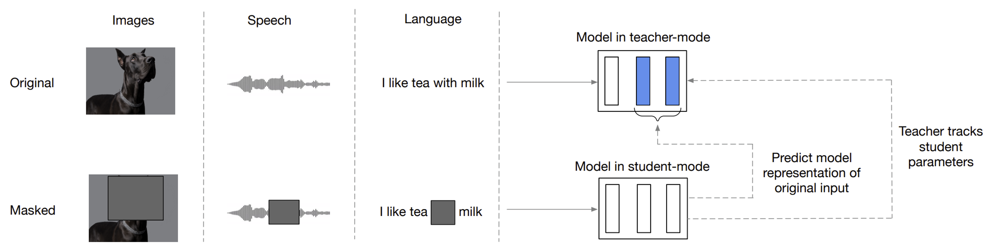
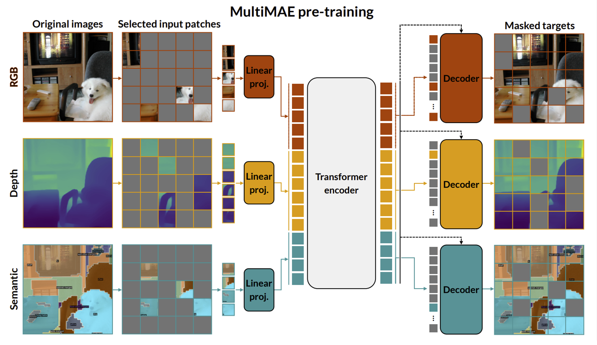

## Including Further Modalities {#c03-01-further-modalities}

*Author: Marco Moldovan*

*Supervisor: Rasmus Hvingelby*

Over the course of the previous chapters, we have introduced the basics of computer vision (CV) and natural language processing (NLP), after that we have learned about several directions of how we can combine these two subfields in machine learning. In the most general sense, we have explored ways in which we can process more than just one modality with our machine learning models.

So far, we have established the basics of multimodal deep learning by examining the intersection of these two most well-understood subfields of deep learning. These fields provide us with easy-to-handle data as seen in the corresponding previous chapter as well as a plethora of established and thoroughly examined models.

In reality though, text and images can be seen as only discrete snapshots of our continuous highly multimodal world. While text and images serve as an important foundation for us to develop concepts and algorithms for multimodal learning, they only represent a small part of what we as humans can perceive. First and foremost, we perceive reality in a temporal direction too, for a machine this could mean receiving video as input instead of just still images [@iv2021multimodal]. In fact, as videos are some of the most abundant types of data, we will later see that self-supervised learning on raw video is one of the major subtasks of multimodal deep learning. Clearly our reality is not just a sequence of RGB images though: just like in most videos we experience sound and speech which we would also like our models to process. Furthermore, we have different senses that can perceive depth, temperature, smell, touch, and balance among others. We also have sensors that can detect these signals and translate them to a digital signal so it is reasonable to want to have a machine learning algorithm detect and understand the underlying structure of these sensory inputs as well.

Now it might be tentative to simply list all different types of signals that we have developed sensors for and give a few examples of a state of the art (SOTA) deep neural network for each that tops some arbitrary benchmark. Since we are talking about multimodal learning, we would also have to talk about how these different modalities can be combined, and what the current SOTA research is, on all of these permutations of modalities. Quickly we would see that this list would get extremely convoluted and that we would not see the end of it. Instead of basing our understanding simply on a list of modalities we need a different, more intuitive system that lets us understand the multimodal research landscape. In the first part of this chapter we will attempt to introduce such a taxonomy based on challenges rather than modalities [@baltrušaitis2017multimodal].

If we consider multimodal deep learning as the task to learn models that can perceive our continuous reality just as precisely (if not more) than us humans [@lecun2022path], we have to ask ourselves how we can generalize our learnings from image-text multimodal learning to more types of signals. We have to ask what constitutes a different type of signal for us versus for a machine. What types of representation spaces we can learn if we are faced with having to process different signal types (modalities) and what are the strategies to learn these representation spaces. Here we will see that in large we can have two ways of processing modalities together, where defining their togetherness during training and inference will play the central role. After formalizing the types of multimodal representation learning we will move on and elaborate what the fundamental strategies are that allow is to learn these representation spaces. Then again, we can ask what we can practically do with these representation spaces: Here the notion of sampling and retrieving from our learnt representation spaces will play a major role. In fact we will see that almost all practical multimodal tasks can be generalized to what we call multimodal translation, where given a signal in one modality we want to return a semantically related signal in another modality.

The ideas that were just introduced are in fact what we consider to be the central challenges of multimodal learning, these challenges constitute the main pillars of our taxonomy of multimodal deep learning. Every problem in multimodal learning will have to solve at least one of these challenges. By viewing multimodal deep learning through these lens we can easily come across a new modality and understand immediately how to approach this problem without breaking our taxonomy.

After understanding these challenges the reader will hopefully take home a new way of thinking about how to solve and understand multimodal problems. Hopefully, when coming across a new research paper and tackling a new research project the reader will identify the challenges that the paper is trying to solve or which challenge requires solving for the research project and immediately know where to look.

Looking at the broader spectrum of the AI research landscape, as Yann LeCun has done in his recent paper [@lecun2022path], we can see that multimodal perception through deep learning is one particularly important building block for creating autonomous agents capable of displaying reason.

After having thoroughly introduced these central multimodal learning challenges we will look at some of the current research trends of multimodal deep learning from the point of view of our challenge taxonomy. In order to solve these challenges a system must implement two major building blocks: a multimodal model architecture and a training paradigm. In this part of the chapter we will introduce examples for both and successively generalize these concepts. By introducing more and more universal and problem- as well as modality-agnostic systems from current research we will lead into a research project that we ourselves are undertaking to merge a general multimodal model with a problem-agnostic training paradigm which will form the conclusion of this chapter. Hopefully by then two major concepts have transpired: 1) Introduce models and training paradigms that are general enough as to give a conclusion to this chapter’s very title: learning from any and including an arbitrary amount of further modalities in our learner and 2) sticking to the analogy of the human perceptive system and presenting models and training paradigms that can learn from any type of input signal just like we humans can. In the spirit of Yann LeCun’s JEPA paper the perceptive aspect of artificial intelligence is only one aspect of the system. Looking at the broader spectrum of the AI research landscape – as Yann LeCun has done in his recent paper, we can identify that multimodal perception through deep learning is one particularly important building block for creating autonomous agents capable of displaying reason. Other aspects such as reasoning and especially multi-tasking and scaling will be elaborated in [this] following chapter.

### Taxonomy of Multimodal Challenges
In this part we will introduce a taxonomy based on challenges within multimodal learning [@baltrušaitis2017multimodal].

#### Multimodal Representation Learning

At the core of most deep learning problems lies representation learning: learning an expressive vector space of distributed embedding vectors in which we can define a distance function that informs us about the semantic relatedness of two data points in this learnt vector space. For the sake of simplicity, we will assume that these vector spaces are learnt via deep neural networks trained with backpropagation. Normally we will have to apply some preprocessing to our raw data in order to transform it into a format that a neural network can read, usually in the form of a 2-dimensional matrix. As output the neural network will return some high-dimensional vector. But what if we are presented with more than one signal type (i.e., multimodal input)? How do we structure our input so that our models can sensibly learn from this multimodal input?

```{r joint-coordinated, echo=FALSE, out.width="100%", fig.align="center", fig.cap="Joint and coordinated multimodal representations[@baltrušaitis2017multimodal]."}
knitr::include_graphics("figures/03-01/joint-coordinated.png")
```

In the introduction for this chapter, we briefly mentioned the togetherness of multimodal signals during training and inference [@DBLP:journals/pami/BengioCV13]. By virtue of having more than one modality present as input into our learner – whether it be during training or inference – we want to relate these modalities somehow, this is the essence of multimodal learning. If we consider that our input signals from different modalities are somehow semantically related, we would like to leverage this relatedness across modalities and either have our learner share information between modalities and leverage this relatedness. Therefore cross-modal information has to come together at some point in our training and/or inference pipeline. How and when this happens is the central question of multimodal representation learning which we describe in this subchapter.

First, we have to specify that what is meant by their togetherness during training and inference. Togetherness loosely means that unside our learner we “merge” the information of the modalities.

To make this more concrete: on one side we could think of concatenating the input from different modalities together to form one single input matrix. This joint input then represents a new entity that consists of multiple modalities but is treated as one coherent input. The model then learns one representation for the joint multimodal signal. On the other hand, we could think of the input always as strictly unimodal for one specific model. Each model would be trained on one modality and then the different modalities are brought together only in the loss function in such a way as to relate semantically similar inputs across modalities. To formalize what we just introduced, joint representation learning refers to projecting a concatenated multimodal input into one representation space while coordinated representation learning will learn different representation spaces for each modality and coordinate them such that we can sensibly align these representation spaces and apply a common distance function that can relate points across modalities to each other.


##### Joint Representations

Given for example a video that consist of a stream of RGB images and a stream of audio signals as a waveform we would like our model to learn a representation of this whole input video as how it appears “in the wild.” Considering the entirety of the available input means that our model could leverage cross-modal information flow to learn better representations for our data: this means the model learns to relate elements from one modality to elements of the other. Of course, one could imagine concatenating all sorts of modalities together to feed into a model, such as audio and text, RGB image and depth maps, or text and semantic maps. The underlying assumption simply has to be that there is something to relate between the modalities – in other words there has to be a sensible semantic relationship between the modalities.

##### Coordinated Representation

When we are given data in multiple modalities, for learning coordinated representations, the underlying assumption will be that there exists some semantic relation between a signal in modality m and modality n. This relation can be equivalence – as in a video dataset where the audio at a given timestep t is directly intertwined with the sequence of RGB images at that timestep: they both are stand-ins for conceptually the same entity. The relation can also be a different function such as in the problem of cross-modal speech segment retrieval: here we want to return a relevant passage from an audio or speech file given a textual query. The text query is not the exact transcript of the desired speech segment, but they do relate to each other semantically, for this our model would have to learn this complex relationship across modalities [@baltrušaitis2017multimodal].

To do this we learn a class of models where each model will learn to project one modality into its own representation space. We then have to design a loss function in such a way as to transfer information from one representation to another: we essentially want to make semantically similar data points sit close together in representation space while having semantically dissimilar points sit far away from each other. Since each modality lives in its own representation space our loss function serves to align – or coordinate – these vector spaces as to fulfill this desired quality.

After having introduced what representation spaces we want to learn in the sections [multimodal fusion] and [multimodal alignment] we will elaborate further on exactly how we can learn joint and coordinate multimodal representation spaces respectively.


#### Multimodal Alignment

Alignment occurs when two or more modalities need to be synchronized, such as matching audio and video. It deals with the how rather than the what of learning coordinated representation spaces. Here, the goal is to learn separate representation spaces for each present modality, given that a dataset of corresponding data n-tuples exist. The embedding spaces are technically separate but through a carefully chosen learning strategy they are rotated and scaled such that their data points can be compared and queried across representation spaces. Currently the most common learning paradigm for alignment is contrastive learning. Contrastive learning was described extensively in a previous chapter, so in short: given a pair of semantically equivalent samples in different modalities we would want these data points to be as close as possible in embedding space while being far apart from semantically dissimilar samples[@baltrušaitis2017multimodal].

#### Multimodal Fusion

```{r fusion, echo=FALSE, out.width="100%", fig.align="center", fig.cap="Different types of multimodal fusion[@baltrušaitis2017multimodal]."}

```

Analogous to alignment, multimodal fusion describes how joint representations are learnt. Fusion describes the process of merging modalities inside the model, usually a concatenated and tokenized or patched multimodal input is fed into the model as a 2D matrix. The information from the separate modalities have to combine somehow inside the model to learn from one another to produce a more meaningful, semantically rich output. In the context of Transformer [@DBLP:conf/nips/VaswaniSPUJGKP17] based models this usually means where the different inputs start attending to one another cross-modally. This can happen either early on in the model, somewhere in the middle, close to the output in the last layer(s) or based on a hybrid approach. These techniques are usually either based on heuristics, the researcher’s intuition, biological plausibility, experimental evidence, or a combination of all [@DBLP:conf/nips/NagraniYAJSS21][@ DBLP:journals/jstsp/ZhangYHD20][@ shvetsova2021everything].

#### Multimodal Translation

```{r translation, echo=FALSE, out.width="100%", fig.align="center", fig.cap="Different types of multimodal translation [@baltrušaitis2017multimodal]."}

```

In many practical multimodal use-cases we actually want to map from one modality to another: As previously mentioned we might want to return a relevant speech segment from an audio file given a text query, we want to return a depth map or a semantic map given an RGB image or we want to return a description of an image to read out for visually impaired people[@bachmann2022multimae]. In any way we are presented with a datapoint in one modality and want to translate it to a different modality. This another one of the main challenges of the multimodal deep learning landscape and it is what this subsection will be about [@DBLP:journals/mt/SulubacakCGREST20].

##### Retrieval

In order to perform cross-modal retrieval one essentially has to learn a mapping that maps items of one modality to items of another modality. Practically this means aligning separate unimodal representation spaces so that the neighborhood of one datapoint contains and equivalent datapoint of a different modality when its representation space is queried at that point [@shvetsova2021everything][@ DBLP:conf/eccv/Gabeur0AS20].

Currently cross-modal retrieval is almost exclusively learnt via contrastive learning which we described previously [@DBLP:conf/icml/ChenK0H20][@ oord2018representation][@ DBLP:conf/icml/ZbontarJMLD21].


##### Generation

We might also be presented with the case where we have a query in one modality but a corresponding datapoint in a different modality simply does not exist. In this case we can train generative multimodal translation models that learn to decode samples from a vector space into an output of a different modality. This requires us to learn models with a deep understanding of the structure of our data: when sampling datapoint from our cross-modal representation space and applying a decoder to produce the intended output we need to sample from a relatively smooth distribution [@DBLP:journals/jstsp/ZhangYHD20]. Since we are actually doing interpolation between known points of our data distribution, we want to produce sensible outputs from “in between” our original data. Learning this smooth distribution often requires careful regularization and appropriate evaluation poses another challenge[@baltrušaitis2017multimodal].

With the hype around generative multimodal models created mostly by models such as Dall-E [@DBLP:conf/icml/RameshPGGVRCS21] came a huge spike in research around this area [@saharia2022photorealistic][@ wu2022nuwainfinity]. Currently lots of models generate photorealistic outputs through diffusion [@DBLP:conf/nips/HoJA20], yet they still employ models such as a pretrained CLIP [@DBLP:conf/icml/RadfordKHRGASAM21] module as the backbone.


### Current Research Trends: Generalized Self-Supervised Multimodal Perception

So far, we have understood the challenges we are faced with when trying to solve multimodal learning problems. We have understood that from a theoretical perspective we need to learn one or several semantic representation spaces and what the overarching constraints are for learning these vector spaces. Moreso, we have seen that given a coordinated representation space we can translate between modalities and decode our vector space into new data points. For joint representation spaces we can apply traditional downstream tasks such as classification or regression to better solve real world problems leveraging the interplay of all modalities at hand.
Going forward we will explore the two major building blocks for realizing these challenges from a more practical perspective:

- Multimodal Architectures
- Multimodal Training Paradigms

A combination of carefully chosen model architecture and training scheme is necessary to solve the challenges we have described on a high level. Throughout the rest of this subchapter, we will look at more and more general concepts for each of these components. In this subchapter we will also connect back to one central principal that we have introduced earlier in this chapter: approaching human-level of multimodal perception. This means that we will follow one of the major lines of research within multimodal deep learning: building more general and problem-agnostic solutions. We pose the question: Why apply hyper-specific solutions when we can simplify and generalize our methods while retaining (or even improving) on experimental results.
Towards the end of the chapter, we will also briefly introduce our own research in which we attempt to combine a modality agnostic model architecture with a generalized non-contrastive training paradigm for uni- and multi-modal self-supervised learning.

#### General Multimodal Architectures

First, we want to establish some desirable characteristics that our generalized multimodal model architectures should have:

- Input-Agnosticism: Whether our input consist of 1-dimensional sequences of audio waveforms or text or 3-dimensional inputs such as video we want out model to process all kinds of modalities equally with as little adjustments as possible.
- Multimodal Fusion: Ideally, we would also like to feed a concatenated input of several modalities into the model to learn joint representations.
- Preservation of Locality
- Respect Compositionality
- Flexible outputs: The model produces not only scalar or vector outputs but can ideally decode into any arbitrary output, thereby essentially having the capability for multimodal translation integrated.

We have not explicitly listed multimodal alignment as a desirable characteristic because the capability to perform alignment becomes trivial since we included the point about flexible outputs: to do alignment we need our model to output vectors that we can predict or regress over via a loss function.
To illustrate the state of current research we will briefly introduce three multimodal model architecture that fulfill some, if not all of the above-mentioned criteria.


##### NÜWA

```{r nuwa, echo=FALSE, out.width="100%", fig.align="center", fig.cap="Data being represented in the NÜWA-imposed 3D format[@wu2021nwa]."}

```

Initially conceived as a generative multimodal translation model here we are especially interested in the 3D-Nearby-Attention encoder-decoder stack at the center of NÜWA (Neural visUal World creAtion). We assume that our input, whether it be 1-dimensional sequences like text (or audio, although it was not used in the paper), 2-dimensional matrices like RGB images, sketches or semantic maps or 3-dimensional matrices like video (or possibly other modalities, e.g., depth maps) is already tokenized or divided into vectorized patches in case of 2D or 3D inputs. This is simply because we are using Transformer based encoder/decoder modules, therefore we need to reduce the input size beforehand. In the case of images or video this is done by a VQ-VAE. In principle any input is in the shape of a 3D matrix where one axis represents the temporal dimensions and the other axis representing the height and width. Clearly videos would fill out this input format in every direction, for still images the temporal dimension is simply one and for sequences such as text or audio they have height and width of one respectively and only stretch along the temporal dimension. Then for every token or patch a local neighborhood is defined amongst which the self-attention mechanism is applied. This saves on computational costs as for larger inputs global self-attention between all tokens or patches can become expensive. By imposing this 3D input format on all inputs, the model preserves the geometric and temporal structure of the original inputs, together with the locality respecting 3DNA mechanism the model introduces valuable and efficient inductive biases that make the model agnostic to input modality (if it is represented in the correct format), respects locality and allows for flexible outputs as it is intended to translate from any input to arbitrary outputs. Depending on how patching is performed for input data one could imagine a setup where the 3D encoder-decoder could also implement a hierarchical structure which would also respect compositionality in data[@kahatapitiya2021swat], but this was not studied in this paper, although a similar idea was implemented in the follow-up paper [@wu2021nwa][@ wu2022nuwainfinity].

##### Perceiver IO

```{r perceiver-io, echo=FALSE, out.width="100%", fig.align="center", fig.cap="Perceiver encoder stack shows how the cross-attention mechanism transforms large inputs into smaller ones that can be processed by a vanilla Transformer encoder [@jaegle2021perceiver]."}

```

The Perceiver consists of a vanilla Transformer encoder block, with the follow-up paper, Perceiver IO, adding an analogous Transformer decoder in order to produce arbitrary multimodal outputs. The trick the Perceiver introduces in order to process nearly any sort of (concatenated) multimodal input is a specific cross-attention operation. Given a (very long) input in of size $M \times C$ a so-called latent array of size $N\times D$ is introduced, where $N\ll M$. With the input array acting as key and value and the latent array as the query a cross-attention block is applied between the two, this transforms the original input to a much smaller size, achieving higher than 300x compression. Perceiver IO is currently likely the most flexible model when it comes to processing and outputting arbitrary multimodal outputs, it also easily handles the learning of joint representation spaces at it can process very large input array of concatenated multimodal data such as long videos with audio or optical flow maps[@DBLP:conf/icml/JaegleGBVZC21][@ jaegle2021perceiver].


##### Hierarchical Perceiver

```{r hierarchical-perceiver, echo=FALSE, out.width="100%", fig.align="center", fig.cap="The hourglass structure of the Hierarchical Perceiver (HiP)[@carreira2022hierarchical]."}

```

With information about locality and compositionality being mostly lost in the Perceiver IO encoder this follow up paper imposes a hierarchical hourglass-like structure on the encoder-decoder stack. An input matrix with length M tokens is broken down into G groups, each M/G in size. For each group a separate latent array of size $K \times Z$ is initialized, and a cross-attention operation is applied between each group and its respective latent array, followed by a number of self-attention + MLP blocks. The set of output vectors of each group is then merged to form an intermediary matrix consisting of KG tokens. This intermediary matrix can be used as input to the next block, forming the hierarchical structure of the encoder. Besides embedding more of the locality and compositionality of data into the model, this architecture also improves upon computational costs on comparison to Perceiver IO [@carreira2022hierarchical].

#### Multimodal Training Paradigms

Research of the past years has shown that in deep learning usually it is best to perform some sort of generalized task-agnostic pretraining routine. During self-supervised training that does not rely on any labeled data our model is trained to find underlying structures in the given unlabeled data. Given the right modeling and training scheme the model is able to approximate the true data distribution of a given dataset. This is extremely helpful as unlabeled data is extremely abundant so self-supervised learning lends itself as a way to infuse knowledge about the data into our model that it can leverage either directly for a downstream task (zero-shot) or helps as a running start during fine-tuning.


Since the conceptual part of pre-training was shown to have such an immense influence on downstream task performance, we will mainly focus on the self-supervised learning aspect of multimodal deep learning in this subchapter.

For self-supervised multimodal training paradigms, we can devise two major subcategories: those training paradigms that are agnostic to the input modality but operate only on a unimodal input and those that are both agnostic to input modalities but are truly multimodal.

##### Uni-Modal Modality-Agnostic Self-Supervised Learning

BYOL [@grill2020bootstrap] has introduced a paradigm shift for uni-modal self-supervised learning with its latent prediction mechanism. Its core idea is that the model to be trained is present in a student state and a teacher state where the teacher is a copy of the student with its weights updated by an exponentially moving average (EMA) of the student. Initially, BYOL was trained only on images: two augmentations would be applied to a base image and are then fed to the student and teacher network. The student would predict the latent states of last layers the teacher network via a simple regression loss. Data2vec extends this idea by generalizing it to other modalities: instead of applying specific augmentations to a base image a masking strategy is designed for each modality in order to augment the inputs, i.e., construct a semantically equivalent altered input. In the paper each modality has its own specific masking strategy and encoder backbone but in principle the paper showed that latent prediction SSL can be applied to other modalities such as text and audio just as well. Later we will introduce our own line of research where we try to generalize and simplify this even further and apply this concept to joint and coordinated representation problems.

Data2vec [@baevski2022data2vec] has already been extensively introduced in a previous chapter, because of that we would like to focus here on the importance of this relatively new line of SSL strategy that we call latent prediction SSL and why we think it is especially suitable for multimodal problems.

```{r data2vec, echo=FALSE, out.width="100%", fig.align="center", fig.cap="Illustration of data2vec[@baevski2022data2vec]."}

```

First off, how is latent prediction training different from other major SSL strategies like contrastive learning, masked auto-encoding (MAE) or masked token prediction? Whereas MAE and masked token prediction predict or decode into data space – meaning they need to employ a decoder or predict a data distribution – latent space prediction operates directly on the latent space. This means that the model has the predict the entire embedded context of an augmented or masked input, this forces the model to learn a better contextual embedding space and (hopefully) learn more meaningful semantic representations. Compared to contrastive approaches latent prediction methods do not require any hard negatives to contrast with. This alleviates us from the problem of producing hard negatives in the first place. Usually, they are sampled in-batch at training time with nothing guaranteeing us they are even semantically dissimilar (or how much so) from the anchor. The loss function of latent prediction SSL is usually L1 or L2 regression loss which is easy and straight-forward and without the need to predict in data space or mine hard negatives we avoid many of the disadvantages of the other SSL training schemes while also improving upon contextuality of our embeddings by virtue of prediction in latent space [@baevski2022data2vec].

Since this training paradigm is generalizable to multimodal problems and avoids common points of failure of other major SSL strategies it is in line with the principle that we follow here, namely: Why solve a harder problem when we can simplify it and retain performance and generality?

##### Multimodal Self-Supervised Learning

As we have elaborated extensively, we are faced with learning either joint or coordinated representations in virtually any multimodal problem. Currently no learning framework or paradigm covers both joint and coordinated learning at the same time. Joint representations are usually learnt via contrastive methods whereas coordinated representations usually employ some variant of masked input prediction or denoising autoencoding.

As an example, for multimodal contrastive learning for joint representations we will first look at VATT [@DBLP:conf/nips/AkbariYQCCCG21], short for Video-Audio-Text Transformer. In this paper the authors propose a simple framework for learning cross-modal embedding spaces across multiple (>= 2) modalities at once. They do so by introducing an extension to InfoNCE loss called Multiple-Instance-Learning-NCE (MIL-NCE). The model first linearly projects each modality into a feature vector and feeds it through a vanilla Transformer backbone. If the model is only used to contrast two modalities, then a normal InfoNCE loss is being used, for a video-audio-text triplet a semantically hierarchical coordinated space is learnt that enables us to compare video-audio and video-text by the cosine similarity.  First a coordinated representation between the video and audio modality is constructed via the InfoNCE [@DBLP:conf/icml/ChenK0H20] loss. Then a coordinated representation between the text modality and the now joint video-audio modality is also constructed similarly as shown in this figure. This hierarchy in these coordinated representations is motivated by the different levels of semantic granularity of the modalities, therefore this granularity is introduced into the training as an inductive bias. The aggregation of the several InfoNCE at different levels serves as the central loss function for this training strategy. It quickly becomes evident how this principle of learning (hierarchical) coordinated embeddings spaces can serve to learn between any n-tuples of different modalities if the respective n-tuples exist in a dataset.

MultiMAE [@bachmann2022multimae] is a different kind of paper in which the authors learn a joint representation of a concatenated input consisting of RGB images, depth, and semantic maps. The input is partitioned into patches with some of them randomly selected for masking. The flattened masked input is then fed into a multimodal ViT [@DosovitskiyB0WZ21] backbone. The authors then use different decoder blocks that act upon only the unimodal segments of the input. They hypothesize that the multimodal transformer can leverage cross-modal information in the input well enough as to embed multimodal semantic information in the output states. An additional global token that can access all input modalities is added for learning the joint representation. The task-specific decoders reconstruct their respective modality also by using one cross-attention module that can access information from the whole (multimodal) input. The aggregate reconstruction loss of all decoders serves as the model’s loss function. This training strategy thereby produces a joint representation of an arbitrary ensemble of patched 2D modalities and can simultaneously learn to perform unimodal tasks as well.

```{r multimae, echo=FALSE, out.width="100%", fig.align="center", fig.cap="Masking and cross-modal prediction visualized for MultiMAE[@bachmann2022multimae]."}

```

So far, we have seen that for multimodal self-supervised learning we have a class of strategy that revolves around learning coordinated representations using contrastive learning. After having met contrastive multimodal models such as CLIP in earlier chapters we have shown that we can extend the same principles to include further modalities such as audio and video. In fact, if we are provided, with collections of multimodal data that pairs one modality to another, this principle can be applied to any set of given modalities.

Also, we have met training strategies that aim to generalize joint representation learning to multiple modalities. While the presented MultiMAE focuses on 2-dimensional modalities such as RGB, depth and semantic maps we could easily imagine applying the same principle to include other modalities as well – given we can process our raw signals to represent them in the appropriate format a model can read.

We have omitted any specific learning strategies that pretrain specifically for translation tasks. For retrieval tasks it is evident that contrastive methods would offer zero-shot cross-modal retrieval capabilities. For generative tasks, the interested reader is invited to study the NÜWA paper whose 3D multimodal encoder we have introduced earlier: in it the authors leverage an identical 3D decoder to translate modalities one into another in a self-supervised manner. While the NÜWA 3D Attention encoder-decoder stack is not technically a multimodal model they do apply cross-modal cross-attention in to transfer semantic information from an encoded prompt to the decoder.

##### Personal Research: General Non-Contrastive Multimodal Representation Learning

So far, we have looked at unimodal and multimodal SSL as two separate categories. Research so far has not married the two concepts into a training paradigm that can learn both multimodal joint representations as well as cross-modal coordinated representations.

Let us consider a concatenated multimodal input signal. This concatenated input array would only really differ from a unimodal signal in that it already contains modality specific encodings added to the raw input – similar to those seen in the Perceiver. In fact, let us consider a multimodal input of the exact format seen in the Perceiver. In principle we could apply some masking strategy to this input array to mask out consecutive chunks of the input matrix and apply the same latent prediction training paradigm as seen in data2vec. We craft this masking strategy in such a way as to account for highly correlated nearby signals. If we were to randomly mask single rows of the input the task of predicting the mask input for very long inputs such as in videos or audio files becomes too trivial.

By representing all inputs, whether they are unimodal or multimodal in this unified format inspired by the Perceiver and applying a generic masking strategy we have essentially generalized data2vec to any arbitrary uni- or multimodal input. A Perceiver backbone model ensures that the handling and encoding of exceptionally large input arrays becomes efficient and effective.

Similarly let us consider a multimodal input for coordinated representations. Let us also assume that our model shares its weights across the separate modality-specific representation spaces (similar to VATT). Latent prediction training schemes such as BYOL and data2vec feed separate augmentations of the same input into the model which can be either in student or teacher (or online and offline) mode. The assumption is that both inputs should be roughly semantically equivalent so the model can learn to ignore the augmentations or masks to catch the essential structure within the data. We pose the question: Are different modalities  of the same thing also not just as semantically equivalent? Can we view different modalities simply as augmentations of one another and leverage the same training paradigm as in BYOL and data2vec, feeding one modality into the student model while feeding another into the teacher model? Would this learner be able to catch the essence of semantic equivalence of these two input signals? In our research project we try to answer these questions as well, our unified generalized multimodal learning framework is the first of its kind to be applicable to both joint as well as coordinated representations without any adjustments.

We propose this unified multimodal self-supervised learning framework as a novel and first-of-its-kind training paradigm that generalizes the unimodal self-supervised latent prediction training scheme inspired by BYOL and data2vec to an arbitrary number of input modalities for joint representation learning as well as cross-modal coordinated representation learning without the use of contrastive methods. Our method requires data to be presented in a generic format proposed by the Perceiver and requires just one single masking strategy.

This resolves the need for modality-specific masking strategies and models like in data2vec. For the cross-modal use-case we eliminate the need for hard negatives which are usually required for contrastive learning.