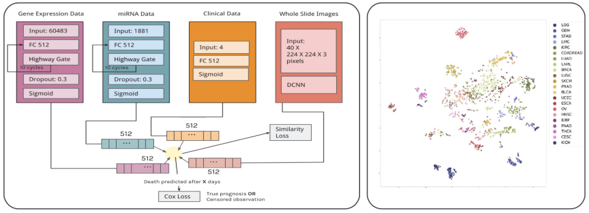
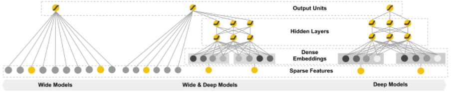
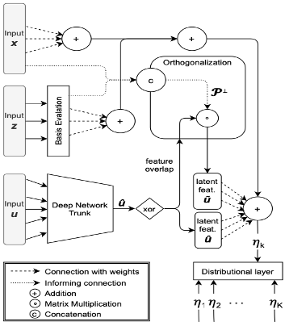
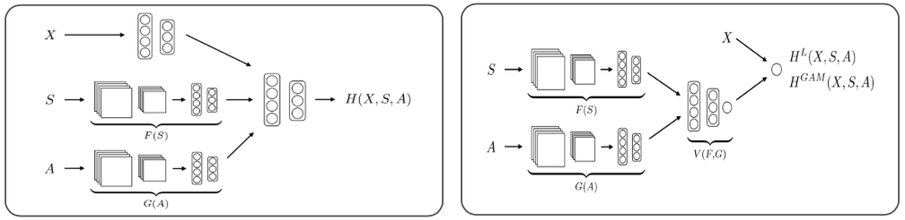

# Structured + Unstructured Data

*Author: Rickmer Schulte*

*Supervisor: Daniel Schalk*

## Intro

While the previous chapter has extended the range of modalities considered in multimodal deep learning beyond image and text data, the focus remained on other sorts of unstructured data. This has neglected the broad class of structured data, which has been the basis for research in pre-deep learning eras and which has given rise to many fundamental modeling approaches in statistics and classical machine learning. Hence, the following chapter aims to give an overview of both data sources and will outline the respective ways how these have been used for modeling purposes as well as more recent attempts to model them jointly. 

Generally, structured and unstructured data substantially differ in certain aspects such as dimensionality and interpretability. This has led to various modeling approaches that are particularly designed for the special characteristics of the data types, respectively. As shown in previous chapters, deep learning models such as neural networks are known to work well on unstructured data. This is due to their ability to extract latent representation and to learn complex dependencies from unstructured data sources to achieve state-of-the art performance on many classification and prediction tasks. By contrast, classical statistical models are mostly applied on tabular data due the advantage of interpretability inherent to these models, which is commonly of great interest in many research fields. However, as more and more data has become available to researchers today, they often do not only have one sort of data modality at hand but both structured and unstructured data at the same time. Discarding one or the other data modality makes it likely to miss out on valuable insights and potential performance improvements.

Therefore, in the following sections we will investigate different proposed methods to model both data types jointly and examine similarities and differences between those. Different fusion strategies to integrate both types of modalities into common deep learning architectures are analyzed and evaluated, thereby touching upon the concept of end-to-end learning and its advantages compared multi-step procedures. The different methods will be explored in detail by referring to numerous examples from survival analysis, finance and economics. 
Finally, the chapter will conclude with a critical assessment of recent research for combining structured and unstructured data in multimodal DL, highlighting limitations and weaknesses of past research as well as giving an outlook on future developments in the field.


## Taxonomy: Structured vs. Unstructured Data

In order to have a clear setup for the remaining chapter, we will start off with a brief taxonomy of data types that will be encountered. Structured data, normally stored in a tabular form, has been the main research object in classical scientific fields. Whenever there was unstructured data involved, this was normally transformed into structured data in an informed manner. Typically, doing so by applying expert-knowledge or data reduction techniques such as PCA prior to further statistical analysis. However, DL has enabled unsupervised feature extraction from unstructured data and thus to feed it to the models directly. Classical examples of unstructured data are image, text, video, and audio data as shown in the figure below. Of these, mostly the use of image data together with tabular data will be examined along various examples later in the chapter. While previously mentioned data types allow for a clear distinction, lines can become increasingly blurred. For example, the record of a few selected biomarkers or genes from patients would be regarded as structured data and normally be analyzed with classical statistical models. On the contrary, having the records of multiple thousand biomarkers or genes would rather be regarded as unstructured data and usually be analyzed using DL techniques. Thus, the distinction between structured and unstructured data does not only follow along the line of dimensionality but also concerns the interpretability of single features within the data. 

<Figure1: Structured vs. Unstructured Data >


## Fusion Strategies

After we have classified the different data types that we will be dealing with, we will now discuss different fusion strategies that are used to merge data modalities into a single model. While there are potentially many ways to fuse data modalities, a distinction between three different strategies, namely early, joint and late fusion has been made in the literature. Here we follow along the taxonomy laid out by @HuangFusion2020 with a few generalizations as those are sufficient in our context. 

**Early fusion** refers to the procedure of merging data modalities into a common feature vector already at the input layer. The data that is being fused can be raw or preprocessed. The step of preprocessing usually involves dimensionality reduction to align dimensions of the input data. This can be done by either training a separate DNN (Deep Neural Network), using data driven transformations such as PCA or directly via expert knowledge.

**Joint fusion** offers the flexibility to merge the modalities at different depths of the model and thereby to learn latent feature representations from the input data (within the model) before fusing the different modalities into a common layer. Thus, the key difference to early fusion is that latent feature representation learning is not separated from the subsequent model. Allowing for backpropagation of the loss to guide the process of feature extraction from raw data. This process is also called end-to-end learning. Depending on the task, CNNs or LSTMs are usually utilized to learn latent feature representations. As depicted in the figure below, learning lower dimensional feature representations does not have to be applied to all modalities and is often only done for unstructured data. A further distinction between models can be made regarding their model head, which can be a FCNN (Fully Connected Neural Network) or a classical statistical model (linear, logistic, GAM). While the former can be desirable to capture possible interactions between modalities, the latter is still frequently used as it preserves interpretability.

**Late fusion** or sometimes also called decision level fusion is the procedure of fusing the predictions of multiple models that have been trained on each data modality separately. The idea originates from ensemble classifiers, where each model is assumed to inform the final prediction separately. Outcomes from the models can be aggregated in various ways such as averaging or majority voting.

```{r fusion-strategies, echo=FALSE, out.width="100%", fig.align="center", fig.cap="(ref:fusion-strategies)"}
knitr::include_graphics("figures/03-02-struc+unstruc-data/Fusion_Strategies.png")
```
(ref:fusion-strategies) Data modality fusion strategies [Adopted from @HuangFusion2020].

We will refer to numerous examples of both early and joint fusion in the following sections. While the former two are frequently applied and easily comparable, late fusion is less common and different in nature and thus not further investigated here. For the sake of simplicity we will refer to the special kind of multimodal DL including both structured and unstructured data when we speak about multimodal DL in the rest of the chapter.

## Applications

The following section will discuss various examples of this kind of multimodal DL by referring to different publications and their proposed methods. The publications originate from very different scientific fields, which is why methods are targeted for their respective use case. Hence, allowing the reader to follow along the development of methods as well as the progress in the field. Thereby, obtaining a good overview of current and potential areas of applications. As there are various publications related to this kind of multimodal DL, the investigation is narrowed down to publications which either introduce new methodical approaches or did pioneering work in their field by applying multimodal DL. 

## Multimodal DL in Survival

Especially in the field of survival analysis, many interesting ideas were proposed with regards to multimodal DL. While clinical patient data such as electronic health records (EHR) were traditionally used for modeling hazard functions in survival analysis, recent research has started to incorporate image data such as CT scans and other modalities such as gene expression data in the modeling framework. Before examining these procedures in detail, we will briefly revisit the classical modeling setup of survival analysis by discussing the well-known Cox Proportional Hazard Model (CPH).

### Traditional Survival Analysis (CPH Model)
Survival Analysis generally studies the time duration until a certain event occurs. While many methods have been developed to analyze the effect
of certain variables on the survival time, the Cox Proportional Hazard Model (CPH) remains the most prominent one. The CPH models the hazard rate which is the conditional probability of a certain event occurring in the next moment given that it has not so far:


$$
h(t|x) = h_0(t) * e^{x\beta}
$$
where $h_0(t)$ denotes the baseline hazard rate and $x\beta$ the linear effects of the covariates on which the probability is conditioned on. The fundamental assumption underlying the traditional CPH is that covariates influence the hazard rate proportionally and multiplicatively. This stems from the fact that the effects in the so-called risk function $f(x) = x\beta$ are assumed to be linear. Although this has the advantage of being easily interpretable, it does limit the flexibility of the model and thus also the ability to capture the full dynamics at hand. 

### Multimodal DL Survival Analysis
Overcoming the limitations of the classical CPH model, @Katzman2018 were among the first to incorporate neural networks into the CPH and thereby replacing the linear effect assumption. While this helped to capture interactions and non-linearities of covariates, it only allowed modeling of structured data. This gave rise to the model DeepConvSurv of @DeepConvSurv, who apply CNNs to extract information from pathological images in order to predict risk of patients subsequently. They showed that learning features from images via CNNs in an end-to-end fashion outperforms methods that relied on hand-crafting features from these images. Building on the idea of DeepConvSurv, @DeepCorrSurv extended the model by adding further modalities. Besides pathological images, their proposed DeepCorrSurv model also includes molecular data of cancer patients. The name of the model stems from the fact that separate subnetworks are applied to each modality and that the correlation between the output of these modality specific subnetworks are maximized before fine-tuning the learned feature embedding to perform well on the survival task. The correlation maximization procedure aims to remove the discrepancy between modalities. It is argued that the procedure is beneficial in small sample settings as it may reduce the impact of noise inherent to a single modality that is unrelated to the survival prediction task. 

The general idea is that the different modalities of multimodal data may contain both complementary as well as common information shared by all modalities. The idea was further explored by subsequent research. @TongAE for example introduced the usage of auto encoders (AE) in this context by proposing models that extract the lower dimensional hidden features of the AE applied to each modality. While their first model trains AEs on each modality separately before concatenating the learned features (ConcatAE), their second model obtains cross-modality AEs that are trained to recover both modalities from each modality respectively (CrossAE). Here, the concept of complementary information of modalities informing survival prediction separately gives rise to the first model, whereas the concept of retrieving common information inherent across modalities gives rise to the latter. Although, theoretically both models could also handle classical tabular EHR data, they were only applied to multi-omics data such as gene expressions of breast cancer patients.

Similar to @TongAE, @Cheerla2019 also derive their model from the idea of common information that is shared by all modalities. Besides, having specialized subnetworks for each modality to learn latent feature embeddings, they also introduce a similarity loss that is added to the classical cox loss from the survival prediction. This similarity loss is applied to each subnetwork output and aims to learn modality invariant latent feature embeddings. This is desirable not only for noise reduction but also in cases of missing data. While previous research often applied their models only on subsets of the large cancer genome atlas program (TCGA), @Cheerla2019 analyze 20 different cancer types of the TCGA using four different data modalities. As expanding the scope of the study increases the problem of data missingness, they specifically target the problem by introducing a variation of regular dropout, which they refer to as multimodal dropout. Instead of dropping certain nodes, multimodal dropout drops entire modalities during training in order to make models less dependent on one single data source. This allows the model to better cope with missing data during inference time. Opposed to @TongAE, the model is trained in an end-to-end manner and thus enables the survival prediction loss to guide latent feature learning. More impressive than their overall prediction performances are the results of T-SNE-mappings that are obtained from the learned latent feature embeddings. One sample mapping is displayed in the figure below, which nicely shows the clustering of patients with regards to cancer types. This is particularly interesting regarding the fact that the model was not trained on this variable. Besides being useful for accurate survival prediction, such feature mappings can directly be used for patient profiling and are thus pointed out as a contribution to the research on their own. 

```{r cheerla-model, echo=FALSE, out.width="100%", fig.align="center", fig.cap="(ref:cheerla-model)"}

```
(ref:cheerla-model) a) Architecture with Similarity Loss  b) T-SNE-mapped representations of feature vectors [@Cheerla2019].

@MultiSurv2021 extend the previous work by enlarging the scope of study, analyzing up to six different data modalities and 33 cancer types of the TCGA dataset. Their so-called MultiSurv model obtains a straightforward architecture, applying separate subnetworks to each modality and a subsequent FCNN (model head) to yield the final survival prediction. Testing their modular model on different combinations of the six data modalities, they find the best model performance for the combination of structured clinical and mRNA data. Interestingly, including further modalities lead to slight performance reductions. Conducting some benchmarking, they provide evidence for their best performing model (structured clinical + mRNA) to outperform all single modality models. However, it is worthwhile mentioning that their largest model, including all six modalities, was not able to beat the classical CPH model, which was based on structured clinical data only. While this already may raise concerns about the usefulness of including so many modalities in the study, high variability of model performance between the 33 cancer types is also found by the authors and may indicate a serious data issue. The finding may seem less surprising, considering the fact that tissue appearances can differ vastly between cancer types. This is particularly problematic as for some of these cancer types only very few samples were present in the training data. For some there were only about 20 observations in the training data. Although state-of-the-art performance is claimed by the authors, the previously mentioned aspects do raise concerns about the robustness of their results. Besides, facing serious data quantity issues for some cancer types, results could simply be driven by the setup of their analysis by testing the model repeatedly on different combinations of data modalities. Thereby increasing the chances to achieve better results at least for some combinations of data modalities. Moreover, the study nicely showcases that the most relevant information can often be retrieved from classical structured clinical data and that including further modalities can by contrast even distort model training when sample sizes are low compared to the variability within the data. While these concerns could certainly have been raised for the other studies as well, they simply became more apparent in @MultiSurv2021 due their comprehensive and transparent analysis.

In the last part of this section we will refer to a different set of survival models by introducing the concept of Wide & Deep NN. The idea for Wide & Deep NN was first introduced by @WideDeepNN2016, who proposed to not only feed data inputs to either a linear or FCNN model part, but both at the same time. Applying it in the context of Recommender Systems, the initial assumption was that models need to be able to memorize as well as generalize for prediction tasks and that these aspects could be handled by the linear and FCNN part, respectively. 

```{r wide-deep-nn, echo=FALSE, out.width="100%", fig.align="center", fig.cap="(ref:wide-deep-nn)"}

```
(ref:wide-deep-nn) Illustration of Wide & Deep Neural Networks [@WideDeepNN2016].

The idea of Wide & Deep NN is applied in the context of multimodal DL survival by @Poelsterl2020 and @DeepPAMM2022. Similar to previous studies @Poelsterl2020 make use of the CPH model and integrate Wide & Deep NN in these. By contrast, @DeepPAMM2022 integrate them in a different set of survival models, namely the piecewise exponential additive mixed model (PAMM). Without going into detail, the general purpose of this model class is not only to overcome the linearity but also the proportionality constraint in the classical CPH. By dropping the proportionality assumption, these models yield piecewise constant hazard rates for predetermined time intervals. Although the two studies differ in their model setup, both studies leverage structured as well as visual data and additionally make use of a linear model head. The latter is particularly interesting as it is this additive structure in the last layer of the models which preserves interpretability. Yielding models that not only obtain the flexibility for accurate predictions itself but which are also able to recover the contributions of single variables to these predictions.

Although, Wide & Deep NN are advantageous due to their flexibility and interpretability, special care needs to be taken regarding a possible feature overlap between the linear and NN part as it can lead to an identifiability problem. This can be illustrated by considering the case that a certain feature $x$ is fed to the linear as well as the FCNN model part. Because of the Universal Approximation Theorem for Neural Networks, it is known the FCNN part could potentially model any arbitrary relation between the dependent and independent variable ($d(x)$). However, this is what raises the identifiability issue as the coefficients ($\beta$) of the linear part could theoretically be altered arbitrarily ($\widetilde{\beta}$) without changing the overall prediction when the weights of the NN ($\widetilde{d}(x)$) are adjusted accordingly.


$$
x\beta + d(x) = x\widetilde{\beta} + d(x) + f(x) = x\widetilde{\beta} + \widetilde{d}(x)
$$
Generally, there are two ways to deal with this identifiability problem. The first possibility would be to apply a two-stage procedure by first estimating only the linear effects and then applying the DL model part only on the obtained residuals. An alternative would be to incorporate orthogonalization within the model, thereby performing the procedure in one step and allowing for efficient end-to-end training. The latter was proposed by @SSDDR2020 and utilized in the DeepPAMM model by @DeepPAMM2022. The next section will go into more detail about the two possibilities to solve the described identifiability issue and proceed by discussing further applications of multimodal DL in other scientific fields. 

### Multimodal DL in Other Scientific Fields

After having seen multiple applications of multimodal DL in survival analysis which predominantly occurs in the biomedical context, we will now extend the scope of the chapter by discussing further applications of multimodal DL related to the field of economics and finance. While structured data has traditionally been the main studied data source in these fields, recent research has not only focused on combining both structured and unstructured data, but also on ways to replace costly collected and sometimes scarcely available structured data with freely available and up-to-date unstructured data sources using remote sensing data. Before examining these approaches, we will first go into more detail about the model proposed by @SSDDR2020, which not only introduced a new model class in the context of multimodal DL but also offered a method to efficiently solve the above mentioned identifiability problem.

As previous research exclusively focused on mean prediction, uncertainty quantification has often received less attention. @SSDDR2020 approach this by extending structured additive distributional regression (SADR) to the DL context. Instead of learning a single parameter e.g. the mean, SADR provides the flexibility to directly learn multiple distributional parameters and thereby natively includes uncertainty quantification. It is nevertheless possible to only model the mean of the distribution, which is why SADR can be regarded as a generalization of classical mean prediction. @SSDDR2020 now extend this model class by introducing a framework that can model these distributional parameters as a function of covariates via a linear, generalized additive (GAM) or NN model. All distributional parameters are resembled in a final distributional layer (output layer) and are learned independently. An illustration of their so-called Semi-Structured Deep Distributional Regression (SSDDR) is given in the figure below. 

```{r SSDDR, echo=FALSE, out.width="100%", fig.align="center", fig.cap="(ref:SSDDR)"}

```
(ref:SSDDR) Architecture of SSDDR [@SSDDR2020].

If the mean is now modeled by both a linear and DNN part and the same feature inputs are fed to both model parts, we are in the setting of Wide & Deep NN. As illustrated above, such feature overlaps give rise to an identifiability issue. The key idea of @SSDDR2020 to mitigate this problem was to integrate an orthogonalization cell in the model, that orthogonalizes the latent features of deep network with respect to the coefficients of the linear and GAM part if feature overlaps are present. More precise, in case $\boldsymbol{X}$ contains the inputs, that are part of the feature overlap, the projection matrix $\boldsymbol{\mathcal{P}^{\perp}}$ projects into the respective orthogonal complement of the linear projection which is on the column space spanned by $\boldsymbol{X}$. This allows backpropagation of the loss through the orthogonalization cell and therefore enables end-to-end learning. As the linear and GAM effect channels are directly connected to the distributional layer, the orthogonalization cell is therefore able to preserve the interpretability of the model.

Another way of orthogonalizing feature representations is by applying a two-stage procedure as described above. @Law2019 utilize this procedure to make their latent feature representations retrieved from unstructured data orthogonal to their linear effect estimates from structured data. More specifically, they try to accurately predict house prices in London using multimodal DL on street and aerial view images as well as tabular housing attributes. Applying the two-stage procedure they aim at learning latent feature representations from the image data which only extracts features that are orthogonal to the housing attributes. Thereby, they limit the chances of confounding in order to obtain interpretable housing attribute effects. Conducting a series of experiments, they find that including image data next to the tabular housing data does improve the prediction performance over single modality models albeit structured data remains the most relevant single data source. As a next step, they test their models with different model heads as depicted in the figure below to explore their respective potentials. Although models with a DNN as model head generally offer larger modeling flexibility, as they can incorporate interactions, they achieved only slight performance gains over models with the additive linear model heads in the study. This is particularly interesting as the latter additionally preserve the often desired interpretability of effects. As the models with linear model head perform reasonably well, they argue that it is indeed possible to obtain interpretable models without losing too much on the performance side.

```{r model-heads, echo=FALSE, out.width="100%", fig.align="center", fig.cap="(ref:model-heads)"}

```
(ref:model-heads) Fully nonlinear and semi-interpretable models [@Law2019].

In the last part of this section, we will allude to several other promising approaches that did pioneering work related to multimodal DL. While most of them use unstructured data sources such as remote sensing data, some do not specifically include structured data. They are still covered in this chapter to give the reader a broad overview of current research in the field. Moreover, structured data could easily be added to each of these models, but often studies intentionally avoid the use of structured data sources as they are sometimes scarcely available due to the cost of data collection. Besides availability, structured data such as household surveys are irregularly conducted and often differ vastly between countries, making large scale studies impossible. Therefore, different studies have tried to provide alternatives to classical surveys by applying DL methods on freely available unstructured data sources. While @Jean2016 use night and daylight satellite images to predict poverty in several African countries, @Gebru2017 use Google Street View images to estimate socioeconomic attributes in the US. Both deploy the classical DL framework such as CNNs to retrieve relevant information from image data for the prediction task. Achieving reasonable prediction results while keeping analysis costs at low levels, both studies outline the potential of their proposed methods as being serious alternatives to current survey based analysis. 

Other studies such as @DeepGPYou2017 and @Sirko2021 proposed DL frameworks for satellite imagery in contexts where labelled data is normally scarce. While @DeepGPYou2017 use deep Gaussian Processes to predict corn yield in the US, @Sirko2021 apply CNNs to detect and map about 516 million buildings across multiple African countries (around 64% of the African continent). Besides being of great importance for applications such as commodity price predictions or financial aid distribution, the results of the two studies could easily be combined with other structured data sources and thereby could constitute a form of multimodal DL with high potential.


### Critical Assessment

### Conclusion and Outlook
-Achievements: Different ways to incorporate multi modal data using DL
-General Observations:
tabular data often carries the most important information (noisy image data and small sample size)
end-to-end learning may improve performance of predictions
Joint fusion with head classical statistical model can preserve interpretability
-Major challenges: Small sample sizes particularly for images from patients,
making it hard for DL to extract valuable information from images so that structured data sources mostly carry the most relevant information,
insufficient benchmarking between proposed models as well as with the most important benchmark of single modality models (especially tabular data only models), DL has many tunable parameters, which makes it easy to achieve small improvements for some configurations
not clear on which data and which fields multi-modal works best, not clear which DL archtiectures as well as fusion strategies work best (joint fusion with interpretable or NN as head)
strong publication bias
-Outlook: Do we need multi-modal deep learning in regular scientific context (outside classical Computer vision tasks) where good and interpretable structured data is available? - In current setup it might seem questionable, but with increasing data sizes 
However: Missing Data might be more easily handled if different data sources contain not only complementary but also consensus information
-mention TCGA
