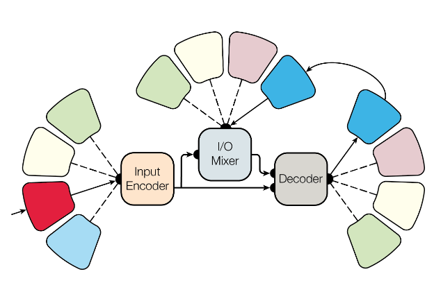
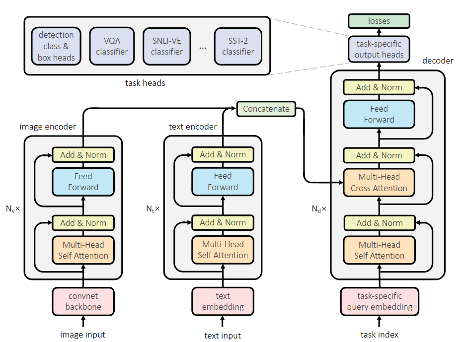
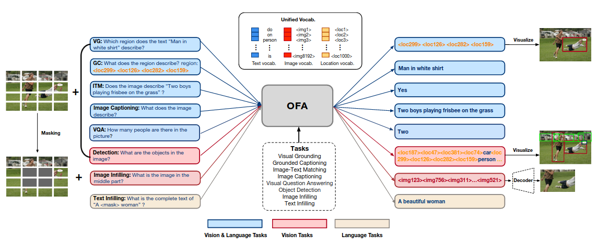
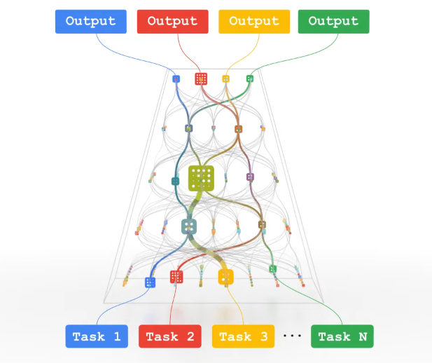
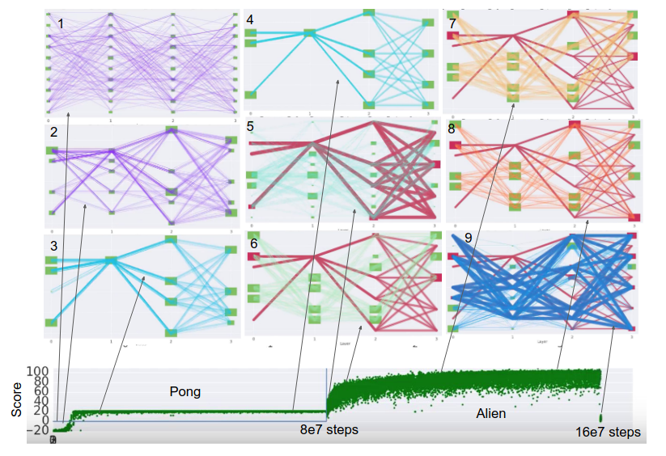
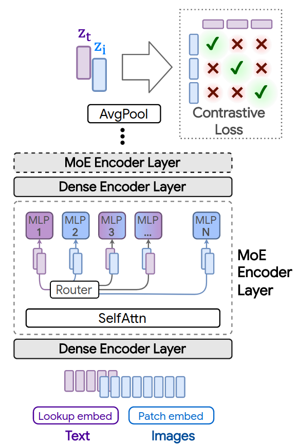

## Multipurpose Models {#c03-03-multi-purpose}

*Author: Philipp Koch*

*Supervisor: Rasmus Hvingelby*


In this chapter, we will broaden the focus to include multitask learning additionally to multimodal learning. We will call this approach multipurpose models.
Many multipurpose models have been introduced in recent years (@Kaiser2017, @Hu2021, @Wang2022, @Reed2022), and the field gained attention.
First, we will provide an in-depth overview of existing multipurpose models and compare them. In the second part, challenges in the field will also be
discussed by reviewing the Pathways proposal [@Dean21] and promising work addressing current issues for the progress of multipurpose models.


### Prerequisites

At first, we will define the concept of multipurpose models and lay out the necessary prerequisites to make the later described models more accessible.
We will introduce the definition of multipurpose models and further concepts that this book has not covered so far.


#### Multitask Learning

After the extensive overview of multimodal learning [in the previous chapter](#c02-00-multimodal), we now need to introduce multitask learning as another concept to define
multipurpose models.

Multitask learning (@Caruana1997, @Crawshaw2020) is a paradigm in machine learning in which models are trained on multiple tasks simultaneously.
Tasks are the specific problems a model is trained to solve, like object recognition, machine translation, or image captioning. Usually, this happens using a single model,
which does not leverage helpful knowledge gained from solving other tasks. It is assumed that different tasks include similar patterns that the model can exploit and use
to solve other tasks more efficiently. The equivalent in human intelligence is the transfer of knowledge for new tasks since humans do not need to learn each task from scratch
but recall previous knowledge that can be reused in the new situation. However, this assumption only sometimes holds since some tasks may require opposing resources, so
performance decreases.

Multitask learning thus aims to achieve better generalization by teaching the model how to solve different tasks so that the model learns relationships that can be used
further on. For a more in-depth overview of multitask learning, we refer to [@Caruana1997] and [@Crawshaw2020].


#### Mixture-of-Experts {#03-03-MoE}

Another prerequisite to this chapter is the mixture-of-expert (MoE) (@Jacobs1991, @Jordan1994, @Shaazer2017) architecture, which is aimed at increasing the overall model
size while still keeping inference time reasonably low. In an MoE, not all parts of the net are used but just a subset. The *experts* are best suited to deal with the input
allowing the model to be sparse.

MoE is an ensemble of different neural networks inside the layer. MoEs allow for being more computationally efficient while still keeping or even improving performance. The
neural networks are not used for every forward pass but only if the data is well suited to be dealt with by a specific expert. Training MoEs usually requires balancing the
experts so that routing does not collapse into one or a few experts. An additional gating network decides which of the experts is called. Gating can be implemented so that
only *K* experts are used, which reduces the computational costs for inference by allowing the model to be more sparse.


#### Evolutionary Algorithms {#03-03-EA}

An evolutionary algorithm is used to optimize a problem over a discrete space where derivative-based algorithms cannot be applied to. The algorithm is based on a population
(in the domain to be optimized) and a fitness function that can be used to evaluate how close a member of the population is to the optimum. Parts of the population are chosen
to create offspring either by mutation or recombination. The resulting population is then evaluated with respect to their fitness function, and only the best-suited individuals are kept.
The same procedure is repeated based on the resulting population until a specific criterion is met (e.g., convergence). While evolving the population, it is necessary to balance exploration
and exploitation to find the desired outcome. Since EAs are research topics themselves and may vary heavily, we refer to [@Baeck1993] and, more recently, to [@Doerr2021] for further insights.


#### Multipurpose Models

Now multipurpose models can be defined as multimodal-multitask models. Akin to the underlying assumptions of both learning paradigms, it can also be deduced
that multipurpose models mimic human intelligence by marrying the concepts of multiple perceptions and transferring knowledge about different tasks for better generalization.


### Overview of Mulitpurpose Models

In this section, we will closely examine existing multipurpose models. The main focus will be on how combining different modalities and tasks is achieved. At the end of
this section, all models will be compared to provide a comprehensive overview of promising research directions.


#### MultiModel

The first prominent multipurpose model is the so-called MultiModel [@Kaiser2017]. This model, from the pre-transformer era, combines multiple architectural approaches
from different fields to tackle both multimodal and multiple tasks. The model consists of four essential modules: The so-called modality nets, the encoder, the  I/O Mixer, and the decoder.

Modality nets function as translators between real world data and a suitable representation for the inner modules. They also follow the purpose of back-translating,
from the representation to the real world, to create output. For language tasks, the modality net is a tokenizer that outputs the appropriate embeddings, while for vision tasks,
convolution operations transform the images into the proper representation. Furthermore, there are also nets for audio and categorical modalities. The modality nets embed the input
into a unifying vector space which can be passed to the encoder. To produce the output, the representations from the decoder are fed into another modality net to produce the output.
Language and categories are the only target modalities that have respective modality nets.

The core model consists of the encoder, the I/O mixer, and the decoder. Input is passed from the modality nets to the encoder first. Subsequently, the encoder passes its output further
to the I/O mixer and the decoder. The decoder produces the output sequence. However, producing an autoregressive sequence requires knowledge of the previously generated sequence. Thus
the output of the decoder is also read by the I/O mixer, which provides the decoder with the necessary information about the previous sequence. The I/O mixer passes its output back to the
decoder to provide the necessary information. The decoder and I/O mixer require modality nets to read and write in the target modality. The encoder consists of multiple convolution operations
and a [mixture-of-expert](#03-03-MoE) layer. The I/O mixer and the decoder combine their dual input using cross-attention. A positional encoding conceptually similar to the one in transformers [@vaswani2017attention]
is used for the attention mechanism.

MultiModel was trained on eight datasets, from which six were from the language modality and COCO [@mccoco] and ImageNet [@ImageNet] from vision. For training, four experts in the MoE layers
were used. The combined trained MultiModel on ImageNet and machine translation were below state-of-the-art (SOTA) models. Also, the combined model did not achieve significantly better results
than a specialist model, which is the same model but trained solely on one task. However, it was found that the combined model did perform much better on a low-resource task than the respective
specialist model.

MultiModel offers a pre-transformer approach to deal with different modalities on multiple tasks; although it is only used to generate text and clasification, the setup allows extending to
other modalities easily.

```{r multimodel, fig.align = 'center', out.width = '80%',echo=FALSE, fig.cap="(ref:multimodel)"}

```
(ref:multimodel) Architecture of *MultiModel*. The outer boxes without text are the modality nets. From @Kaiser2017.


#### Unified Transformer (UniT)

A more recent multipurpose model is UniT (Unified Transformer) [@Hu2021]. UniT is built upon the transformer architecture, in which both encoder and decoder are used.

To account for multimodality and multitasking, the basic transformer [@vaswani2017attention] is enhanced. The encoder part of UniT consists of two modality-specific encoders since the initial
setup is aimed at the modalities of text and vision. However, more modality-specific encoders may be added. For the case of language, a BERT model [@Devlin2018] is used, while a
detection transformer (DETR) [@Carion2020] encoder is used for vision. DETR uses a particular approach to feed images to the encoder. At first a CNN is used to create a lower dimensional
representation of the input image, which is then reorganized as a sequence. This sequence is then fed into the encoder following @vaswani2017attention. The [CLS] token is also used in the BERT
encoder, which is also included in the output sequence of the encoder. A task-specific token is additionally added to the input of the encoders. The output of the encoders is then concatenated
to form a single sequence. The decoder is fed with this sequence and a task-specific query. Since the decoder architecture sticks to the DETR model, the decoder does not produce a sequence
autoregressively. Instead of taking the previously produced sequence (autoregressively) as input, the decoder is fed with the task-specific query vectors instead, thus producing a uniform output. On top of the
decoder are task-specific heads needed to transform the decoder output into the desired shape for the specific task.

For training, the object detection task requires bounding box loss from DETR, while the other tasks use cross-entropy loss.

In experiments, UniT was evaluated against a single-task version of itself. The
general model outperformed the specialist one on multimodal tasks but was outperformed on unimodal tasks by the specialist UniT. UniT was furthermore also outperformed by SOTA models, although
the numbers remained comparable.

Even though UniT does not achieve SOTA or consistently outperforms its specialist version, it is a powerful method to achieve a simple multipurpose model. By using available encoder models, it
is easily extendable.

```{r unit, fig.align = 'center', out.width = '80%',echo=FALSE, fig.cap="(ref:unit)"}

```
(ref:unit) Modified transformer for UniT. The decoder follows the implementation of DETR [@Carion2020]. From @Hu2021.

#### OFA - Sequentialization is All You Need

Another multipurpose transformer is OFA (Once For All) [@Wang2022]. To utilize the sequence-to-sequence (seq2seq) architecture of the transformer, all input is transformed into a seq2seq problem.

While MultiModel and UniT use specific modules for a modality (modality nets and modality-specific encoders), a different approach is used for OFA. All input is sequentialized and embedded in a shared
representation space. Since tokenizing an image using a vocabulary is not feasible, a similar approach to ViT [@dosovitskiy2020image] is used (where input is flattened to 16 x 16) to 
obtain a sequence of $P$ representations. These representations are in the same dimension as the token embeddings from text input, which are tokenized using Byte-Pair-Encoding
[@sennrich-etal-2016-neural]. After feeding the embeddings through the encoder, the decoder produces the output as a sequence again. However, in this case, images are represented as a sequence of
tokens, similar to the image-patch vocabulary in DALL-E [@pmlr-v139-ramesh21a]. Furthermore, a special sequence for bounding boxes is also used for object detection and recognition. To generate
the task-specific solution, it is thus required that another model is used to generate the images based on the tokens and to visualize the bounding boxes based on the obtained coordinates.

Since OFA is an autoregressive model (the probability for the next token is predicted based on the previously produced tokens and the input provided), the objective is based on cross-entropy loss.
OFA was trained on different crossmodal tasks: visual grounding, grounded captioning, image-text matching, image captioning, and visual question answering. Further unimodal tasks for training did
include: image infilling, object detection, and text reconstruction as in BART [@lewis-etal-2020-bart].

OFA outperformed SOTA models on cross-modal tasks like image captioning, visual question answering, visual entailment, and visual grounding. On uni-modal tasks, OFA performed well, although it
did not outperform SOTA models. OFA showed additional transfer capabilities to unseen tasks, which were presented with an additional description to solve the task in a few-shot manner. Although
the results were satisfactory, the model was not evaluated against a specialist baseline.

OFA proved to be a powerful model that is capable of using the entire transformer architecture by sequentializing all input and thus producing tokenized output.

```{r ofa, fig.align = 'center', out.width = '100%',echo=FALSE, fig.cap="(ref:ofa)"}

```
(ref:ofa) *OFA*, the different input and output concepts can be seen here. From @Wang2022.

#### Gato - A Generalist Decoder

Another model that utilizes the seq2seq approach in transformers is Gato [@Reed2022]. The model can be used as a language model, an agent to play games, and an agent to control robotics.

As in OFA, problems are transformed into a seq2seq problem, on which a transformer (decoder only) is applied. Every input from text, vision, robotics, and games is represented sequentially.
Visual input is encoded using a flattened sequence of 16x16 patches fed into a ResNet [@ResNet], while text input is tokenized using SentencePiece [@kudo-richardson-2018-sentencepiece].
Furthermore, discrete values like buttons in games and continuous data like movements from robotics are tokenized in a vocabulary too. To represent
all modalities sequentially, the different tokens are concatenated. A separator token "|" is added to distinguish the observations from the following action, so that a sequence looks simplified as the following:

$$\left [ ... \left [ x_{\textrm{Text}}, x_{\textrm{Images}}, x_{\textrm{Discrete and Continuous Values}}, |, y_{\textrm{Action}} \right ]_i, ... \right ]$$

By using this approach, the transformer can predict the next action autoregressively since it is a sequential problem. In the case of text, the action token is also a text token. Since it is
only necessary to predict the action based on the previous values, a mask function is added to the cross-entropy loss function, which masks the previous values so that only the next action
is predicted and not the conditions for the action. The masking function is always one for text since every previous text token is necessary for language modeling.

Gato was evaluated on reinforcement-learning-based (RL) tasks against specialist RL agents, where Gato performed worse than the specialist agents. On unseen tasks, Gato required fine-tuning since
few-shot learning is not feasible due to the input length restrictions in transformers. However, the results were mixed. Some improvements were possible, and the expert was outperformed, but
in other cases, massive fine-tuning efforts only led to small gains. It was found that the generalist agent outperformed the specialist agent (particularly trained for this task) most of the time.
Only at the specific Atari Boxing [@atari] task, Gato was outperformed by the specialist Gato model. Both performed much lower than another task-specific model used as a baseline. In robotics, Gato showed comparable
behavior to the baseline SOTA model. Additionally, Gato also showed capabilities in image captioning and dialogue modeling, although these aspects were not elaborated further.

Like OFA, Gato can sequentialize all input and produce a sequential output that can be back-transformed to solve a task. It was shown that Gato could sometimes transfer knowledge on unseen tasks and outperform the specialist agent most of the time.


#### Comparison

Although many tasks and modalities lead to a curse of dimensionality for comparison, the architectures and the respective modifications of the introduced systems remain simple to compare.

A trend toward seq2seq models can be seen with MultiModel, OFA, and Gato solving tasks in a seq2seq manner. The most prominent similarity is the transformer architecture used entirely
(encoder & decoder) in OFA and truncated (decoder only) in Gato. Another significant similarity between both architectures is the use of a particular ordering of input and output. 
In Gato, the sequence is organized around predicting an action using a special token, while OFA produces a sequence as a solution which can be the bounding box or the sequence of an image
to be fed in the generator module. While Gato can solve tasks from robotics and game playing, OFA can also generate images. However, both architectures require specific modules to decode the tokens into
the respective modality.

Gato and OFA both use a shared representation space. Minor details differ, so the image tokenization process is different, and additionally, Gato can encode more modalities than the published
version of OFA (although extending OFA is theoretically simple).

MultiModel also show some familiar characteristics. The architecture is from the pre-transformer age but also brings many characteristics of the transformer architecture, like the use of
attention, positional encodings, and encoder-decoder. Since the output in the presented version only produced text or classification separately, there is no need for special orderings used
in OFA and Gato.
The necessity to produce the modality-specific output in modality nets is similar to the generator module in OFA that produces images. However, the tokens are already produced in an
intermediate step in OFA, while the modality nets are crucial to producing the final output in MultiModel. UniT follows an entirely different approach that is more pragmatic by leveraging the
contextual capabilities of the transformer decoder.
*M* modalities can be encoded as a sequence on which the transformer decoder fuses the modalities and learns the relationships. The use of special tokens for each task and task-specific heads,
focus the model on the requested task yet also requires tuning the model specifically.

None of the models besides OFA achieved SOTA results. Compared to specialist models, the general models were comparable in their results (Gato, UniT, MultiModel). MultiModel, OFA, and Gato showed transferability on
low-resource or unseen tasks. However, more research in this direction is highly recommended. MultiModel was only compared on a low-resource task against a specialist model,
and OFA was not compared to another model for the unseen task. Gato performed better than a specialist model, trained from scratch on most unseen tasks, but failed against the untrained specialist
model in Atari Boxing.


| Model         | Approach                              | Modalities                                                | Outperformed Specialist Model?            |Unseen Tasks?                  | Number of Parameters  | Year  |
|---            |---                                    |---                                                        |---                                        |---                            |---                    |---    |
| OFA           | Seq2Seq                               | Vision, Text                                              |                                           | Yes                           | 33M-930M              | 2022  |
| Gato          | Seq2Seq                               | Vision, Text, Robotics, Discrete Entities (e.g., Buttons) | In most cases                             | Yes                           | 79M-1.18B             | 2022  |
| UniT          | *m* Encoders, task-specific head      | Vision, Text                                              | No                                        | No                            | 201M                  | 2021  |
| MultiModel    | Different *modality nets* for Seq2Seq | Vision, Text, Audio, Categorical                          | Comparable                                | Excelled on low resource task | Unknown               | 2017  |

Comparing the models among each other becomes difficult with more modalities and tasks, which is its own curse of dimensionality. For example, Gato also included robotics and RL,
which none of the other models included. MultiModel also has a modality net for sound, while UniT and OFA only worked for vision and text. Further research into the comparability of
multipurpose models becomes essential.


### Pathways and Promising Works
Although models have become more capable of solving complex tasks, significant limitations remain. 
A persisting issue in current deep learning is the necessity to train from scratch and disregard already obtained knowledge, which is highly ineffective compared to human intelligence. Another
issue arises from the evergrowing, dense networks that requires more and more resources.

In this section, we will review the Pathways proposal [@Dean21] and promising techniques to address these issues. Overcoming these problems would be especially beneficial for multipurpose
models. Reusability of knowledge is crucial for the multitask perspective, and improving the performance of potentially billion-parameter-sized models will also have a significant positive impact.

```{r pathways, fig.align = 'center', out.width = '80%',echo=FALSE, fig.cap="(ref:pathways)"}

```
(ref:pathways) Concept of Pathways. Different tasks follow different paths to different expert models. From @Dean21, [Screenshot August 31th 2022](https://www.youtube.com/watch?v=Nf-d9CcEZ2w).


#### Pathways Proposal
Pathways [@Dean21] follows a different idea than previously seen methods. The model consists of a large graph through which data can be forward passed. The nodes of the network are neural
networks themselves. A pass through this network does not include passing all nodes and thus not all neural networks, but only a few. The pass follows a specific path from one entry to the
network's exit. The underlying idea behind this is similar to the mixture-of-expert models described previously. Only the specific networks dedicated to solving a problem are to be activated during inference.

At this point, it is necessary to recall that multitask learning aims to generalize better on new tasks since the knowledge about previously learned tasks can be applied. This idea is the
foundation of Pathways too, where specialist networks (nodes) are combined in a larger network. It is assumed that the model's generalization capabilities increase significantly by finding
an appropriate path for a task to the appropriate expert nodes. In this setup, the particular task-specific problem-solving capabilities are combined. Furthermore, multimodality is also
considered as a potential extension. Adding more modalities might not be a difficult problem considering the architecture of the previously introduced transformer-based models.
Overall the approach of a sparse model combining multiple experts offers many opportunities to combine modalities and reuse task-specific capabilities. The sparsity of the model offers
decreased inference time since only few parts of the networks are activated during inference.

Another aspect of the Pathways proposal includes the improvement of current hardware limitations. It is already observable that Moore's Law (*each n years, the compute capacity doubles*) has
been slowing down substantially, while deep learning research has grown exponentially in the late 2010s [@Dean20]. Thus, hardware also needs to be adapted to the growing demand in deep learning.
In the context of the pathway proposal, a novel framework for Google data centers has been introduced, aiming to reduce overhead during computation and access specific parts of the model to
utilize the technical advantages of sparse networks. As opposed to dense models where a whole model must be accessed, with sparse networks it is not necessary to use the whole network but only chunks of it. So far, two large pre-trained models have been introduced based on the new training framework. One is the Pathways Language Model (PaLM) [Chowdhery2022],
which is currently the largest language model using 540 billion parameters, Minerva [@Lewkowycz2022]. Minerva is based on PaLM, and Parti [@parti],


#### PathNet

An earlier approach for a sparse multitask network, which looks deceptively similar, is PathNet [@Fernando2017]. PathNet is a training concept that reuses knowledge from a previously learned
task without the risk of catastrophic forgetting (knowledge is overwritten), thus using solely the positive aspects of multitask learning. The objective of PathNet consists of a evolutionary
algorithm (EA).

Neural networks are often depicted as a graph in which the input is directed to all nodes in hidden layers, and their output is again passed to all nodes in the next hidden layer or an output layer.
In the case of PathNet, each node is itself a neural network. The training algorithm finds the best paths for a specific task through the network.

At first random paths through the network are initialized, then the paths are trained for *T* epochs. After training, the paths are evaluated against each other. The winning path overwrites
the losing path. However, to achieve exploration, the overwritten path is mutated by randomly including neighbors of the winning path. Until a specific criterion to stop
(e.g., number of epochs) is reached, the current paths are frozen so that no more modifications to the parameters of the networks on this path are possible. All other parameters
are newly initialized again. Also, a different, task-specific head is initialized. The same procedure is now done again for the next task. Then, the main difference is that the previously obtained path,
including the trained networks, is frozen during training so that the model can transfer knowledge from the previous task to the new task. The model then finds appropriate paths throughout the
network until the stopping criterion is met again.

PathNet was evaluated on supervised learning tasks and RL scenarios. Learning from scratch and fine-tuning a PathNet, were chosen as a baseline. For fine-tuning, the first path was chosen as a
base model that was fine-tuned on the second task. Overall, PathNet improved training time and prediction quality for the second task compared to standard fine-tuning and learning from scratch.
PathNet has shown that different tasks can reuse the knowledge from training on previous tasks without suffering from catastrophic forgetting.

```{r pathnet, fig.align = 'center', out.width = '80%',echo=FALSE, fig.cap="(ref:pathnet)"}

```
(ref:pathnet) Training *PathNet* on two tasks. At first random paths are initialized (1), then trained (2-3) and fixed (4). The same procedure is repeated for the next paths using the previously
fixed paths and new parameters in all other nodes (5-9). From @Fernando2017.


#### LIMoE
LIMoE (Multimodal Contrastive Learning with LIMoE: the Language-Image Mixture of Experts) [@Mustafa2022] combines text and vision input using a MoE-enhanced transformer encoder.

While previous methods used two models (two-tower) to encode modalities, LIMoE is solely based on one model, where the modalities are processed in a single modified transformer-model (one-tower).
The text data is encoded using One-Hot-SentencePiece [@kudo-richardson-2018-sentencepiece] encoding, while images are
tokenized in the same way as in ViT [@dosovitskiy2020image] (elaborated further in the previous [chapter](#c01-02-SOTA-cv)) to provide the input appropriately. The main difference to the standard transformer is an MoE layer where the feed-forward network
usually lies. In this layer, *E* experts are used, which are themselves feed-forward-networks. For each token,*K* appropriate experts will map the tokens further downstream. The routing is computed
by a gating net network, which decides which *K* experts are called. Another feature here is a fixed-length buffer for each expert in the MoE layer. This buffer is used to store tokens before an
expert network processes them, assuming that the allocations of tokens for each expert are balanced. If it is impossible to buffer tokens for the experts, the tokens will be dropped. To process the
more important tokens first, Batch Priority Routing [@Riquelme2021] is used to provide a ranking mechanism. The output of the transformer encoder is then average pooled and subsequently multiplied with
a modality-specific weight matrix, which produces the eventual output
for the token of both modalities.

```{r LIMoE, fig.align = 'center', out.width = '80%',echo=FALSE, fig.cap="(ref:LIMoE)"}

```
(ref:LIMoE) Architecture of *LIMoE*. From @Mustafa2022.

The model is trained using a contrastive objective. In this case, the contrastive loss aims to maximize the paired visual and textual input while minimizing all combinations of unpaired embeddings.
This objective can be achieved by using the dot-product as a similarity measure between the embeddings of both modalities, which provide a differentiable
operation through which the overall loss can be minimized.

Additionally, the pitfalls of a multimodal MoE are also considered. One challenge in MoE is the correct balancing of
routing to the experts, which is even more challenging when using unbalanced multimodal data. To address this issue, two new losses based on entropy are introduced. Entropy can be used as an appropriate
term since it provides a valuable number for the uniformity of the distribution, which is necessary to balance the expert assignments. The losses are aimed at controlling the allocation of experts
to tokens, which is also necessary to fulfill the assumptions for the implemented buffer. One loss considers the token level (local) routing distribution, and the other considers the overall
expert routing distribution (global). The local loss aims to achieve no uniform behavior in expert allocation such that each token is indeed assigned to specific experts. In contrast, the overall
global loss aims to achieve uniformity over all tokens to avoid a collapse in which tokens are solely assigned to a few experts which do not have the capacity to deal with all tokens. These losses
are computed for each modality. Furthermore, already available losses for training MoE models were also added to avoid known downsides of MoE models.

LIMoE was compared against similar models like CLIP [@radford2021learning].
The test dataset was ImageNet [@deng2009imagenet] and COCO [@mccoco]. Overall, LIMoE-H/14 (largest model, 12 MoE-layers, 32 experts per layer) achieved strong performance considering that only
one model was used for two modalities against specialist models in two-tower setups. It was also possible to outperform CLIP by a significant margin while using minimal additional parameters.
Models that achieved similar results to LIMoE used at least twice the number of parameters for a forward pass.

LIMoE provides an example that an MoE-based model achieves impressive results in a multimodal model. Current language and vision encoding techniques are combined and married with the upsides of
the MoE-architecture, leading to a single model that can outperform current state-of-the-art models like CLIP.


#### muNet (Multitask Network)

muNet [@Gesmundo2022a] is an architecture that maximizes the reusability of previously learned knowledge by using an evoluationary algorithm to evolve a new model.
The authors address the current practice for fine-tuning, where a pre-trained model is copied and then explicitly trained on a task by overwriting previous knowledge.

An initial model is evolved by using an [evoluationary algorithm](#03-03-EA) to fit specific tasks, while keeping the previously learned knowledge.
Eventually, a set of models is obtained, which includes new neural networks, based majorly on the parameters of the initial model. The new modules can be seen as paths to task-specific
modifications of the initial network.

The EA of muNet starts with an initially proposed model that is mutated further on. All further mutations are stored so that after a set of candidates is available, the set can be split into
models trained for this task (active population) and models for other tasks (inactive population). These two sets become the sets of candidates for the following task-specific iterations.
Training a specific task follows three steps: Sampling candidate models, mutating, training, and evaluation. The best scoring model is added to the active population for further mutation.
A sampling algorithm accounts for exploration and exploitation to get a candidate model for subsequent mutation. The active population is ordered in a descending list based on the model's score.
Each list entry is then revisited, starting from the highest scoring model onward, so that the better performing models are considered first (exploitation). The draw probability is computed as:

$$\mathbb P(m|t) = 0.5 ^{ \#timesSelected(m, t)}$$

Where $\#timesSelected(m, t)$ is the amount of previous mutations based on model *m* for task *t*). The more unsuccessful mutations the model has had before, the smaller the draw probability
becomes. Thus, exploration is emphasized by considering previous attempts and allowing other models to be preferred as well. However, if this method does not yield a candidate, a model is drawn from
the union of the inactive and active population.
Applying mutations is the next step in the algorithm. A random number of mutations are drawn from the set of possible mutations, which include:

- **Layer Cloning**: A layer is cloned for training. The layer's parameters are copied from the parent model so that training can continue using the same knowledge. The other layers are still used
    but are not updated. Additionally, the task-specific head layer is cloned to account for the underlying changes. In case of training on a new task, the head is also newly initialized.
- **Layer Insertion**: Two layers are added to the model as residual adapters ([@Rebuffi2017], [Houlsby2019@]). The second layer is zero-initialized to keep an identity function so that training
    can continue from the state before mutation.
- **Layer Removal** is used to skip layers while still using all other layers of the parent model in a frozen state.
- **Hyperparameter Change**: samples hyperparameters close to the ones of the parent model. A list of neighboring values is constructed from which a parameter is drawn.

Subsequently, the models are trained on the task and scored. If the mutated model is better than the parent model, it is also added to the task's set of active models. This routine is done for
all tasks iteratively and can be repeated several times. Ultimately, only the best scoring models are kept for each task, yielding a list of models each fit to a particular task.
muNet was evaluated for fine-tuning against a ViT instance, which was aimed at being the most generalizable one [@Steiner2021]. The evaluation benchmarks consisted of multiple classification problems
(to simulate multitasking). ViT was fine-tuned on all of these tasks as a baseline. In contrast, another ViT was evolved using muNet, on which the baseline model was evaluated again. The approach using
muNet outperformed the fine-tuned ViT while using significantly fewer parameters.

muNet offers a simple, evolutionary-based approach for fine-tuning and keeping all previously acquired knowledge safe, thus maximizing reusability. 


### Conclusion Pathways
The introduced models show promising novel features that might improve multipurpose models. However, these models can only be improved if research is done to combine the distinct concepts. PathNet
and muNet offer novel approaches to leverage already acquired knowledge, while LIMoE improves handling different modalities in a single, sparse model.
Furthermore, it also becomes necessary to conduct research into scaling these concepts up. Since the multitask-related models (PathNet and muNet) only included a few tasks, introducing more tasks
for training and testing might offer insights into how transfer between tasks succeeds and fails. 

LIMoE offers a promising architecture with respect to performance. Due to the sparsity of the MoE-layer, LIMoE is faster, while it also outperforms previous dense models. Using MoE-layers in
transformers might also be a viable path for models like OFA and Gato. Combining the flexible encoding techniques of these models with the relative sparsity of LIMoE might result in even more capable
and efficient models. We, therefore, recommend further research in this direction.

Another potential path for future research is intelligent routing for evolving methods like muNet and PathNet. Evolutionary models offer a promising approach to leveraging previous knowledge.
However, the resulting models are tailored to a particular task. Novel routing techniques to send data to dedicated expert nodes in a complex network of models might help models generalize,
as was outlined in the Pathways proposal.


### Discussion

We reviewed multipurpose models that have become capable of solving multiple tasks from different modalities. The transformer architecture also boosted the development in this field, in which
three of the four presented models were transformer-based and from recent years. Multipurpose models offers an opportunity to use one model instead of many different expert-models. Furthermore, some
multipurpose models (Gato, OFA) also outperformed expert-models. However, Gato also showed inferior performance on ATARI Boxing compared to competing models, indicating that research is still
required to explore the relationship between tasks. We also presented promising novel architectures that alleviate or may solve problems in current multipurpose models.
However, further issues remain that have not been solved by research to this day:

 - A pitfall of models of these sizes is the low accessibility. Researchers need to access the model through an API since running these models on a few GPUs will likely be infeasible. It might be
   unlikely to see a BERT-like engagement with the community of researchers if the access to models remains limited. On the contrary, more open-source collaborations, as seen with
   [EleutherAI](www.eleuther.ai) or [Huggingface](www.huggingface.co), might evolve as well as a countermovement and techniques like distillation [@Hinton2015] might become more critical.

 - Another issue with multipurpose models is the lack of metrics. Current metrics are not suited for multitask and multimodal models. Evaluation might also become harder since many different
   modalities can be used, as seen here with the robotics property of Gato, which was not used in any of the other reviewed models.

 - Eventually, it is also necessary to consider the societal impact. The bias problem will also become an issue in multipurpose models, especially since multiple datasets must be considered.

 - Also, the environmental impact of training large models needs to be considered since it is likely that larger models will yield better performance according to scaling laws [@Reed2022]
   but will also have a larger carbon footprint.