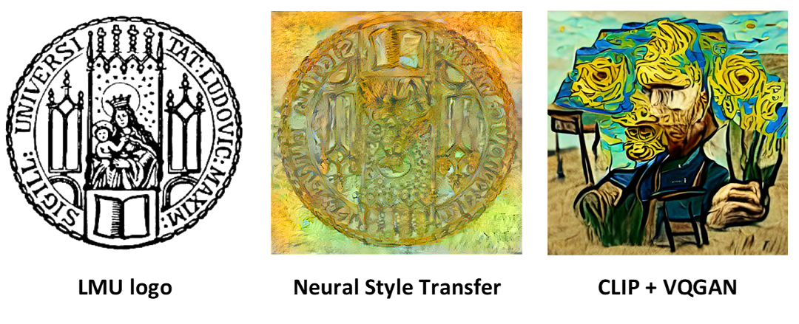
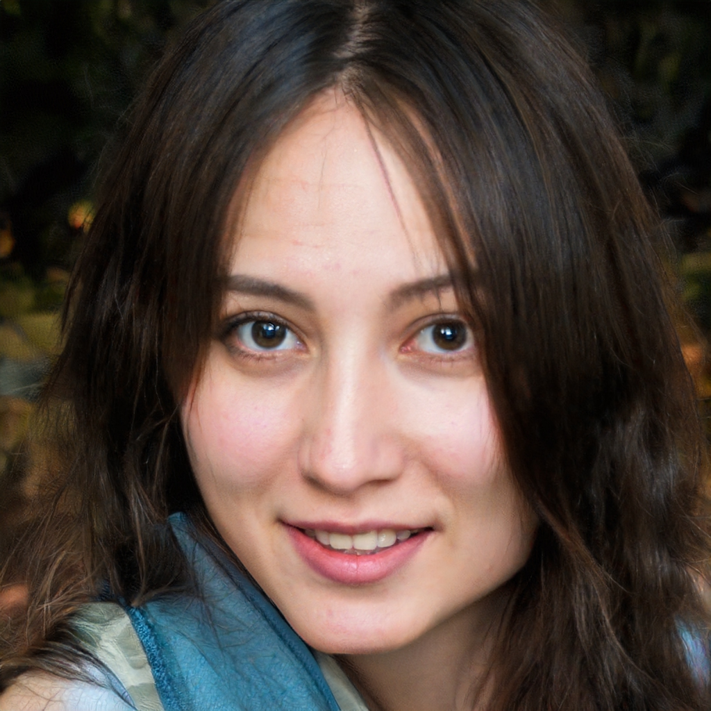

# Generative Art
*Author: Nadja Sauter*  
*Supervisor: Jann Goschenhofer*


```{r Logo, echo=FALSE, out.width="90%", fig.cap="(ref:Logo)", fig.align="center"}

```
(ref:Logo) LMU logo in style of Van Gogh's Sunflower painting

As we have seen in subsection \@ref(02-02-text2img), with the help of multimodal deep learning computers can create images only based on text prompts. This new ability is also used in arts in the field of ‘generative art’ or also known as ‘computer art’. The new movement comprises all artwork where the human artist cedes control to an autonomous system [@galanter2016generative]. In this way everyone, even artistically untalented people, can easily create pictures as the computer does the work for you. In some way, the computer becomes the artist with some sort of creativity, a distinct human ability. In this chapter we want to give an overview about how computers improved over time in generating images and how this is used in the art scene. For instance in Figure \@ref(fig:Logo) we used the seal of the Ludwig Maximilians Universtiy and changed the style to Van Gogh's [Sunflower painting](https://wallpaperaccess.com/full/787825.jpg) by the [Neural Stlye Transfer Algorithm ](https://www.tensorflow.org/tutorials/generative/style_transfer) and the method [CLIP + VQGAN](https://colab.research.google.com/drive/1ZAus_gn2RhTZWzOWUpPERNC0Q8OhZRTZ#scrollTo=FhhdWrSxQhwg). 


## Historical Overview
The first attempt to use AI to generate pictures was made by Google engineer Alexander @mordvintsev_2015 and his "DeepDream" Software. He used Convolution Neural Networks to generate very interesting and abstract images based on the activation of a layer, visualizing the patterns learned by a neural network. Below you can see a picture of a Labrador after processed by the DeepDream algorithm.


```{r DeepDream, echo=FALSE, out.width="50%", fig.cap="(ref:DeepDream)", fig.align="center"}
knitr::include_graphics("./figures/03-chapter3/DeepDream.png")
```
(ref:DeepDream) Picture of a Labrador processed by DeepDream ([ Google Colab](https://www.tensorflow.org/tutorials/generative/deepdream))


In the following year, @StyleTransfer investigated methods to transfer the style of pictures. This method was used to transfer the stlye of Van Gogh's Sunflower painting to the LMU seal in the beginning of this chapter (see Figure \@ref(fig:Logo)). Besides, below in Figure \@ref(fig:StyleTransfer2) you can see the same Labrador picture from Figure \@ref(fig:DeepDream) in [Kandinsky style](https://storage.googleapis.com/download.tensorflow.org/example_images/Vassily_Kandinsky%2C_1913_-_Composition_7.jpg).


```{r StyleTransfer2, echo=FALSE, out.width="50%", fig.cap="(ref:StyleTransfer2)", fig.align="center"}
knitr::include_graphics("./figures/03-chapter3/Kandinsky.png")
```
(ref:StyleTransfer2) Picture of a Labrador with Kandinsky style [(Google Colab)](https://www.tensorflow.org/tutorials/generative/style_transfer)


Furthermore, the architecture of Generative Adversarial Networks (GANs), which was first introduced by Google Researcher @NIPS2014_5ca3e9b1, was used by NVIDIA researches @karras2019style to create very realistic fake images with their architecture StyleGAN. For instance, you can create pictures of people who do not exist, but look totally realistic (see Figure \@ref(fig:GAN)).


```{r GAN, echo=FALSE, out.width="50%", fig.cap="(ref:GAN)", fig.align="center"}

```
(ref:GAN) Fake face generated by [StyleGAN](https://thispersondoesnotexist.com/)


Nevertheless, it was almost not possible to control the exact output of these early forms of AI art. There was no option to make specifications of how the result should look like in detail. For instance, you always get a human face with the earlier mentioned StyleGAN application, but you cannot specify to generate a blond girl with blue eyes. This can be achieved by applying the artist-critic paradigm [@8477754]: First of all, the computer as artist generates a picture based on what the Neural Network learned in the training phase (e.g. StyleGAN learns to generate pictures of human faces). Additionally, you also need a critic that tells the computer if the output satisfies the concrete idea of the human artist. For this reason multimodal deep learning models emerged in the field of generative art. Here you can control the output with the help of text prompting. In this way you can check if the generated picture matches the initial text description. Looking at our StyleGAN example, the multimodal architecture supervises if the output picture is indeed a blond girl with blue eyes. A new class of models for generating pictures evolved. 

This idea was used by OpenAI for their models DALL-E [@DALLE] and CLIP [@CLIP] which were released in January 2021. Both architectures are critics for multimodal models. Only a few days after the release, Ryan Murdock combined CLIP (critic) with the already existing Neural Net “BigGAN” (artist) in his “The Big Sleep” software. Furthermore, @StyleGAN developed StyleCLIP, a combination of StyleGAN (artist) and CLIP (critic) to edit parts of images via text instructions. In the following months, Katherine Corwson combined CLIP with the existing VQGAN algorithm. She also hooked up CLIP with guided diffusion models as artists. This approach was further investigated by OpenAI that published a paper [@DiffusionModels] in May 2021 about guided diffusion models. Moreover, in December 2021 they introduced GLIDE [@GLIDE], a model with CLIP or classifier-free guidance as critics and diffusion models as artists. For more technical details about text2img methods like DALL-E and GLIDE look at subsection \@ref(02-02-text2img)
or for text supporting CV models like CLIP at subsection \@ref(02-04-text-support-img).


## How to use models?
A lot of different notebooks are publicly available to apply the different pre-trained models. In general, all notebooks work pretty similar: You only need to enter your text prompt in the code and after running the notebook the computer generates a picture based on your instruction. It is easy and no coding knowledge required. Moreover, there are also some API and GUI applications (e.g. [MindsEye beta](https://multimodal.art/mindseye)), and in this way no programming is needed at all. Using these models it is important to think about how exactly you enter your text prompt. You can influence the output in a desired way with little changes in your short text instruction. This is also known as prompt engineering. For instance, in the beginning of this chapter, we entered “in the style of Van Gogh” to change the style of the LMU seal. Besides, a special trick is to append “unreal engine” [@unrealEngine] which makes picture more realistic and higher in quality. This seems surprising, but the models were trained on data from the internet including pictures of the software company Epic Games that has a popular 3D video game engine called "Unreal Engine". This is one of the most popular prompting tricks.

Unfortunately, OpenAI has never released DALL-E. There is only an open-source version called ruDALL-E [@ruDALLE] that was trained on Russian language data. Besides, hugging face hosts DALL-E mini [@DALLEmini] where you can generate pictures, but do not have access to the model itself.  PyTorch offers a replication of the DALL-E code [@DALLEpytorch] but no trained model. Furthermore, CLIP was released without publishing the used training data. However, there exists an open source data set with CLIP embeddings called LAION-400m [@LAION]. In the following, we used different publicly available notebooks to try out the different models [CLIP + BigGAN](https://colab.research.google.com/drive/1NCceX2mbiKOSlAd_o7IU7nA9UskKN5WR?usp=sharing), 
[CLIP + VQGAN](https://colab.research.google.com/drive/1ZAus_gn2RhTZWzOWUpPERNC0Q8OhZRTZ#scrollTo=FhhdWrSxQhwg), 
[CLIP + Guided Diffusion](https://colab.research.google.com/drive/12a_Wrfi2_gwwAuN3VvMTwVMz9TfqctNj#scrollTo=X5gODNAMEUCR), 
[GLIDE](https://colab.research.google.com/github/openai/glide-text2im/blob/main/notebooks/text2im.ipynb)
with the text prompt *"a fall landscape with a small cottage next to a lake"* (see Figure \@ref(fig:comparison1)) and *"panda mad scientist mixing sparkling chemicals, artstation"* (see Figure \@ref(fig:comparison2)). The first prompt shows pretty realistic results, whereas the second prompt results in more different and crazier outputs. That is because the panda-prompt is more abstract than the first one and in this way more difficult to illustrate. In addtition, some of the notebooks run on lower resolution due to computational limitations. Besides, GLIDE is also downsized by the publisher: The released smaller model consists of 300 million parameters, whereas the unreleased model has about 3.5 billion parameters [@GLIDE]. So better results are possible with higher computational power and other implementations of the models. 


```{r comparison1, echo=FALSE, out.width="100%", fig.cap="(ref:comparison1)", fig.align="center"}
knitr::include_graphics("./figures/03-chapter3/fall_landscape.png")
```
(ref:comparison1) Comparison of different models with prompt "fall landscape with a small cottage next to a lake"


```{r comparison2, echo=FALSE, out.width="100%", fig.cap="(ref:comparison2)", fig.align="center"}
knitr::include_graphics("./figures/03-chapter3/panda.png")
```
(ref:comparison2) Comparison of different models with prompt "panda mad scientist mixing sparkling chemicals, artstation"


## Different tasks and modalities
So far, we concentrated on the two modalities text and image. Combining both of them, you can tackle different tasks with the models mentioned above. The main usage is to generate images based on a text prompt. Therefore, you can start from noise or you can chose a real image as starting point [@qiao2022initial]. This was done in the beginning with the LMU seal by CLIP + VQGAN (see Figure \@ref(fig:Logo)): instead of starting from noise, the model started from the LMU seal as initialization and then used the prompt "in style of Van Gogh". The video captures how the model develops during fitting. In the end the typical Van Gogh sunflowers emerge as well as what could be a part of Van Gogh's face. 

Besides, you can edit, extend, crop and search images with models like GLIDE  [@GLIDE]. For instance, @GLIDE fine-tuend the model for text-conditional image inpainting (see figure  \@ref(fig:inpainting)). By marking some area in the pictures, here in green, and adding a text prompt, you can edit pictures very easily and precise. This is quite impressive as the model needs to understand from the text prompt which object should be filled in and then do this in the right stlye of the surrounding to produce a realistic outcome. Another idea is to use a sketch of a drawing and let the model fill in the details based on a text caption (see figure  \@ref(fig:sketch) below). This allows controlled changes of parts of pictures with relatively little effort. In this way GLIDE can be used to generate pictures out of nothing, but also to edit pictures in a specific way. Furthermore, it is also possible to combine other modalities as well (see more details in subsection \@ref(03-01-further-modalities)). For instance, @WZRD accompanies your video with suitable audio. Or it is even imaginable to create sculptures with 3D-printers [@3D]. 


```{r inpainting, echo=FALSE, out.width="90%", fig.cap="(ref:inpainting)", fig.align="center"}
knitr::include_graphics("./figures/03-chapter3/Impainting_GLIDE.png")
```
(ref:inpainting) Text-conditional image inpainting examples with GLIDE [@GLIDE]


```{r sketch, echo=FALSE, out.width="90%", fig.cap="(ref:sketch)", fig.align="center"}
knitr::include_graphics("./figures/03-chapter3/GLIDE_sketch.png")
```
(ref:sketch) Text-conditional edit from user scratch with GLIDE [@GLIDE]


## Discussion and prospects
In the last years methods to generate images via text prompting improved tremendously and a new field in arts arised. It is surprising how these models are able to create images only based on a short text instruction. This is quite impressive as AI achieved some kind of creativity. It is up for discussion to which extent the computer is becoming the artist in generative arts and in this way replacing the human artist. However, there is still no direct loss function that can calculate how aesthetically pleasing a picture is [@bias]. This is probably also quite subjective and cannot be answered for everyone in the same way. Most of the time the computer works as aid for the creative process by generating multiple images. Then, the human artist can pick the best outcome or vary the text prompt to improve the output in a desired way. However, the better AI becomes, the less the human artist needs to intervene in this process. 

Furthermore, as the output becomes more and more realistic, there is the risk that these methods are abused to facilitate plagiarism or create fake content and spread misleading information [@misconduct]. After all, the output looks totally realistic, but are completely made-up and generated by the computer. For this reason, some organisations like Open-AI do not release all their models (e.g. DALL-E) or downstream models (e.g. CLIP). On the other hand from a scientific point of view, it is important to get access to such models to continue research. 

Moreover, similarly to most Deep Learning algorithms, these models are affected by biases in the input data [@bias_ML]. For instance, @bias points out that CLIP text embeddings associate a human being more with a man than a woman. In this way it might be likelier that our models generate a man with the text prompt "human being" than a woman. This effect needs to be further investigated and should be removed. 

After all, generative arts can be used to create Non Fungible Tokens (NFT) really easily. NFTs are digital artworks where a special digital signature is added making them unique and in this way non-fungible [@NFT]. The digital artwork is bought and sold online, often by cryptocurrency. That is why this field is also called Cryptoart. This provides the perfect platform to sell generative arts. However, this trading market is quite new and controversial like crypotcurrency in general.

In conclusion, generative arts is quite a new and impressive field. It combines technology with arts, two rather opposite fields. The methods are already really impressive and  still getting better and better. For instance, this year Open AI already published DALLE-2 [@DALLE2] that outperforms DALLE-1. It remains highly interesting to follow up the developments in this field. 


### Header7 {#02-02-text2img}
### Header10 {#03-01-further-modalities}
### Header7 {#02-04-text-support-img}


